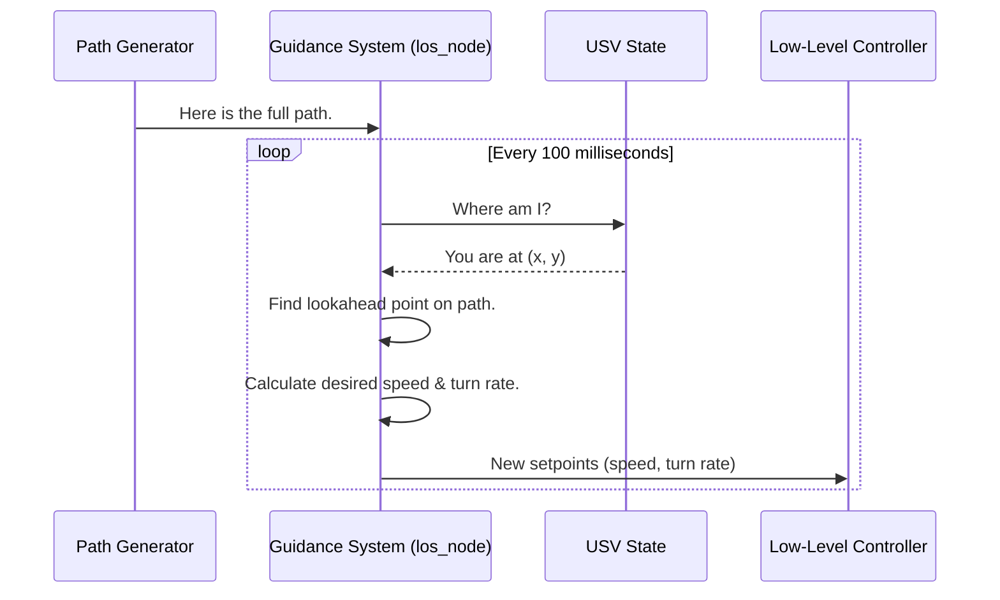

# Chapter 5: Guidance System

In our [previous chapter](04_obstacle_avoidance_.md), we built a smart safety system that can generate a safe "blue line" on our map, even if it has to plot a course around unexpected obstacles. We now have a reliable path from where we are to where we're going.

But having a route on a map and actually *driving* that route are two different things. How does the USV constantly adjust its steering to stay on that blue line? This is the job of the **Guidance System**.

### The Driver Analogy

Imagine you're driving using a GPS. The screen shows the full route to your destination, which might be miles away. But you aren't pointing your car's hood at the final destination. Instead, you're focused on the road immediately in front of you, making small, constant adjustments to your steering wheel to keep the car on the blue line shown on the screen.

Our Guidance System is this driver. It's the tactical navigator that looks at the full path and the USV's current position and decides on the *immediate* heading and speed. It doesn't care about the final waypoint; it only cares about the next few feet of the path.

## The "Lookahead" Point

The core trick behind our guidance system is the concept of a **lookahead point**. Instead of trying to aim for the end of the path, the guidance system picks a target point on the path that is a short distance *ahead* of the USV's current position.

This moving target gives the USV a short-term goal. As the USV moves forward, this lookahead point also moves, always staying a fixed distance ahead along the path.

```
      (Lookahead Point)
            [*]
             |
             |
Path: -------/-----------------------------------> (Final Waypoint)
            /
           /
    (USV) O
```

By constantly aiming for this nearby lookahead point, the USV smoothly follows the overall path, even if it has curves.

## How It Works: The Line-of-Sight (LOS) Node

The logic for this is contained in the `los_node`, which stands for "Line-of-Sight" guidance. Its job is simple:

*   **Inputs:**
    1.  The full path to follow (`/usv/path_to_follow`).
    2.  The USV's current position and heading (`/usv/state/pose`).
*   **Outputs:**
    1.  The desired forward speed (`/guidance/desired_velocity`).
    2.  The desired turning speed, or angular velocity (`/guidance/desired_angular_velocity`).

These outputs are not "turn the thruster on." They are higher-level commands like "go forward at 0.5 meters/second" and "turn right at 5 degrees/second."

## Under the Hood: The Guidance Loop

The `los_node` runs in a continuous loop, making calculations many times per second to keep the USV on track. Here is a simplified diagram of its interactions.



Let's walk through the code in `los_node.cpp` to see how this is done.

### 1. Getting the Path and Pose

First, the node needs its two key inputs. It subscribes to the topics providing the path and the USV's current state.

```cpp
// File: src/los_node.cpp

// Subscribe to the full path from the path generator
path_sub = this->create_subscription<nav_msgs::msg::Path>(
    "/usv/path_to_follow", 10,
    [this](const nav_msgs::msg::Path &msg) { path = msg; });

// Subscribe to the USV's current pose
pose_sub = this->create_subscription<geometry_msgs::msg::Pose2D>(
    "/usv/state/pose", 10,
    [this](const geometry_msgs::msg::Pose2D &msg) { this->pose = msg; });
```
This code continuously updates the `los_node`'s internal knowledge of the "blue line" and the "You Are Here" pin.

### 2. Finding the Lookahead Point

Inside a timer that runs every 100 milliseconds, the main logic happens. The first step is to find that all-important lookahead point on the path.

```cpp
// File: src/los_node.cpp

// A constant defining how far ahead to look
const double lookahead_dist{2.1}; // in meters

// Find the point on the path that is the best target
for(int i = wp_i; i < path.poses.size(); i++){
    dist = distance(this->pose, path.poses[i].pose.position);

    // If a point is within our lookahead distance and is the farthest we've found so far...
    if(dist < lookahead_dist && dist > max_distance_found_){
        max_idx_ = i; // ...it becomes our new target.
        max_distance_found_ = dist;
    }
}
wp_i = max_idx_; // Save the index of our lookahead point
```
This loop searches along the path starting from the last-known position and finds the point that is almost, but not more than, `2.1` meters away from the boat. This becomes the immediate target.

### 3. Calculating Desired Heading

Once we have our target point (`path.poses[wp_i]`), we can calculate the angle we need to point the boat to head straight for it. This is a simple trigonometry calculation using `atan2`.

```cpp
// File: src/los_node.cpp

// Calculate the desired heading angle (psi_d) to the lookahead point
psi_d = std::atan2((path.poses[wp_i].pose.position.y - this->pose.y), 
                 (path.poses[wp_i].pose.position.x - this->pose.x));
```
`psi_d` is now the direction our "driver" wants to steer towards.

### 4. Calculating Desired Speed and Turn Rate

Finally, the node computes the two output commands:
1.  **Desired Velocity:** For simplicity, our boat slows down as it gets very close to the final destination on the path.
2.  **Desired Angular Velocity (Turn Rate):** This is based on the error. The bigger the difference between our boat's *current* heading (`this->pose.theta`) and our *desired* heading (`psi_d`), the faster we need to turn.

```cpp
// File: src/los_node.cpp

// Slow down as we approach the very end of the entire path
vel_msg.data = std::clamp(distance_to_final_point - 1.0, 0.0, 0.5);

// Turn faster if the heading error is large
heading_vel_msg.data = -get_angle_diff(this->pose.theta, psi_d) * 5.0;
```

These values are then published for the next module in the chain to use.

```cpp
// File: src/los_node.cpp

// Publish the desired speed
vel_pub->publish(vel_msg);

// Publish the desired turning speed
heading_vel_pub->publish(heading_vel_msg);
```

## Conclusion

You now understand the USV's tactical navigator! The **Guidance System** acts like a driver, translating a long-term plan (the path) into immediate, actionable commands. By focusing on a **lookahead point** instead of the final destination, it can smoothly and accurately follow any route it's given.

We've successfully converted a path into a desired speed and a desired turn rate. But these are still abstract concepts. How do we turn "go forward at 0.5 m/s and turn right at 5 deg/s" into the precise electrical power signals needed for the left and right thrusters? That's the final piece of our control puzzle.

Next up: [Low-Level Motion Controller](06_low_level_motion_controller_.md)

---

Generated by [AI Codebase Knowledge Builder](https://github.com/The-Pocket/Tutorial-Codebase-Knowledge)