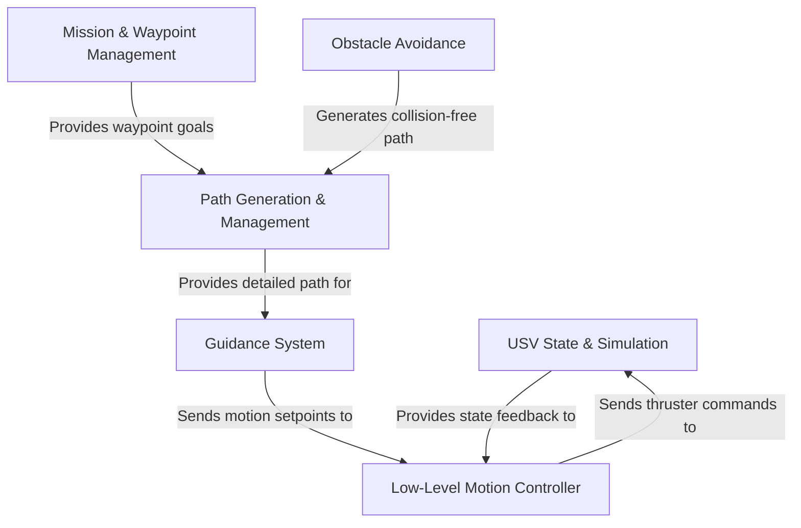

# Tutorial: src

This project is a complete *control system* for a robotic boat, also known as an **Unmanned Surface Vehicle (USV)**. It allows the boat to autonomously navigate a series of *waypoints* to complete a mission, much like a car following a GPS route. The system includes a **simulator** to test the software without a physical boat, path planners to create smooth routes, a guidance system to stay on track, and low-level controllers that translate steering commands into actual thruster movements. It also features a safety system for *obstacle avoidance*.

**Source Repository:** [None](None)

## Chapters

1. [Mission & Waypoint Management
](01_mission___waypoint_management_.md)
2. [USV State & Simulation
](02_usv_state___simulation_.md)
3. [Path Generation & Management
](03_path_generation___management_.md)
4. [Obstacle Avoidance
](04_obstacle_avoidance_.md)
5. [Guidance System
](05_guidance_system_.md)
6. [Low-Level Motion Controller
](06_low_level_motion_controller_.md)

---

Generated by [AI Codebase Knowledge Builder](https://github.com/The-Pocket/Tutorial-Codebase-Knowledge)