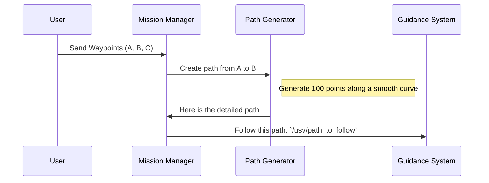

# Chapter 3: Path Generation & Management

In the [previous chapter](02_usv_state___simulation_.md), we learned how our USV gets its "You Are Here" pin on the map. We have a stream of reliable position data. And from [Chapter 1](01_mission___waypoint_management_.md), we know how to give the USV a list of destinations (waypoints).

So, we have a starting point (our current location) and a series of stops on our itinerary. But how do we connect these dots? We can't just tell the boat "head towards that point" and hope for the best. We need to draw the exact, continuous line on the map for the boat to follow. This is **Path Generation**.

### The GPS Navigation Analogy

Think about your car's GPS. You enter a destination, and it doesn't just draw a single straight line—that might go through buildings! Instead, it calculates a specific route that follows roads, accounts for turns, and gives you a continuous blue line to follow.

Our Path Generation & Management module does exactly this. It takes the high-level waypoints and creates a detailed, point-by-point trajectory—the "blue line"—for the USV.

There are two main ways we can do this, depending on the situation.

1.  **Smooth Sailing (Interpolation):** When the path is clear, we can create a beautiful, smooth curve between our waypoints.
2.  **Obstacle Course (A* Planning):** When there are obstacles, we need a smarter algorithm to find a safe route around them.

Let's explore both.

## Scenario 1: Smooth Sailing with Interpolation

Imagine an open, clear lake. We have two waypoints, A and B. A straight line is the shortest path, but making a sharp turn at waypoint B would be inefficient and jerky. We want the USV to follow a graceful, sweeping curve.

This is where **interpolation** comes in. It's a fancy word for "filling in the gaps." We use a mathematical technique (specifically, a Bezier curve) to generate hundreds of small, intermediate points between our main waypoints.

### How It Works

The `waypoint_handler_node` is responsible for this when the coast is clear.



The logic inside the `waypoint_handler_node` takes each pair of consecutive waypoints and calls a special function to create the smooth path segment.

```cpp
// File: src/waypoint_handler_node.cpp

// In the main update loop...
if (wp_vec.size() >= 2) {
    // For each pair of waypoints (e.g., from A to B)
    for (int i = 0; i < wp_vec.size() - 1; ++i) {
        Wp start_wp = wp_vec[i];
        Wp end_wp = wp_vec[i + 1];
        
        // Create a smooth, curved path between them
        interpolateWaypoints(start_wp, end_wp, 100, 0.9);
    }
}
```
This code loops through our list of waypoints and, for each segment (like from waypoint 1 to 2, then 2 to 3), it calls `interpolateWaypoints`.

The `interpolateWaypoints` function is where the magic happens. You don't need to understand the complex math, just what it does:

*   **Input:** A start point, an end point, and the number of points to create.
*   **Output:** It adds 100 new, closely-spaced points that form a smooth curve to our global path.

```cpp
// File: src/waypoint_handler_node.cpp

void interpolateWaypoints( Wp start_wp, Wp end_wp, int num_interpolations, ...) {
    // ... complex math to define a curve ...
    
    for (int i = 0; i <= num_interpolations; ++i) {
        // Calculate the next point (x, y) along the curve
        double x_interp = /* ... math ... */;
        double y_interp = /* ... math ... */;
        
        // Add this new point to our final path
        path_to_follow.poses.push_back(/* new point */);
    }
}
```
Finally, this complete, detailed path is published for other parts of the system to use.

```cpp
// File: src/waypoint_handler_node.cpp

// Publish the full, detailed path
path_to_follow_pub_->publish(path_to_follow);
```
This sends the "blue line" to the `/usv/path_to_follow` topic, where the [Guidance System](05_guidance_system_.md) will pick it up.

## Scenario 2: Navigating an Obstacle Course with A*

Now, what if there's an island between waypoint A and B? Simple interpolation won't work—it would create a path straight through the land! We need a true path-planning algorithm. For this, we use **A\* (pronounced "A-star")**.

### The Maze-Solving Analogy

Imagine a grid-based maze. The A* algorithm is a popular and efficient way to find the shortest path from a start square to a finish square without going through walls.

Our `obstacle_avoidance_node` does exactly this. It treats the water like a giant grid and obstacles (like islands or other boats) as "walls."

1.  **It gets a map of obstacles:** It listens to a topic that tells it which grid cells are blocked.
2.  **It gets a destination:** It listens for the mission waypoints.
3.  **It finds the best path:** It runs the A* algorithm to compute a path of grid cells from the USV's current position to the next waypoint, going around any blocked cells.

### Under the Hood of A*

Let's look at the code in `obstacle_avoidance_node.cpp`.

First, it listens for obstacle data. The `generator` is our A* pathfinding object.

```cpp
// File: src/obstacle_avoidance_node.cpp

// Listen for the map of blocked areas
obstacle_sub_ = this->create_subscription<nav_msgs::msg::GridCells>(
    "/usv/obstacle_margins_map", 10,
    [this](const nav_msgs::msg::GridCells &msg)
    {
        generator.clearCollisions(); // Clear old obstacles
        for(int i = 0 ; i < msg.cells.size() ; i++){
            // Tell the A* generator where the "walls" are
            generator.addCollision(/* coordinates of an obstacle */);
        }
    });
```
Next, when it receives a list of waypoints, it asks the `generator` to find a path.

```cpp
// File: src/obstacle_avoidance_node.cpp

// When we get new goals...
goals_sub_ = this->create_subscription<usv_interfaces::msg::WaypointList>(
    "/usv/goals", 10,
    [this](const usv_interfaces::msg::WaypointList &msg) {
        // For each waypoint in the mission...
        for(int i = 0 ; i < msg.waypoint_list.size() ; i++){
            // ...find the optimal path to it from the previous one.
            auto path = generator.findPath(/* start */, /* end */);
        }
    });
```
The A* `generator.findPath` function returns a list of coordinates. We loop through this list and convert it into the standard `nav_msgs::msg::Path` format, which we then publish, just like in the interpolation scenario.

```cpp
// File: src/obstacle_avoidance_node.cpp

// In the update loop, publish the path found by A*
a_star_path_pub_->publish(a_star_path);
```
Whether the path comes from smooth interpolation or the clever A* algorithm, the result is the same: a detailed, followable trajectory published on the `/usv/path_to_follow` topic.

## Conclusion

You now understand how our USV plans its route! It's not just about knowing the destination; it's about creating the detailed roadmap to get there.

-   In **clear waters**, we use **interpolation** to generate a smooth, efficient curve between waypoints.
-   In **complex environments**, we use the **A\* algorithm** to intelligently find the best path around obstacles.

Both methods produce a standard `Path` message that tells the rest of the system, "Here is the exact blue line to follow."

But for A* to work, it needs to know *where* the obstacles are in the first place. How do we build that map of "walls" for our maze-solving algorithm? That's the topic of our next chapter.

Next up: [Obstacle Avoidance](04_obstacle_avoidance_.md)

---

Generated by [AI Codebase Knowledge Builder](https://github.com/The-Pocket/Tutorial-Codebase-Knowledge)