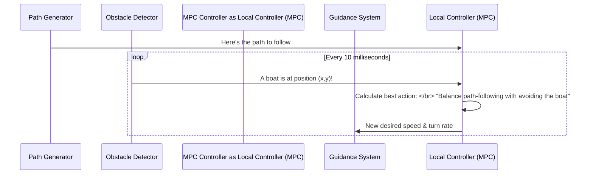

# Chapter 4: Obstacle Avoidance

In the [previous chapter](03_path_generation___management_.md), we saw how our USV can use the A* algorithm to plot a course around a big, known obstacle like an island. The A* algorithm is like planning your driving route on a map *before* you leave the house, making sure to go around a park instead of through it.

But what happens when something unexpected appears? What if another boat suddenly cuts across your path? You can't pull over and re-plan your entire trip. You need to react, right now! This is the job of **Obstacle Avoidance**.

### The Smart Car Analogy

Think of a modern car's Advanced Driver-Assistance System (ADAS). While your GPS provides the main route (our "path"), the ADAS acts as a real-time safety system. It uses sensors to see the car that just slammed on its brakes in front of you and automatically applies your car's brakes to prevent a collision.

Our Obstacle Avoidance system is that safety layer for the USV. It's constantly watching for nearby dangers and can take over to make small, immediate adjustments to the boat's trajectory to keep it safe.

## Two Layers of Safety

Our USV uses a clever two-part strategy for dealing with obstacles:

1.  **Global Planner (A\*):** This is what we saw in the [previous chapter](03_path_generation___management_.md). It's used for large, static obstacles that are known ahead of time (like islands or docks). It creates a completely new, safe path from start to finish.
2.  **Local, Reactive Controller (MPC):** This is our real-time ADAS. It handles unexpected or moving obstacles (like other boats). It doesn't create a whole new path. Instead, it temporarily nudges the USV off its current path just enough to avoid a collision, before guiding it back.

This chapter focuses on the second part: the smart, reactive controller.

## The "Force Field" of the MPC

We use a powerful technique called **Model Predictive Control (MPC)**. You don't need to know the complex math behind it, but you can think of it like this:

The MPC puts an invisible "force field" or "safety bubble" around our USV. It's constantly looking a few seconds into the future and asking: "Based on my current path and the location of nearby obstacles, what is the absolute best move I can make *right now*?"

It tries to find the perfect balance between two competing goals:
*   **Goal 1:** Stick to the "blue line" path.
*   **Goal 2:** Stay as far away from obstacles as possible.

When there are no obstacles, it focuses 100% on Goal 1. But as an obstacle gets closer, it starts prioritizing Goal 2, sacrificing a little bit of path accuracy for a lot of safety.



## How the MPC Makes Decisions

Let's look at how the `mpc_node` (our MPC controller) thinks.

### 1. Getting Obstacle Information

First, the controller needs to know where the dangers are. It listens to the `/obj_n_nearest_list` topic, which provides a list of the closest obstacles to the USV.

```cpp
// File: src/mpc_node.cpp

// Listen for the list of nearby obstacles
obstacle_list_sub_ = this->create_subscription<usv_interfaces::msg::ObjectList>(
    "/obj_n_nearest_list", 10,
    [this](const usv_interfaces::msg::ObjectList &msg){
      // We only care about the 3 closest obstacles
      for(int i = 0 ; i < 3; i++){
        // Save the obstacle's position (x, y)
        obs_arr[i*2] = msg.obj_list[i].x;
        obs_arr[i*2+1] = msg.obj_list[i].y;
       }
     });
```
This code tells our controller: "Pay attention to the obstacle list. When a new one comes in, update your internal map of where the top three closest dangers are."

### 2. The "Importance" of an Obstacle

Not all obstacles are equally important. One that's 50 meters away is less of a concern than one that's 5 meters away. The MPC uses a function called `weight_calculator` to decide how much it should care about avoiding an obstacle versus following the path.

```cpp
// File: src/mpc_node.cpp

// These are pre-defined settings
// path_tracking_weights: "Focus on the path!"
// avoidance_weights: "Focus on avoiding things!"

std::vector<double> weight_calculator(double dist){
    // Define a "danger zone" start and end
    double danger_dist{2.0}, safe_dist{3.0};
    
    // Calculate a "danger level" from 0.0 (safe) to 1.0 (danger)
    double danger_level = std::clamp(dist - danger_dist, 0.0, safe_dist-danger_dist) / (safe_dist-danger_dist);
    
    // Blend the two behaviors based on the danger level
    // ...
    return new_weights;
}
```
This logic is simple but powerful:
*   If an obstacle is more than 3 meters away (`dist > 3.0`), the `danger_level` is 0. The MPC uses `path_tracking_weights` and focuses on following the path perfectly.
*   If an obstacle is closer than 2 meters (`dist < 2.0`), the `danger_level` is 1. The MPC uses `avoidance_weights` and prioritizes safety above all else.
*   If the obstacle is between 2 and 3 meters, it smoothly blends the two behaviors.

### 3. The Magic Black Box

Once the MPC knows the path, its own state, the obstacle locations, and how important each goal is (the weights), it feeds all this information into a "solver."

```cpp
// File: src/mpc_node.cpp

// In the main update loop...

// Set all the inputs: our state, the path, obstacle locations, and weights...
app_->set_parameter("X_0", ...);       // Our current state
app_->set_parameter("target", ...);    // The path we want to follow
app_->set_parameter("qs", ...);        // The calculated avoidance weights

// Run the optimization!
app_->optimize();

// Get the results (the best immediate velocity and turn rate)
// ...
```
You can think of `app_->optimize()` as a magic black box. It's a highly advanced calculator that solves the complex problem and tells us the ideal velocity and turn rate for the next fraction of a second. These "ideal" values are then sent to the [Guidance System](05_guidance_system_.md) to be executed.

## Conclusion

You now understand the USV's sophisticated, two-layered safety system! It's not just one single thing, but a combination of strategies:

*   For big, predictable obstacles, the **A\* global planner** in `obstacle_avoidance_node` draws a whole new route on the map.
*   For sudden, unpredictable obstacles, the **MPC local controller** in `mpc_node` acts like a "force field," temporarily nudging the boat to safety without losing track of the overall mission.

This reactive controller calculates the *ideal* change in speed and direction to stay safe. But how do we translate that desire—"go a bit faster and turn slightly to the right"—into the precise electrical signals needed to power the left and right thrusters? That's the job of our next module.

Next up: [Guidance System](05_guidance_system_.md)

---

Generated by [AI Codebase Knowledge Builder](https://github.com/The-Pocket/Tutorial-Codebase-Knowledge)