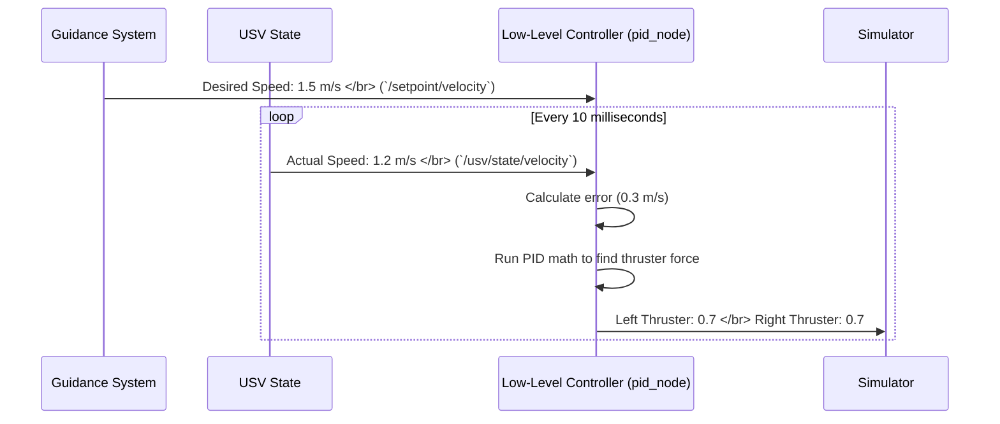

# Chapter 6: Low-Level Motion Controller

We've come a long way! In the [previous chapter](05_guidance_system_.md), we created a "driver" for our USV. This driver looks at the path and decides on an immediate, desired motion, like "go forward at 1.5 m/s and turn right at 5 degrees per second."

But this is still an abstract command. The USV's thrusters don't understand "meters per second." They only understand power levels, like a percentage or a voltage. How do we translate the driver's intention into concrete, physical action?

This is the job of the **Low-Level Motion Controller**, the final piece of our autonomous puzzle.

### The Car's Engine Control Unit (ECU) Analogy

Think about driving a modern car. When you press the gas pedal, you're not mechanically pulling a wire that opens a valve anymore. You're sending an electronic signal that says, "I want to accelerate."

The car's **Engine Control Unit (ECU)** receives that signal. It then looks at the current engine speed, air temperature, and a dozen other factors, and calculates the *precise* amount of fuel and air to inject into the engine to achieve the acceleration you requested. The ECU is the boat's "brainstem"—it handles the low-level, reflexive actions needed to execute a higher-level command.

Our Low-Level Motion Controller is the USV's ECU.
*   **The Gas Pedal:** The [Guidance System](05_guidance_system_.md) sending a desired speed.
*   **The ECU:** The Low-Level Motion Controller node (e.g., `pid_node` or `asmc_node`).
*   **Fuel/Air Mixture:** The final power commands sent to the left and right thrusters.

## The Problem: Closing the Loop

Why can't we just have a simple mapping, like "1.5 m/s = 70% power"? Because the real world is messy. A headwind, a current, or the boat's own momentum will affect its actual speed. If we just set power to 70% and hope for the best, we might end up going 1.2 m/s or 1.8 m/s.

To be precise, we need a **feedback loop**. The controller must constantly:
1.  **Compare** the *desired* speed with the *actual* speed.
2.  **Calculate** the error (e.g., "I'm 0.3 m/s too slow").
3.  **Adjust** the thruster power to correct this error.

This is the essence of control theory, and our project implements several different ways to do it.

## The Interchangeable Brains

Just as a car can have different ECU "tunes" (e.g., an "Eco" mode and a "Sport" mode), our project has different controller nodes that use different mathematical theories. They all do the same job, but they do it with different strategies. The three main ones are:

*   `pid_node`: Uses a classic **PID** (Proportional-Integral-Derivative) controller. This is the most common and intuitive type of controller.
*   `asmc_node` & `aitsmc_node`: Use more advanced **Sliding Mode Control** theories, which are very robust and can adapt to changing conditions.
*   `mpc_node`: As we saw in the [Obstacle Avoidance](04_obstacle_avoidance_.md) chapter, this can also act as a controller, but its main strength is planning.

For this chapter, we'll focus on the `pid_node`, but the overall structure is the same for all of them.

## Under the Hood: The Controller's Logic

Let's follow the data as it flows through the `pid_node`.



The controller node runs in a tight loop, constantly making tiny adjustments to keep the boat on target.

### 1. Getting the Setpoints (The Goal)

First, the controller needs to know what the goal is. It subscribes to the topics published by the [Guidance System](05_guidance_system_.md).

```cpp
// File: src/pid_node.cpp

// Listen for the desired forward speed
velocity_setpoint_sub_ = this->create_subscription<std_msgs::msg::Float64>(
    "setpoint/velocity", 10,
    [this](const std_msgs::msg::Float64 &msg) { u_d = msg.data; });

// Listen for the desired turning speed
angular_velocity_setpoint_sub_ =
    this->create_subscription<std_msgs::msg::Float64>(
        "setpoint/angular_velocity", 10,
        // ... save the turning speed setpoint ...
        );
```
This code tells our `pid_node`: "Whenever a new desired speed (`u_d`) or turn rate shows up, save it. That's my new target."

### 2. Getting the State (The Reality)

To calculate the error, the controller must also know the boat's current, actual state. It gets this information by subscribing to the state topics published by the [USV State & Simulation](02_usv_state___simulation_.md) module.

```cpp
// File: src/pid_node.cpp

// Listen for the boat's actual, current velocity
velocity_sub_ = this->create_subscription<geometry_msgs::msg::Vector3>(
    "usv/state/velocity", 10,
    [this](const geometry_msgs::msg::Vector3 &msg) {
      this->velocity = msg;
    });
```
Now the controller knows both the goal and the reality. It can calculate the difference.

### 3. The Update Loop: The Heart of the ECU

The `update()` function runs every 10 milliseconds. This is where the magic happens.

```cpp
// File: src/pid_node.cpp

void PIDNode::update() {
    // 1. Package the current state (actual speed, heading, etc.)
    vanttec::ControllerState state;
    state.u = velocity.x; // u is forward speed
    state.psi = pose.theta; // psi is heading

    // 2. Package the desired state (the setpoints)
    PIDSetpoint setpoint;
    setpoint.u = u_d;
    setpoint.psi = psi_d;

    // 3. The "black box": calculate required thruster forces
    auto out = controller.update(state, setpoint);

    // 4. Publish the final commands to the thrusters
    rt.data = out.right_thruster;
    lt.data = out.left_thruster;
    right_thruster_pub_->publish(rt);
    left_thruster_pub_->publish(lt);
}
```

The most important line is `auto out = controller.update(state, setpoint);`. This is where the PID algorithm does its work. It takes the error between the `state` and the `setpoint` and uses some clever math to figure out the exact forces needed (`out`) to close that gap.

### 4. Swapping Controllers

The beauty of this design is its modularity. If we want to try the more advanced `AITSMC` controller instead of the `PID` controller, we just need to run a different node. Look how similar the `update()` function is in `aitsmc_node.cpp`:

```cpp
// File: src/aitsmc_node.cpp

void AitsmcNode::update() {
    // 1. Package the current state
    vanttec::ControllerState state;
    state.u = velocity.x;
    // ...

    // 2. Package the desired state
    AITSMCSetpoint setpoint;
    setpoint.u = u_d;
    // ...

    // 3. The "black box" (a different one!)
    auto out = controller.update(state, setpoint);

    // 4. Publish the results (same as before)
    // ...
}
```
The inputs (setpoints, state) and outputs (thruster commands) are identical! Only the internal "black box" (`controller.update`) has changed. This allows us to experiment with different control strategies without rewriting the rest of our system.

## Conclusion

You have now reached the end of our core software journey! You've seen how a high-level mission is broken down, piece by piece, until it becomes physical action.

The **Low-Level Motion Controller** is the final, crucial link in this chain. It acts as the USV's "brainstem" or ECU, taking abstract desires from the **Guidance System** and translating them into the precise thruster commands needed to control the boat in a messy, unpredictable world.

Let's recap the entire flow:
1.  **[Mission & Waypoint Management](01_mission___waypoint_management_.md)** sets the overall destination.
2.  **[Path Generation & Management](03_path_generation___management_.md)** draws the "blue line" on the map.
3.  **[Obstacle Avoidance](04_obstacle_avoidance_.md)** adjusts that line in real-time for safety.
4.  The **[Guidance System](05_guidance_system_.md)** acts as the driver, deciding on the immediate speed and heading to follow the line.
5.  And finally, the **Low-Level Motion Controller** acts as the ECU, turning those driving commands into raw power for the thrusters, all while getting constant feedback from the **[USV State & Simulation](02_usv_state___simulation_.md)**.

Congratulations on completing the tutorial! You now have a comprehensive understanding of how an autonomous vehicle thinks, from a simple list of coordinates all the way down to the electrical signals that make it move.

---

Generated by [AI Codebase Knowledge Builder](https://github.com/The-Pocket/Tutorial-Codebase-Knowledge)