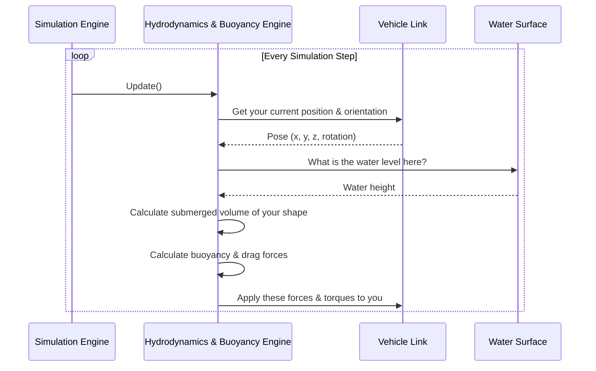

# Chapter 1: Hydrodynamics & Buoyancy Engine

Welcome to the `src` tutorial! Have you ever wondered what makes a boat float in a video game or a simulator? How does it bob up and down, and why does it feel resistance when it moves through the water? The answer lies in the physics engine. In this chapter, we'll explore the very heart of our water simulation: the **Hydrodynamics & Buoyancy Engine**.

This engine is the "brain" that understands how objects interact with water. It's responsible for making our simulated vehicles behave like real boats, not just bricks sliding on a blue surface.

Our goal for this chapter is simple: to understand how to make a basic, box-shaped barge float realistically on the water.

### The Three Pillars of Water Physics

To make our barge behave correctly, the engine needs to simulate three crucial physical effects. Let's think of them as the three pillars of our water world.

#### 1. Buoyancy: The Upward Push

Imagine you're at a pool trying to push a beach ball underwater. You can feel a strong upward force pushing back at you. That's buoyancy!

*   **What it is:** Buoyancy is the upward force exerted by a fluid that opposes the weight of a partially or fully immersed object.
*   **How it works:** According to Archimedes' principle, this upward force is equal to the weight of the water the object displaces. The more of your boat's hull is underwater, the more water it displaces, and the stronger the upward push. This is what keeps a heavy steel ship afloat.

#### 2. Drag: The Water's Resistance

Now, imagine trying to run through that same pool. It's much harder than running in the air, right? The water resists your movement. That's drag.

*   **What it is:** Drag is the force that opposes an object's motion through a fluid (like water).
*   **How it works:** As your boat moves, it has to push water out of the way. This creates a resistance force that slows it down. The faster the boat moves, the stronger the drag becomes.

#### 3. Added Mass: The "Sluggishness" Effect

This one is a bit less intuitive. Imagine trying to quickly shake a paddle back and forth in the water versus in the air. In the water, it feels "heavier" and more sluggish to accelerate. This isn't because the paddle's mass has changed; it's because you also have to move the water around it.

*   **What it is:** Added mass is an effect that makes an object feel heavier when accelerating in a fluid.
*   **How it works:** As the boat accelerates, it must also accelerate the water surrounding it. This creates an inertial force that makes the boat feel more massive and sluggish than it actually is.

### Putting It to Work: Simulating Our Barge

So, how do we tell our engine to apply these forces to our barge? We do this by configuring a "plugin" in a simulation file (called an SDF file). Think of this as giving the engine a blueprint for our boat's physical properties.

Let's start with buoyancy. We need to tell the engine two things: what the boat's shape is and where the water is.

Here’s a small snippet from a configuration file that sets up buoyancy for our barge:

```xml
<plugin filename="vrx::PolyhedraBuoyancyDrag" name="vrx::PolyhedraBuoyancyDrag">
  <fluid_density>997</fluid_density>
  <buoyancy>
    <link_name>barge_link</link_name>
    <geometry>
      <box>
        <size>10 5 2</size> <!-- length, width, height in meters -->
      </box>
    </geometry>
  </buoyancy>
</plugin>
```

Let's break this down:
*   `<plugin ...>`: This line loads our Hydrodynamics & Buoyancy Engine.
*   `<fluid_density>`: This sets the density of the water (997 kg/m³ is typical for fresh water).
*   `<link_name>`: This tells the engine which part of our vehicle model to apply forces to—in this case, the main hull, called `barge_link`.
*   `<geometry><box><size>...`: This is the most important part! We are telling the engine to model our boat's hull as a simple box that is 10 meters long, 5 meters wide, and 2 meters tall for buoyancy calculations.

With just this configuration, the simulation will automatically calculate the submerged volume of the box and apply the correct upward buoyancy force, making our barge float!

Now, for drag and added mass, we use a similar plugin:

```xml
<plugin filename="vrx::SimpleHydrodynamics" name="vrx::SimpleHydrodynamics">
  <link_name>barge_link</link_name>
  <!-- Linear drag in the forward direction -->
  <xU>50</xU>
  <!-- Added mass in the forward direction -->
  <xDotU>5</xDotU>
</plugin>
```
Here, `<xU>` defines the drag force when moving forward, and `<xDotU>` defines the added mass effect. Higher numbers mean more resistance and more sluggishness.

### Under the Hood: A Step-by-Step Look

What actually happens inside the computer when the simulation runs? It's a continuous loop that updates many times per second.

Here’s a simplified look at what the engine does in a single simulation step:



1.  **Get Pose:** The engine first checks where the vehicle's link is located in the world.
2.  **Check Water Level:** It determines the water height at that location. This is crucial for the next chapter on [Wavefield Simulation](02_wavefield_simulation_.md), but for now, let's assume it's a flat surface.
3.  **Calculate Submerged Volume:** Using the vehicle's shape (our 10x5x2 box) and the water level, it calculates exactly how much of the box is underwater.
4.  **Calculate Forces:** It uses this volume to calculate the buoyancy force. It also uses the vehicle's velocity to calculate drag.
5.  **Apply Forces:** Finally, it applies these calculated forces to the vehicle's link, which the main physics simulator then uses to update its position and rotation for the next step.

### A Peek at the Code

Let's look at a few super-simplified snippets to see how these ideas turn into code.

#### 1. Defining the Shape (`ShapeVolume.cc`)
First, the engine needs to understand the shape from the configuration file. A factory function reads the SDF and creates the right geometry object.

```cpp
// In ShapeVolume.cc
ShapeVolumePtr ShapeVolume::makeShape(const sdf::ElementPtr _sdf)
{
  // ...
  if (_sdf->HasElement("box"))
  {
    // Gets dimensions from the <size> tag
    math::Vector3d dim = _sdf->GetElement("box")->GetElement("size")->Get<math::Vector3d>();
    return new BoxVolume(dim[0], dim[1], dim[2]);
  }
  // ... more checks for <sphere>, <cylinder>, etc. ...
}
```
This code checks for a `<box>` element in the file, grabs its dimensions, and creates a `BoxVolume` object to represent it internally.

#### 2. Calculating Buoyancy (`PolyhedraBuoyancyDrag.cc`)
In every simulation update, the engine calculates the submerged part of the shape and applies the buoyancy force.

```cpp
// In PolyhedraBuoyancyDrag.cc, inside the main update loop...

// Calculate how much of the shape is underwater
auto submergedVolume = buoyancyObj.shape->CalculateVolume(linkFrame, fluidLevel);

if (submergedVolume.volume > 1e-6)
{
  // Apply Archimedes' principle: Force = -(water_density * submerged_volume * gravity)
  math::Vector3d buoyancy = -this->dataPtr->fluidDensity *
    submergedVolume.volume * this->dataPtr->gravity;
  
  // Apply this upward force to the vehicle's link
  buoyancyObj.link.AddWorldForce(_ecm, buoyancy, ...);
}
```
This is where the magic happens! The code calculates the submerged `volume`, uses the formula for buoyancy, and then calls `AddWorldForce` to give the vehicle that upward push.

#### 3. Calculating Drag (`SimpleHydrodynamics.cc`)
A separate but related plugin handles the detailed drag and added mass calculations. It reads the coefficients from the SDF file and applies forces based on the vehicle's current velocity.

```cpp
// In SimpleHydrodynamics.cc, inside the main update loop...

// Get the vehicle's linear velocity in its own frame of reference
auto localLinearVel = ...;

// Create a matrix to hold drag values
Dmat(0, 0) = this->dataPtr->paramXu +
  this->dataPtr->paramXuu * std::abs(localLinearVel.X());

// Calculate the final drag force vector
const Eigen::VectorXd kDvec = -1.0 * Dmat * state;
```
This code uses the drag coefficients (like `<xU>`) we set in the file to calculate a resistance force that opposes the vehicle's current velocity (`state`).

### Conclusion

Congratulations! You've just taken your first step into the world of simulated hydrodynamics.

We've learned that the **Hydrodynamics & Buoyancy Engine** is what makes objects float and move realistically in water by simulating three key effects: **buoyancy**, **drag**, and **added mass**. We also saw how we can easily define a vehicle's properties in a configuration file to control how it behaves.

So far, our barge is floating on perfectly calm, flat water. But what happens when things get choppy? In the next chapter, we'll bring our water to life by exploring the [Wavefield Simulation](02_wavefield_simulation_.md).

---

Generated by [AI Codebase Knowledge Builder](https://github.com/The-Pocket/Tutorial-Codebase-Knowledge)