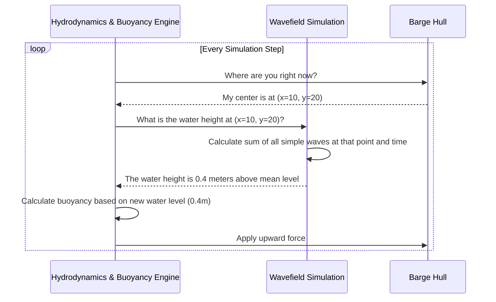

# Chapter 2: Wavefield Simulation

In the [last chapter](01_hydrodynamics___buoyancy_engine_.md), we learned how to make our barge float on a perfectly calm, flat sheet of water. But the real ocean is rarely so still! It's a dynamic, moving surface full of waves.

This chapter is all about bringing that water to life. We'll explore the **Wavefield Simulation**, the system that mathematically models the ocean surface. Think of it as the "brain" that defines the shape, size, and movement of every wave. It doesn't draw the waves you see, nor does it directly push the boat around. Instead, it provides a detailed, moment-by-moment blueprint of the sea state. This blueprint is then used by two other systems:

1.  The **visual system** uses it to draw the water surface, creating the illusion of a rolling ocean.
2.  The [Hydrodynamics & Buoyancy Engine](01_hydrodynamics___buoyancy_engine_.md) uses it to determine the water height under the boat, making it bob and sway realistically.

Our goal for this chapter is to understand how we can create a simple, wavy sea for our barge to float on.

### The Big Idea: One Complex Wave from Many Simple Ones

How do you create a realistic, chaotic-looking ocean surface? It might seem incredibly complex, but the core idea is surprisingly simple. A realistic ocean wavefield is just the sum of many simple, predictable sine waves.

**Analogy: The Orchestra of Waves**

Imagine a single musician playing a simple note—that's one sine wave. It's clean and predictable. Now imagine an entire orchestra, with dozens of musicians all playing different notes at different volumes. The sound you hear is incredibly rich and complex, but it's just the result of adding all those simple individual sounds together.

Our `Wavefield Simulation` works the same way. We don't define one giant, complicated wave. Instead, we generate a whole "orchestra" of simple waves, each with its own:
*   **Amplitude:** How tall the wave is.
*   **Period:** How quickly it moves.
*   **Direction:** The direction it's traveling.

When we add all these simple waves together at any given point, we get a complex, realistic, and ever-changing water surface. This is a physical principle called **superposition**.

### Putting It to Work: Configuring Our Ocean

Just like in the last chapter, we configure the `Wavefield Simulation` in our world's SDF file. We don't need to define every single simple wave; we just describe the *overall* sea state we want, and the engine handles the rest.

Here's a snippet that defines a basic wavefield:

```xml
<wavefield>
  <wave>
    <model>PMS</model>
    <period>8</period>
    <amplitude>0.8</amplitude>
    <direction>1.0 0.0</direction>
  </wave>
</wavefield>
```

Let's break down this blueprint for our ocean:
*   `<wavefield>`: This is the main tag that activates the wave simulation.
*   `<wave>`: This block contains the parameters that describe our desired sea state.
*   `<model>PMS</model>`: This specifies the mathematical model to use for generating the "orchestra" of simple waves. "PMS" stands for Pierson-Moskowitz spectrum, a common model in oceanography. You can think of it as choosing a style of music for our orchestra (e.g., "classical" or "jazz").
*   `<period>8</period>`: This sets the *average* period of the waves to 8 seconds. This means we'll see larger, slower-moving swells.
*   `<amplitude>0.8</amplitude>`: This sets the *average* wave amplitude to 0.8 meters (meaning the wave crests are about 0.8m above the mean water level).
*   `<direction>1.0 0.0</direction>`: This defines the main direction the waves are traveling, in this case, along the positive X-axis.

With just this small configuration, the simulation now has a dynamic, moving water surface instead of a flat plane!

### Under the Hood: A Step-by-Step Look

So what happens when the simulation is running with our new wavefield? How does the barge know to bob up and down?

The process involves a conversation between the Buoyancy Engine and the Wavefield Simulation in every single step of the simulation.



1.  **Get Position:** The [Hydrodynamics & Buoyancy Engine](01_hydrodynamics___buoyancy_engine_.md) needs to know the water level to calculate buoyancy. It starts by finding the position of the barge's hull.
2.  **Ask for Height:** It then asks the `Wavefield Simulation` a simple but critical question: "For this exact moment in time, what is the water height at position (x, y)?"
3.  **Calculate Height:** The `Wavefield Simulation` takes the position and the current time, calculates the height of *every simple wave* in its "orchestra" at that spot, and adds them all together.
4.  **Return Height:** It returns the final, summed-up height to the Buoyancy Engine.
5.  **Apply Force:** The Buoyancy Engine now knows the precise water level under the barge and can calculate the correct buoyancy force, making the barge rise and fall with the waves.

This happens many times per second for multiple points under the hull, resulting in realistic bobbing, pitching, and rolling motions.

### A Peek at the Code

Let's see how these ideas are represented in the code.

#### 1. Loading the Configuration (`Wavefield.cc`)

First, the system needs to read our SDF file to understand the ocean we want to create.

```cpp
// In Wavefield.cc
void Wavefield::Load(const std::shared_ptr<const sdf::Element> &_sdf)
{
  // ... find the <wavefield> element ...
  auto sdfWave = sdfWavefield->GetElement("wave");

  // Read the parameters we defined in the file
  this->data->period =
    sdfWave->Get<double>("period", this->data->period).first;
  this->data->amplitude =
    sdfWave->Get<double>("amplitude", this->data->amplitude).first;

  // Use these parameters to generate the component waves
  this->data->Recalculate();
}
```
This function is straightforward: it finds the `<wave>` tag and reads the `<period>` and `<amplitude>` values we provided. The crucial last step is `Recalculate()`, which builds our "orchestra" of simple waves based on these overall parameters.

#### 2. Calculating the Water Height (`Wavefield.cc`)

This is the core function that answers the question, "What's the water height here?".

```cpp
// In Wavefield.cc
double Wavefield::ComputeDepthSimply(const math::Vector3d &_point, double _time)
{
  double h = 0.0; // Start with a total height of zero
  
  // Loop through every simple wave in our "orchestra"
  for (std::size_t i = 0; i < this->Number(); ++i)
  {
    // Get the properties of this specific wave (amplitude, frequency, etc.)
    double a = this->Amplitude_V()[i];
    double omega = this->AngularFrequency_V()[i];
    // ... and other properties like wavenumber (k) and direction (dot)

    // Calculate the height of just this one wave
    double theta = k * dot - omega * _time;
    double wave_i_height = a * cos(theta);

    // Add this wave's height to the total
    h += wave_i_height;
  }
  return h;
}
```

This code perfectly illustrates the superposition principle. It initializes height `h` to zero, loops through every simple wave, calculates its individual height at the given `_point` and `_time`, and adds it to the total. The final `h` is the exact height of the water at that spot.

#### 3. Using the Wave Height (`PolyhedraBuoyancyDrag.cc`)

Finally, how does the buoyancy engine use this information? It calls the function we just saw.

```cpp
// In PolyhedraBuoyancyDrag.cc, inside the main update loop...

// Ask the wavefield for the current water height at the link's position
double waveHeight = this->dataPtr->wavefield.ComputeDepthSimply(
  linkFrame.Pos(), simTime);

// Use this height to determine how much of the boat is underwater
auto submergedVolume = buoyancyObj.shape->CalculateVolume(linkFrame,
  waveHeight);
// ...then calculate and apply buoyancy forces based on this volume.
```
This snippet closes the loop. The `PolyhedraBuoyancyDrag` plugin gets the `waveHeight` from our `Wavefield` and immediately uses that value to calculate the `submergedVolume`, which is the key to making our barge float and bob correctly.

### Conclusion

You've now seen how our simulated ocean comes to life! The **Wavefield Simulation** is the foundation for a dynamic sea. By combining many simple waves, it creates a complex surface and serves as the single source of truth for water height. This allows the physics and visual systems to stay perfectly synchronized, ensuring that our boat not only *looks* like it's in a wavy ocean but *behaves* like it, too.

So far, our waves are generated from a mathematical model. But in the real world, what's a primary cause of waves? Wind! In the next chapter, we'll dive into the [Wind Simulation](03_wind_simulation_.md) and see how we can add another layer of environmental realism.

---

Generated by [AI Codebase Knowledge Builder](https://github.com/The-Pocket/Tutorial-Codebase-Knowledge)