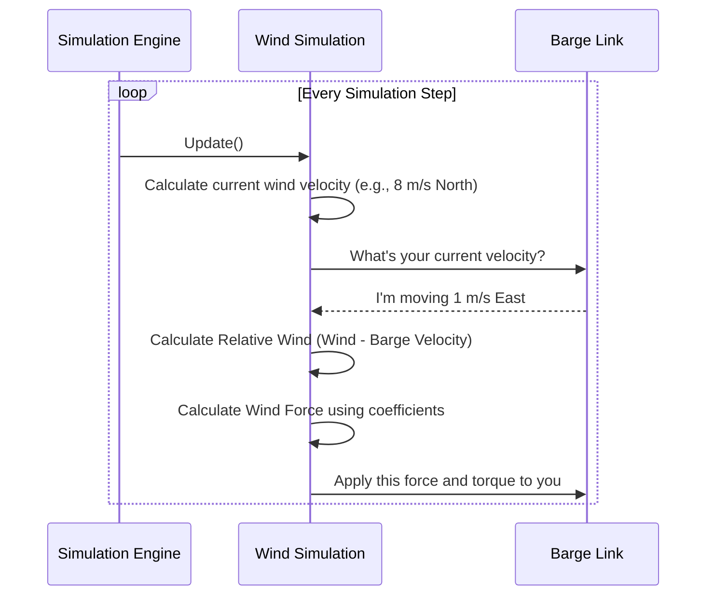

# Chapter 3: Wind Simulation

In the [previous chapter](02_wavefield_simulation_.md), we brought our ocean to life with a dynamic, rolling wavefield. But what often causes waves in the real world? Wind! Now, we'll add another layer of environmental challenge by exploring the **Wind Simulation**.

This component is like an invisible fan in our simulation. It generates a wind velocity that can push our vehicle around, making simple tasks like staying in one place or following a straight line much more difficult. The vehicle's control systems must be smart enough to counteract this constant disturbance, just like a real boat captain would.

Our goal for this chapter is to understand how to create a steady wind that pushes our barge off course.

### The Key Concepts of Wind

To simulate wind realistically, we need to understand two simple but important ideas.

#### 1. Constant and Variable Wind

Just like in the real world, the wind in our simulation can be simple or complex:
*   **Constant Wind:** This is like a steady, predictable breeze. It has a fixed direction and speed. This is great for creating a simple, repeatable challenge.
*   **Variable Wind:** This is more realistic. It includes random gusts and lulls, where the wind speed changes over time around an average value.

For this beginner's guide, we'll focus on setting up a simple, constant wind.

#### 2. Relative Wind: The Wind You *Feel*

This is the most crucial concept. The force a boat feels doesn't depend on the absolute wind speed, but on the **relative wind speed**.

**Analogy: Hand Out of a Car Window**

Imagine you're in a car on a windless day.
*   If the car is stopped and you stick your hand out, you feel nothing.
*   If the car moves at 30 mph, you feel a 30 mph "wind" on your hand.

Now, imagine there's a 10 mph headwind (blowing against you).
*   When you drive at 30 mph into it, your hand feels a much stronger 40 mph wind (30 + 10). The wind you *feel* is the sum of your speed and the actual wind speed.

The `Wind Simulation` works the same way. It constantly calculates the difference between the world's wind velocity and the vehicle's own velocity. This "relative wind" is what's used to determine the force that pushes the boat.

### Putting It to Work: Configuring the Wind

We enable and configure the wind in our world's SDF file, just like we did for waves. We need to tell the simulation two things: which object the wind should affect, and what the properties of the wind are.

Here is a basic configuration to create a wind that blows our barge:

```xml
<plugin filename="vrx::USVWind" name="vrx::USVWind">
  <!-- 1. Define the object to be affected -->
  <wind_obj>
    <name>barge</name>
    <link_name>barge_link</link_name>
    <coeff_vector>25 50 10</coeff_vector>
  </wind_obj>

  <!-- 2. Define the wind's properties -->
  <wind_direction>180</wind_direction>
  <wind_mean_velocity>8.0</wind_mean_velocity>
</plugin>
```

Let's break this down:

1.  **Defining the Affected Object (`<wind_obj>`)**
    *   `<link_name>barge_link</link_name>`: This tells the plugin to apply forces to our barge's main body.
    *   `<coeff_vector>25 50 10</coeff_vector>`: This is the important part! These three numbers are "sensitivity" sliders for how the wind affects the boat.
        *   `25`: Pushing force from the front/back (longitudinal).
        *   `50`: Pushing force from the side (lateral). A higher value here means the wind can more easily push the boat sideways.
        *   `10`: Twisting force (yaw). This determines how much the wind will try to turn the boat.

2.  **Defining the Wind's Properties**
    *   `<wind_direction>180</wind_direction>`: The direction the wind is coming *from*, in degrees. `180` means it's blowing from the South, pushing things North (along the positive Y-axis).
    *   `<wind_mean_velocity>8.0</wind_mean_velocity>`: The average speed of the wind, in meters per second.

With this configuration, our barge will no longer sit still. It will now be constantly pushed sideways by an 8 m/s wind, and we would need to use its thrusters to hold its position.

### Under the Hood: A Step-by-Step Look

How does the simulation translate that configuration into a force? It's a loop that runs continuously.



1.  **Calculate Wind:** The engine first determines the current wind speed and direction in the world.
2.  **Get Vehicle Velocity:** It then asks the barge for its current velocity.
3.  **Calculate Relative Wind:** It subtracts the barge's velocity from the world's wind velocity. This gives the wind the barge actually "feels."
4.  **Calculate Force:** Using the sensitivity sliders (`<coeff_vector>`) we defined, it calculates a force (push) and a torque (twist) based on this relative wind.
5.  **Apply Force:** Finally, it applies that force and torque to the barge, which the main physics simulator uses to update its movement.

### A Peek at the Code

Let's look at some simplified code from `USVWind.cc` to see how this is implemented.

#### 1. Reading the Configuration (`Configure`)

First, the plugin reads our SDF file to get the wind parameters.

```cpp
// In USVWind.cc
void USVWind::Configure(...)
{
  // ...
  if (sdf->HasElement("wind_mean_velocity"))
  {
    this->dataPtr->windMeanVelocity =
        sdf->Get<double>("wind_mean_velocity");
  }

  if (sdf->HasElement("wind_direction"))
  {
    double windAngle = sdf->Get<double>("wind_direction");
    // Convert angle to a direction vector
    this->dataPtr->windDirection.X(cos(windAngle * M_PI / 180));
    this->dataPtr->windDirection.Y(sin(windAngle * M_PI / 180));
  }
  // ...
}
```
This code simply looks for the `<wind_mean_velocity>` and `<wind_direction>` tags in the file and stores their values for later use. It converts the angle in degrees into a mathematical direction vector.

#### 2. Calculating the Force (`PreUpdate`)

In every update step, the plugin calculates and applies the wind force.

```cpp
// In USVWind.cc, inside the PreUpdate loop...

// 1. Get the final wind velocity for this step
double velocity = this->dataPtr->varVel + this->dataPtr->windMeanVelocity;

// 2. Get the vehicle's velocity
auto worldVel = _ecm.ComponentData<sim::components::WorldLinearVelocity>(
  windObj.linkEntity);

// 3. Calculate the relative wind velocity
math::Vector3d relativeWind =
    this->dataPtr->windDirection * velocity - worldVel;

// 4. Calculate the force and torque using the coefficients
math::Vector3d windForce(
    windObj.windCoeff.X() * relativeWind.X() * abs(relativeWind.X()),
    windObj.windCoeff.Y() * relativeWind.Y() * abs(relativeWind.Y()), 0);
// ... more calculations for torque ...

// 5. Apply the force to the barge
_ecm.CreateComponent(windObj.linkEntity, wrench);
```
This snippet follows our diagram perfectly:
1.  It gets the total wind `velocity`.
2.  It gets the vehicle's `worldVel`.
3.  It subtracts them to get `relativeWind`.
4.  It uses the coefficients (`windObj.windCoeff`) to calculate the final `windForce`.
5.  It applies this force to the vehicle's link.

### Conclusion

You've now added another critical piece of environmental realism to our simulation! The **Wind Simulation** acts as a persistent force that challenges the vehicle's stability and control. We've seen how to configure its direction, speed, and effect on our vehicle using a simple SDF plugin.

Our simulated world now has a dynamic water surface thanks to the [Wavefield Simulation](02_wavefield_simulation_.md) and a challenging atmospheric disturbance from the wind. We've built a great environment for testing our vehicle. But how do we measure how well the vehicle is performing its tasks within this environment?

In the next chapter, we will explore the [Scoring Plugin Framework](04_scoring_plugin_framework_.md), which is the system used to grade a vehicle's performance on a given challenge.

---

Generated by [AI Codebase Knowledge Builder](https://github.com/The-Pocket/Tutorial-Codebase-Knowledge)