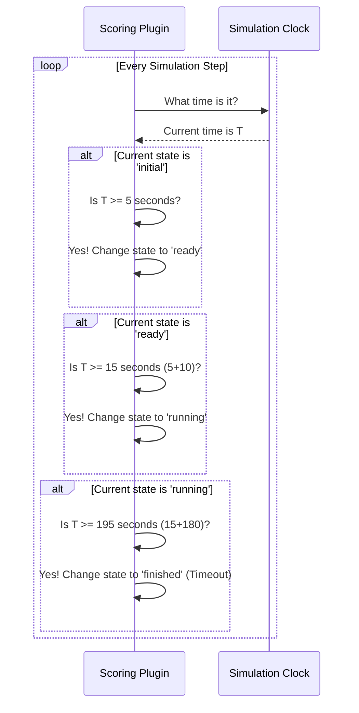

# Chapter 4: Scoring Plugin Framework

In the [previous chapter](03_wind_simulation_.md), we added wind to our simulation, creating a challenging environment with both waves and atmospheric forces. Our world is now a great place to test a vehicle's capabilities. But how do we actually run a test? How do we start a task, time it, and give it a score?

This is where the **Scoring Plugin Framework** comes in. Think of it as the main referee for any VRX competition. It's the system that holds the stopwatch, blows the starting whistle, and records the final score on the scoresheet. It doesn't know the specific rules of every game (like docking vs. navigation), but it provides the universal structure that all games must follow.

Our goal for this chapter is to understand how this framework manages a task's lifecycle and calculates a score. We'll use a simple "station keeping" task as our example, where the goal is to keep the vehicle at a specific location.

### The Big Idea: A Lifecycle for Every Task

Every competition, whether it's a running race or a boat challenge, follows a standard sequence of events. The `Scoring Plugin Framework` formalizes this sequence using a "state machine". A task moves through distinct states, one after another.

Here are the key states in our framework's lifecycle:

1.  **`initial` State (On Your Marks...)**
    *   This is the warm-up phase. The simulation has started, but the clock for the task hasn't. It's a brief period to let everything settle. The vehicle might be held in place during this time.

2.  **`ready` State (Get Set...)**
    *   The vehicle is released and is free to move, but the official task timer has not started yet. This gives the vehicle's control systems a moment to activate and prepare for the challenge.

3.  **`running` State (Go!)**
    *   The whistle blows! The official task timer starts counting down. During this state, the specific rules of the challenge are applied, and the score is actively calculated.

4.  **`finished` State (Time's Up!)**
    *   The task is over, either because time ran out or the vehicle completed the objective. The final score is recorded, and the simulation prepares to end.

This standardized lifecycle ensures that every challenge starts, runs, and ends in a consistent and fair way.

### Putting It to Work: Configuring a Task

Just like our environmental plugins, we configure a scoring plugin in our world's SDF file. This is where we tell the "referee" the basic parameters for the competition.

Let's look at a simplified configuration for our base scoring plugin:

```xml
<plugin filename="vrx::ScoringPlugin" name="vrx::ScoringPlugin">
  <!-- 1. Name the task and the competitor -->
  <task_name>station_keeping</task_name>
  <vehicle>barge</vehicle>
  
  <!-- 2. Set the duration for each state -->
  <initial_state_duration>5</initial_state_duration>
  <ready_state_duration>10</ready_state_duration>
  <running_state_duration>180</running_state_duration>
</plugin>
```

Let's break this down:
1.  **Task and Vehicle:**
    *   `<task_name>`: A simple name for our task, like "station_keeping".
    *   `<vehicle>`: The name of the vehicle model that is being scored, in our case, the `barge`.

2.  **State Durations (The Stopwatch Settings):**
    *   `<initial_state_duration>5</initial_state_duration>`: The task will stay in the `initial` state for 5 seconds.
    *   `<ready_state_duration>10</ready_state_duration>`: After the initial phase, it will be in the `ready` state for 10 seconds.
    *   `<running_state_duration>180</running_state_duration>`: The main task will run for 180 seconds (3 minutes). If the vehicle doesn't finish by then, it times out.

With just this configuration, the framework will automatically manage the task's lifecycle, transitioning through the states based on the simulation time.

### Under the Hood: The State Machine in Action

What is the framework actually doing during the simulation? It's constantly checking the clock and changing the task's state when the time is right.

Here's a simplified look at the logic:



1.  **Check Time:** In every update, the plugin gets the current simulation time.
2.  **Compare and Transition:** It compares this time against the pre-calculated transition times (`readyTime`, `runningTime`, `finishTime`).
3.  **Execute State Logic:** When a transition happens, it calls a special function (like `OnReady()` or `OnRunning()`) that allows specific challenge plugins to react to the new state. For example, when the state becomes `running`, the actual scoring calculations begin.

### A Peek at the Code

Let's see how these ideas are implemented in the base `ScoringPlugin.cc`.

#### 1. Reading the Durations (`ScoringPlugin.cc`)

The `Configure` function reads the SDF file and calculates the absolute times for each state transition.

```cpp
// In ScoringPlugin.cc, inside the Configure function
void ScoringPlugin::Configure(...)
{
  // ... reads <task_name> and <vehicle> ...

  // Read the duration for each state from the SDF file
  this->dataPtr->initialStateDuration = 
    _sdf->Get<double>("initial_state_duration");
  this.dataPtr->readyStateDuration = 
    _sdf->Get<double>("ready_state_duration");
  this.dataPtr->runningStateDuration = 
    _sdf->Get<double>("running_state_duration");

  // Calculate the absolute time for each transition
  this->dataPtr->readyTime =
    std::chrono::duration<double>(this->dataPtr->initialStateDuration);
  this->dataPtr->runningTime = this->dataPtr->readyTime +
    std::chrono::duration<double>(this->dataPtr->readyStateDuration);
  // ... and so on for finishTime
}
```
This code simply grabs the duration values we set in the XML and adds them up to determine the exact simulation time at which each state change should occur.

#### 2. Managing the Lifecycle (`ScoringPlugin.cc`)

The `UpdateTaskState` function, called in every simulation step, acts as the core of our state machine.

```cpp
// In ScoringPlugin.cc, inside the main update loop...
void ScoringPlugin::UpdateTaskState()
{
  // If we are 'initial' and the time is past readyTime...
  if (this->dataPtr->taskState == "initial" &&
      this->dataPtr->currentTime >= this->dataPtr->readyTime)
  {
    this->dataPtr->taskState = "ready";
    this->OnReady(); // Call the hook for the 'ready' state
    return;
  }
  
  // If we are 'ready' and the time is past runningTime...
  if (this->dataPtr->taskState == "ready" &&
      this->dataPtr->currentTime >= this->dataPtr->runningTime)
  {
    this->dataPtr->taskState = "running";
    this->OnRunning(); // Call the hook for the 'running' state
    return;
  }
  // ... more checks for 'running' -> 'finished' ...
}
```
This is the logic from our diagram turned into code. It's a simple series of `if` statements that check the time and change the `taskState` variable accordingly.

### Extending the Framework: Adding the Rules

So far, our referee knows *when* to run the game, but not *how* to score it. This is where specific scoring plugins come in. A plugin like `StationkeepingScoringPlugin.cc` **inherits** from our base `ScoringPlugin` and adds its own unique scoring logic.

The child plugin overrides the `PreUpdate` function to calculate its score, but it makes sure to call the base plugin's `PreUpdate` first to handle the state transitions.

Here's a very simplified example from `StationkeepingScoringPlugin.cc`:

```cpp
// In StationkeepingScoringPlugin.cc
void StationkeepingScoringPlugin::PreUpdate(...)
{
  // 1. Let the referee manage the clock and states first
  ScoringPlugin::PreUpdate(_info, _ecm);

  // 2. If the game isn't running, do nothing
  if (this->TaskState() != "running")
    return;
  
  // 3. Apply the specific rules for this challenge
  // Get the vehicle's position
  auto vehiclePose = ...; 
  // Calculate distance from the goal
  double dist = vehiclePose.Pos().Distance(this->dataPtr->goal);
  
  // 4. Update the official score
  this->SetScore(dist);
}
```
This is the key to the whole framework!
1.  It first calls `ScoringPlugin::PreUpdate` to let the base class handle the state machine logic.
2.  It then checks if the task is in the `running` state.
3.  If it is, it performs its specific calculations (like finding the distance to a goal point).
4.  Finally, it calls `this->SetScore(dist)`, telling the base framework to update the official score on the scoreboard.

### Conclusion

Congratulations! You now understand the backbone of all VRX challenges. The **Scoring Plugin Framework** acts as a universal referee, managing the task lifecycle through `initial`, `ready`, `running`, and `finished` states. It provides a standardized structure for timing and scoring.

We saw that specific challenges are built by creating new plugins that inherit from this base framework. They add their own unique "rulebooks" by implementing scoring logic that runs only during the `running` state.

But how do these plugins actually check the rules? How does the station keeping plugin know if the vehicle is in the right spot, or how does a navigation plugin know if the vehicle has passed through a gate? This is handled by a set of powerful tools we will explore in the next chapter: [Task Logic & State Checkers](05_task_logic___state_checkers_.md).

---

Generated by [AI Codebase Knowledge Builder](https://github.com/The-Pocket/Tutorial-Codebase-Knowledge)