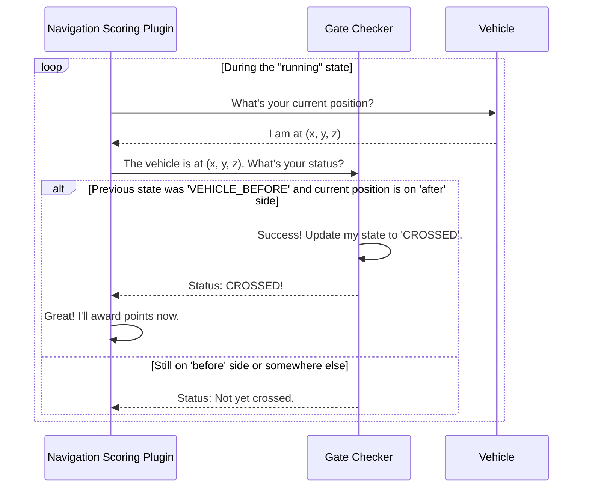

# Chapter 5: Task Logic & State Checkers

In the [last chapter](04_scoring_plugin_framework_.md), we learned about the [Scoring Plugin Framework](04_scoring_plugin_framework_.md), our main "referee" that manages the start, stop, and timing of a task. The referee knows *when* the game is running, but it doesn't know the specific rules of the game itself. For example, how do we know if a boat has successfully passed *between* two buoys? How do we check if it has parked correctly in a docking bay?

This is where **Task Logic & State Checkers** come in. These are specialized sub-systems that act like the linesmen or umpires in a sports game. Each checker has a very specific job: to watch for one particular event and report back to the main referee (the Scoring Plugin) when it happens.

Our goal for this chapter is to understand how these checkers work by looking at one of the most common examples: a **Gate Checker** for a navigation task.

### The Big Idea: A Team of Specialized Officials

Think of a complex task like a soccer match.
*   **The Referee (Scoring Plugin):** This is the main official. They hold the stopwatch, start and end the game, and are the final authority on the score.
*   **The Linesmen (State Checkers):** These officials are positioned along the sides of the field. They have one primary job: to watch if the ball goes out of bounds. When it does, they raise their flag to notify the referee. They don't worry about fouls or the game clock; they just focus on their one specific task.

Our state checkers work exactly the same way. We have different types of checkers for different tasks:
*   A `Gate` checker determines if the boat has passed between two markers.
*   A `DockChecker` monitors if the boat is correctly parked for a certain amount of time.
*   A `Buoy` checker can track if a boat has successfully circled a buoy.

Each scoring plugin assembles a "team" of these checkers to help it judge the task correctly.

### Putting It to Work: The Navigation Gate

Let's imagine a simple navigation task: the boat must pass through a gate made of two buoys. The `NavigationScoringPlugin` is the referee, but it needs a `Gate` checker to act as its linesman.

The scoring plugin's job is simple:
1.  During setup, it creates a `Gate` checker object, telling it which two buoys form the gate.
2.  During the `running` state of the task, it repeatedly asks the `Gate` checker a simple question in every simulation update: "Has the vehicle crossed you yet?"
3.  When the `Gate` checker finally answers "Yes!", the scoring plugin awards points and moves on.

This separation of duties is powerful. The scoring plugin doesn't need to know any complex geometry; it just needs to trust its specialized checker to do its job.

### Under the Hood: How Does a Gate Checker Think?

So, what's the logic inside the `Gate` checker? How does it decide if the boat has passed through? The core idea is to figure out which side of the gate the boat is on.

A gate is just an invisible line drawn between two markers. The checker defines a "before" side and an "after" side.

1.  When the task starts, the boat is on the **"before"** side. The checker's internal state is `VEHICLE_BEFORE`.
2.  As the boat moves, the checker constantly checks its position.
3.  The moment the boat's position moves across the line to the **"after"** side, the checker knows a crossing has occurred! It changes its internal state to `CROSSED` and reports this success back to the scoring plugin.

Here’s a look at the conversation between the plugins:



### A Peek at the Code

Let's see how this is implemented. The code is spread across a few places, but the ideas are straightforward.

#### 1. Defining the Checker (`NavigationScoringPlugin.cc`)

First, the `NavigationScoringPlugin` has a helper class inside it called `Gate`. This class is our checker. It holds all the information for one gate, like the names of its markers and its current state.

```cpp
// In NavigationScoringPlugin.cc
class Gate
{
public:
  // Names of the buoys that form the gate
  std::string leftMarkerName;
  std::string rightMarkerName;

  // The state of this gate (e.g., VEHICLE_BEFORE, CROSSED)
  GateState state = GateState::VEHICLE_OUTSIDE;

  // The main logic function
  GateState IsPoseInGate(const math::Pose3d &_robotWorldPose) const;
};
```
This is the blueprint for our linesman. Each `Gate` object is an independent checker responsible for one gate on the course.

#### 2. The Core Logic: "Which Side Are You On?" (`NavigationScoringPlugin.cc`)

The most important part of the checker is the `IsPoseInGate` function. It takes the vehicle's position and returns whether it's on the "before" or "after" side. The math can be tricky, but the concept is simple.

```cpp
// In NavigationScoringPlugin.cc's Gate class
GateState Gate::IsPoseInGate(const math::Pose3d &_robotWorldPose) const
{
  // ... do some math to get the robot's position relative to the gate ...
  const math::Vector3d robotLocalPosition = /* ... complex math here ... */;
  
  // Is the robot on the "after" side (positive X in the gate's frame)?
  if (robotLocalPosition.X() >= 0.0)
    return GateState::VEHICLE_AFTER;
  else // Otherwise, it must be on the "before" side
    return GateState::VEHICLE_BEFORE;
}
```
This function is the "eyes" of our linesman. It constantly watches the vehicle and determines its position relative to the gate line.

#### 3. Using the Checker (`NavigationScoringPlugin.cc`)

Finally, the main `NavigationScoringPlugin` uses its `Gate` checker in its update loop. This is where the referee asks the linesman for a decision.

```cpp
// In NavigationScoringPlugin::PreUpdate...
Implementation::Gate &gate = this->dataPtr->gates[i];

// Ask the gate for its analysis of the vehicle's current pose
auto currentState = gate.IsPoseInGate(vehiclePose);
    
// If the last known state was 'before' and the current is 'after'...
if (currentState == GateState::VEHICLE_AFTER &&
    gate.state == GateState::VEHICLE_BEFORE)
{
  // ... then the gate has been crossed!
  gate.state = GateState::CROSSED;
  this->SetScore(this->Score() + pointsPerGateCrossed);
}
```
This code perfectly shows the teamwork: the scoring plugin gets the `currentState` from its helper checker and then decides if a scoring event has occurred based on the change in state.

### Another Example: The `DockChecker`

This pattern of using specialized checkers is very common. The `ScanDockScoringPlugin`, for example, uses a `DockChecker`.

The `DockChecker`'s job is different. It doesn't care about crossing a line. Instead, it needs to:
1.  Detect when the vehicle *enters* a docking bay.
2.  Start a timer.
3.  Report success only after the vehicle has *stayed* inside the bay for a minimum amount of time.

The `ScanDockScoringPlugin` uses it in the same way:

```cpp
// In ScanDockScoringPlugin.cc
// For each dock checker in the task...
dockChecker->Update(_info);
    
// Ask the checker if the boat has fulfilled the docking criteria
if (dockChecker->AnytimeDocked())
{
  // Points granted for a successful dock!
  this->SetScore(this->Score() + this->dataPtr->dockBonusPoints);
  this->Finish();
}
```
Once again, the main scoring plugin delegates the complex logic ("have you been in the bay long enough?") to its specialized helper.

### Conclusion

You've now learned about the "special forces" of our task system! **Task Logic & State Checkers** are helper objects that contain the specific rules for individual parts of a challenge. They act as vigilant linesmen, each watching for a single type of event, whether it's crossing a gate, docking in a bay, or circling a buoy.

This design keeps our main [Scoring Plugin Framework](04_scoring_plugin_framework_.md) clean and simple, allowing it to act as a general-purpose referee while the checkers handle the nitty-gritty details.

In our `DockChecker` example, we mentioned that it detects when a vehicle enters an "activation zone." What are these zones? They are a type of invisible, interactive object in our world. In the next chapter, we'll explore these and other [Interactive Task Elements](06_interactive_task_elements_.md).

---

Generated by [AI Codebase Knowledge Builder](https://github.com/The-Pocket/Tutorial-Codebase-Knowledge)