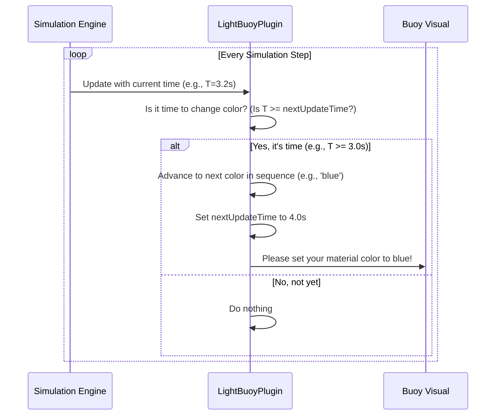

# Chapter 6: Interactive Task Elements

In the [last chapter](05_task_logic___state_checkers_.md), we learned how specialized "umpires" like the Gate Checker help our main referee know if a task rule has been met. These checkers often monitor the vehicle's interaction with objects in the world, like buoys or docking bays. But what makes these objects more than just static obstacles? What gives them a "personality"?

This is where **Interactive Task Elements** come in. These are the dynamic "props" in our simulation world that bring challenges to life. They aren't just passive objects; they actively send signals that the robot must perceive and react to. Think of them as the traffic lights, electronic signs, and hidden beacons of our simulated ocean.

Our goal for this chapter is to understand how we can create a buoy that flashes a sequence of colors, forming a simple perception challenge for our robot.

### The Big Idea: Giving Objects a Brain

Most objects in a simulation are simple—a rock is just a rock. But some objects need to be "smart." A traffic light needs to cycle through red, yellow, and green. A warning buoy might flash a light. An emergency beacon might emit a sound.

Our framework provides special plugins that we can attach to simple models to give them these smart, dynamic behaviors. These are the core pieces of our perception challenges. There are three main types:

1.  **The Flashing Light (`LightBuoyPlugin`):** This plugin makes an object flash a sequence of colors. It's perfect for tasks where the robot must identify a light pattern.
2.  **The Changing Sign (`PlacardPlugin`):** This plugin makes an object display different symbols and colors, like a digital sign. This is used for tasks where a robot must identify both a shape and a color.
3.  **The Invisible Sound (`AcousticPingerPlugin`):** This plugin makes an object emit a trackable acoustic "ping." A robot with the right sensor can use this signal to find a hidden or submerged target.

Let's focus on the `LightBuoyPlugin` to see how these elements work.

### Putting It to Work: Creating a Flashing Buoy

Imagine a task where the robot must approach a buoy and report the sequence of colors it flashes. To set this up, we take a normal buoy model and attach the `LightBuoyPlugin` to it in our world's SDF file.

Here’s a simple configuration for a buoy that flashes Red, Green, and then Blue.

```xml
<plugin filename="vrx::LightBuoyPlugin" name="vrx::LightBuoyPlugin">
  <!-- 1. Define the color sequence -->
  <color_1>red</color_1>
  <color_2>green</color_2>
  <color_3>blue</color_3>

  <!-- 2. Tell the plugin which visual part to change -->
  <visuals>
    <visual>buoy_light_visual</visual>
  </visuals>
</plugin>
```

Let's break this down:
1.  **The Color Sequence:**
    *   `<color_1>red</color_1>`: The first color in the sequence is red.
    *   `<color_2>green</color_2>`: The second is green.
    *   `<color_3>blue</color_3>`: The third is blue.
    The plugin will automatically flash each color for one second, followed by two seconds of being "off," and then repeat the cycle.

2.  **The Target Visual:**
    *   `<visual>buoy_light_visual</visual>`: This tells the plugin which specific part of the buoy model should change color. In this case, it's a part named `buoy_light_visual`.

That's it! When you run the simulation, this buoy will come to life, flashing its programmed sequence, creating a dynamic challenge for a robot's camera to solve.

### Under the Hood: The Plugin's Internal Clock

How does the buoy "know" when to change color? The plugin has a simple internal state machine that works like a metronome.



1.  **Check Time:** In every simulation update, the plugin checks the current simulation time.
2.  **Compare to Schedule:** It compares the current time to its scheduled `nextUpdateTime`.
3.  **Update Color:** If enough time has passed (e.g., one second), it advances to the next color in its stored sequence (`red` -> `green` -> `blue` -> `off` -> `off`).
4.  **Change Visual:** It then tells the simulation's rendering engine to change the material color of the target visual.
5.  **Reschedule:** Finally, it sets its `nextUpdateTime` one second into the future and waits.

This simple loop creates the steady, predictable flashing pattern that the robot can observe.

### A Peek at the Code

Let's see how these ideas look in the code.

#### 1. Reading the Sequence (`LightBuoyPlugin.cc`)

The `ParseSDF` function reads the configuration and stores the color sequence.

```cpp
// In LightBuoyPlugin.cc
bool LightBuoyPlugin::Implementation::ParseSDF(sdf::ElementPtr _sdf)
{
  // ...
  // Read the <color_1> tag from the SDF file
  auto color = _sdf->GetElement("color_1")->Get<std::string>();

  // Store it as the first element in our pattern array
  this->pattern[0] = color;
  
  // ... repeats for color_2 and color_3 ...
  return true;
}
```
This code simply looks for the `<color_1>` element in the file and saves its string value ("red") into an internal array that holds the sequence.

#### 2. Flashing the Light (`LightBuoyPlugin.cc`)

The `Update` function contains the timer logic we saw in the diagram. It's called very frequently by the rendering engine.

```cpp
// In LightBuoyPlugin.cc, inside the Update function
void LightBuoyPlugin::Implementation::Update()
{
  // If it's not time to update yet, do nothing.
  if (this->currentTime < this->nextUpdateTime)
    return;

  // It's time! Schedule the next update for 1 second from now.
  this->nextUpdateTime += std::chrono::duration<double>(1.0);

  // Get the next color from our sequence (e.g., "red")
  auto colorName = this->pattern[this->state];
  auto color = this->kColors[colorName];

  // Tell the visual to change to this color
  mat->SetDiffuse(gazeboColor);

  // Move to the next state for the next time
  ++this->state;
}
```
This is the heart of the plugin. It checks the time, gets the next color from its pattern, applies it to the visual's material (`mat`), and increments its state for the next cycle.

### Other Interactive Elements

The same principles apply to our other interactive elements.

*   **`PlacardPlugin`**: Instead of just a color sequence, its configuration defines a default shape and color. It works just like the `LightBuoyPlugin` but changes which shape is visible and what color it has.

    ```xml
    <plugin filename="vrx::PlacardPlugin" name="vrx::PlacardPlugin">
      <shape>circle</shape>
      <color>blue</color>
      <visuals>
        <visual>placard_circle_visual</visual>
        <visual>placard_triangle_visual</visual>
      </visuals>
    </plugin>
    ```

*   **`AcousticPingerPlugin`**: This one is different because it's not visual. Its configuration defines its location and how often it "pings." Instead of changing a color, its `Update` function calculates the direction and distance to the robot and publishes that data on a topic for a sensor to "hear."

    ```xml
    <plugin filename="vrx::AcousticPingerPlugin" name="vrx::AcousticPingerPlugin">
      <position>10 20 -15</position>
      <update_rate>5.0</update_rate> <!-- Pings 5 times per second -->
      <topic>/pinger/range_bearing</topic>
    </plugin>
    ```

### Conclusion

You've now seen how we bring our simulation challenges to life! **Interactive Task Elements** are special plugins that give ordinary models dynamic behaviors. By making buoys flash colors, signs change symbols, and hidden objects emit signals, we create the rich perception problems that are at the core of robotics competitions.

These plugins are the "game pieces" that the robot must observe. But how does a robot's camera reliably *see* these objects in a complex 3D world, especially from far away or in difficult lighting? In the next chapter, we'll look at a system that helps with this: [Visual Markers](07_visual_markers_.md).

---

Generated by [AI Codebase Knowledge Builder](https://github.com/The-Pocket/Tutorial-Codebase-Knowledge)