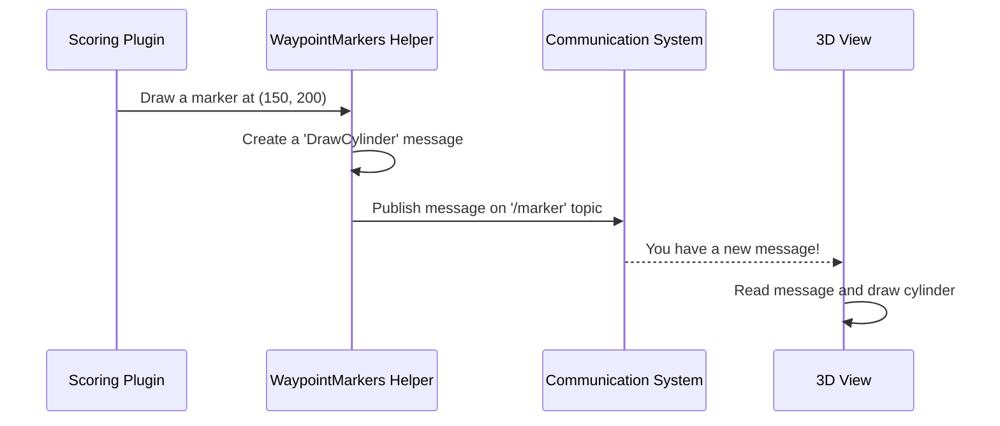

# Chapter 7: Visual Markers

In the [last chapter](06_interactive_task_elements_.md), we saw how we can create dynamic "props" like flashing buoys that a robot must perceive to complete a challenge. These are objects that are physically present for the robot's sensors. But what about us, the humans running or watching the simulation? How can we get a better view of what's happening?

Sometimes, we need to draw things in the world that aren't real objects. Think of the yellow "first down" line in an American football broadcast—it's not actually painted on the field, but it's a crucial visual aid for the viewers. This is where **Visual Markers** come in. They are a helper system for drawing simple shapes in the simulation that are purely for visualization. They have no physical presence and can't be collided with.

Our goal for this chapter is to understand how a scoring plugin can draw a bright cylinder in the water to show us the goal location for a "station keeping" task.

### The Big Idea: Drawing on the Field

Imagine you're coaching a team. You might draw plays on a whiteboard with circles and arrows to show players where to go. These drawings aren't the players themselves; they are just symbols that provide guidance and context.

Visual Markers work the same way inside our simulation. They are a simple system that lets our scoring plugins "draw" things in the 3D world. These markers are used to:
*   Show the location of a target waypoint.
*   Highlight a finish line or a gate.
*   Draw a path for the vehicle to follow.

They are visual aids for the human operator, developer, or competition viewer. The vehicle itself doesn't "see" them with its sensors; it's like they're invisible to the robot but visible to us.

### Putting It to Work: Marking a Goal

Let's go back to our "station keeping" task from a previous chapter. The goal is for the vehicle to stay at a specific coordinate, say (X=150, Y=200). How can we visualize this target point?

The `StationkeepingScoringPlugin` can use the Visual Marker system to draw a bright, tall cylinder at that exact spot. To do this, we add a special `<markers>` block to the plugin's configuration in the SDF file.

```xml
<!-- Inside StationkeepingScoringPlugin's configuration -->
<markers>
  <scaling>0.2 0.2 1.5</scaling>
  <height>4.0</height>
</markers>
```

Let's break down this simple configuration:
*   `<scaling>0.2 0.2 1.5</scaling>`: This defines the size of our cylinder marker. It will have a radius of 0.2 meters and be 1.5 meters tall.
*   `<height>4.0</height>`: This sets the vertical position of the marker. The base of the cylinder will be 4 meters above the water level, making it easy to see.

With just this small addition, the scoring plugin now knows it should create a visual marker for its goal.

### Under the Hood: A Message to the GUI

How does the scoring plugin, which is a physics-based system, tell the graphical user interface (GUI) to draw a shape? It doesn't have a direct connection. Instead, it uses the simulation's underlying communication system to send a message.

Think of it like sending a text message. The scoring plugin doesn't need to know how the phone's screen works. It just creates a message with the content ("draw a cylinder at this location") and sends it to a specific address. A different part of the simulation, the Marker System, is always listening at that address. When it receives the message, it handles the job of actually drawing the shape in the 3D view.



1.  **Request:** The `StationkeepingScoringPlugin` calls a function in its helper object, `WaypointMarkers`.
2.  **Create Message:** The `WaypointMarkers` helper creates a structured message containing all the details: shape type (cylinder), position (150, 200, 4), size (0.2, 0.2, 1.5), color, etc.
3.  **Publish:** It sends this message out over the simulation's communication system on a topic named `/marker`.
4.  **Receive and Draw:** The simulation's GUI is subscribed to the `/marker` topic. It receives the message and follows its instructions to render a new cylinder in the world.

### A Peek at the Code

Let's see how this process looks in the code.

#### 1. Requesting the Marker (`StationkeepingScoringPlugin.cc`)

Inside the `Configure` function, the scoring plugin loads the marker settings from the SDF and then calls the `DrawMarker` function.

```cpp
// In StationkeepingScoringPlugin.cc, inside Configure...
if (_sdf->HasElement("markers"))
{
  this->dataPtr->waypointMarkers.Load(_sdf->Clone()->GetElement("markers"));
  
  // Tell the helper to draw the marker at the goal's location
  if (!this->dataPtr->waypointMarkers.DrawMarker(0,
         this->dataPtr->goalX, this->dataPtr->goalY, this->dataPtr->goalYaw))
  {
    gzerr << "Error creating visual marker" << std::endl;
  }
}
```
This code shows the teamwork. The scoring plugin itself doesn't know *how* to draw. It just reads its configuration and then delegates the job to its specialized helper, `waypointMarkers`.

#### 2. Building and Sending the Message (`WaypointMarkers.cc`)

This is where the real work happens. The `DrawMarker` function in the `WaypointMarkers` class builds the message and sends it.

```cpp
// In WaypointMarkers.cc
bool WaypointMarkers::DrawMarker(int _markerId, double _x, double _y, ...)
{
  // 1. Create a blank marker message
  msgs::Marker markerMsg;
  markerMsg.set_action(msgs::Marker_Action_ADD_MODIFY);
  
  // 2. Set the shape and its properties
  markerMsg.set_type(msgs::Marker_Type_CYLINDER);
  msgs::Set(markerMsg.mutable_scale(), this->scaling);
  msgs::Set(markerMsg.mutable_pose(), math::Pose3d(_x, _y, this->height, 0, 0, 0));
  markerMsg.set_id(_markerId);

  // 3. Send the message to the '/marker' topic
  bool result = node.Request("/marker", markerMsg);
  return result;
}
```
This snippet is the core of the whole system:
1.  It creates a `msgs::Marker` object, which is the "envelope" for our request.
2.  It fills in the details: it's a `CYLINDER`, and here are its `scale` (size) and `pose` (position).
3.  Finally, it calls `node.Request("/marker", markerMsg)`, which sends our completed message to the GUI for drawing.

Other plugins, like `WayfindingScoringPlugin` and `AcousticPerceptionScoringPlugin`, use this exact same helper class to draw their own waypoints and targets, making it a powerful and reusable tool.

### Conclusion

Congratulations! You've reached the end of the `src` tutorial. In this final chapter, we learned about **Visual Markers**, a simple yet essential system for adding visual context to our simulations. They act as non-physical annotations, allowing us to see goals, boundaries, and paths clearly.

Over the course of these seven chapters, you have journeyed from the fundamental physics of water to the complex logic of scoring a competition task:
*   You started by making a boat float with the [Hydrodynamics & Buoyancy Engine](01_hydrodynamics___buoyancy_engine_.md).
*   You brought the world to life with [Wavefield Simulation](02_wavefield_simulation_.md) and [Wind Simulation](03_wind_simulation_.md).
*   You learned how tasks are timed and managed by the [Scoring Plugin Framework](04_scoring_plugin_framework_.md).
*   You saw how specific rules are checked with [Task Logic & State Checkers](05_task_logic___state_checkers_.md).
*   You created perception challenges using [Interactive Task Elements](06_interactive_task_elements_.md).
*   And finally, you learned how to visualize it all with Visual Markers.

You now have a solid foundation for understanding how `src` works and are well-equipped to start exploring, modifying, and creating your own maritime challenges. Happy simulating

---

Generated by [AI Codebase Knowledge Builder](https://github.com/The-Pocket/Tutorial-Codebase-Knowledge)