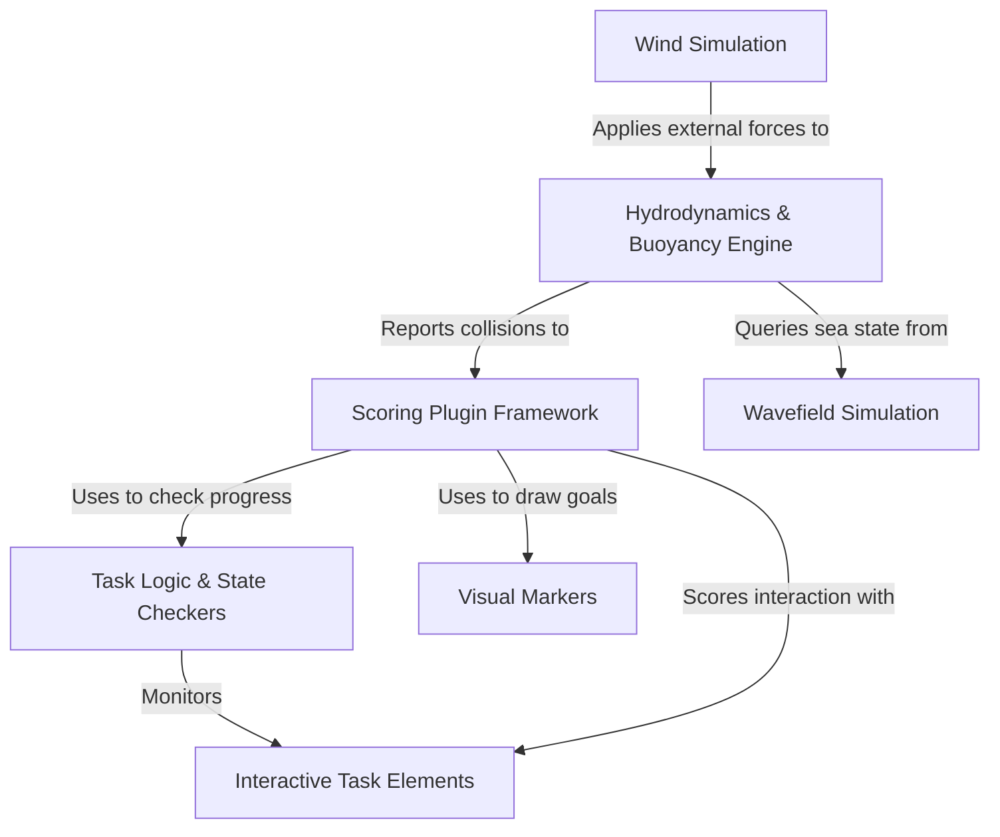

# Tutorial: src

This project is a *simulation framework* for maritime robotics competitions, specifically for the Virtual RobotX (VRX) challenge. It provides a realistic virtual environment where a robotic boat operates under the influence of environmental factors like **simulated waves** and **wind**. The core of the project is a flexible **scoring system** that manages different tasks, such as navigation and docking, by tracking the vehicle's progress and applying rules. The vehicle's movement is governed by a detailed **hydrodynamics engine** that simulates buoyancy and drag, creating a lifelike experience for testing robot autonomy.

**Source Repository:** [None](None)

## Chapters

1. [Hydrodynamics & Buoyancy Engine
](01_hydrodynamics___buoyancy_engine_.md)
2. [Wavefield Simulation
](02_wavefield_simulation_.md)
3. [Wind Simulation
](03_wind_simulation_.md)
4. [Scoring Plugin Framework
](04_scoring_plugin_framework_.md)
5. [Task Logic & State Checkers
](05_task_logic___state_checkers_.md)
6. [Interactive Task Elements
](06_interactive_task_elements_.md)
7. [Visual Markers
](07_visual_markers_.md)

---

Generated by [AI Codebase Knowledge Builder](https://github.com/The-Pocket/Tutorial-Codebase-Knowledge)