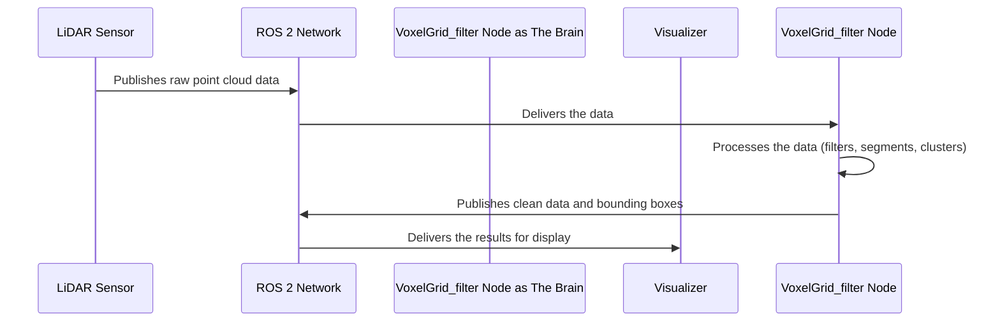

# Chapter 2: VoxelGrid_filter ROS 2 Node

In the [previous chapter](01_ros_2_parameterization_.md), we learned how to use parameters to create a "settings menu" for our program. This allows us to easily tune our LiDAR processing without ever touching the C++ code.

Now, let's pull back the curtain and meet the main character of our project: the `VoxelGrid_filter` ROS 2 node.

### The Brain of the Operation

Imagine our Unmanned Surface Vehicle (USV) is a living creature. The LiDAR sensor is its eyes, constantly seeing the world in a flurry of points. But just having eyes isn't enough; you need a brain to make sense of what you're seeing.

The `VoxelGrid_filter` node is the brain of our perception system. It performs three critical jobs:

1.  **Listens (Subscribes):** It listens for the raw data coming from the LiDAR sensor's "eyes."
2.  **Thinks (Processes):** It runs a series of steps to clean up the data, remove the unimportant ground (water surface), and identify distinct objects.
3.  **Speaks (Publishes):** It announces its findings, like "I see two objects here and here," so that other parts of the robot (or a human operator) can use this information.

In ROS 2 terminology, a **node** is simply an executable program. Our `clustering_segmentation` executable runs this `VoxelGrid_filter` node.

### A Day in the Life of the Node

Let's visualize the flow of information. It's like a simple reflex arc in a nervous system.



This entire cycle happens many times per second. Our node is constantly listening, thinking, and speaking to provide a real-time understanding of the environment.

### A Look Inside the Code

Let's peek inside the `src/clustering_segmentation.cpp` file to see how this brain is constructed. We'll focus on the three main jobs.

#### 1. Listening for LiDAR Data (The Subscriber)

The first thing a brain needs is sensory input. In the constructor of our `VoxelGrid_filter` class, we set up a "subscriber." A subscriber tunes into a specific channel (called a **topic** in ROS) to receive messages.

**File:** `src/clustering_segmentation.cpp`
```cpp
// Inside the VoxelGrid_filter() constructor...

/* Subscriptions */
subscription_ =
this->create_subscription<sensor_msgs::msg::PointCloud2>(
  "velodyne_points", 10, std::bind(&VoxelGrid_filter::timer_callback, this, std::placeholders::_1));
```

This small block of code does a lot:
- `create_subscription`: This is the function that creates our "ear."
- `"velodyne_points"`: This is the name of the topic we are listening to. It's like tuning a radio to the "LiDAR Data" station.
- `&VoxelGrid_filter::timer_callback`: This is the most important part. It tells the node, **"Whenever you hear a message on this topic, immediately run the `timer_callback` function."**

#### 2. Thinking About the Data (The Callback)

The `timer_callback` function is the heart of our node. It's the "thinking" part of the brain that gets triggered every time a new LiDAR scan arrives.

The function itself is quite long, because it contains the entire processing workflow. For now, we'll just look at its signature and a simplified overview of its job.

**File:** `src/clustering_segmentation.cpp`
```cpp
void timer_callback(const sensor_msgs::msg::PointCloud2::SharedPtr input_cloud)
{
  // This is where all the magic happens!

  // Step 1: Clean up the raw data from input_cloud.
  // We'll cover this in the Point Cloud Processing Pipeline chapter.

  // Step 2: Remove the ground/water surface.
  // We'll cover this in the Planar Segmentation chapter.

  // Step 3: Group remaining points into objects.
  // We'll cover this in the Euclidean Clustering chapter.

  // Step 4: Publish the results for others to see.
}
```
This function receives the `input_cloud` (the raw data from the LiDAR) and guides it through our entire perception pipeline. We will explore each of these steps in detail in the upcoming chapters.

#### 3. Speaking the Results (The Publishers)

Once the brain has processed the information, it needs to share its conclusions. It does this using "publishers." A publisher sends messages out on a specific topic for any other node to hear.

**File:** `src/clustering_segmentation.cpp`
```cpp
// Inside the VoxelGrid_filter() constructor...

/* Publishers */
clusters_seg_pub =
  this->create_publisher<sensor_msgs::msg::PointCloud2>("/clusters", 10);

boxes_pub =
  this->create_publisher<visualization_msgs::msg::MarkerArray>("boxes_marker_array", 10);
```

Here, we're setting up two "mouths":
- `clusters_seg_pub`: This publisher will broadcast the final, cleaned-up point cloud showing only the detected objects on the `/clusters` topic.
- `boxes_pub`: This publisher will broadcast the visualization markers (the colorful boxes) on the `boxes_marker_array` topic. This is what lets us see the bounding boxes in RViz.

### Conclusion

In this chapter, we met the `VoxelGrid_filter` node, the central orchestrator of our project. We learned that it functions like a brain, performing three key tasks:
- **Subscribing** to raw sensor data.
- **Processing** that data in a callback function.
- **Publishing** the results for other tools to use.

This subscribe-process-publish pattern is one of the most common and fundamental designs in all of robotics programming.

Now that we understand the overall structure of our node, it's time to dive into the first step of its "thinking" process.

[Next Chapter: Point Cloud Processing Pipeline](03_point_cloud_processing_pipeline_.md)

---

Generated by [AI Codebase Knowledge Builder](https://github.com/The-Pocket/Tutorial-Codebase-Knowledge)