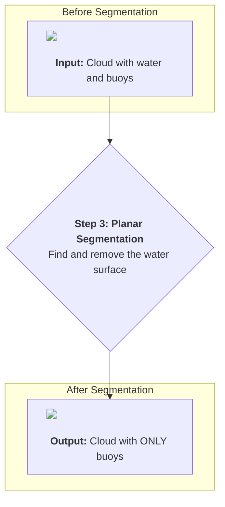

# Chapter 4: Planar Segmentation (Ground Removal)

In the [previous chapter](03_point_cloud_processing_pipeline_.md), we saw the entire assembly line for our LiDAR data, the **Point Cloud Processing Pipeline**. We're now ready to zoom in on one of the most important stages of that assembly line: removing the ground.

### Ignoring the Sand to Find the Seashells

Imagine you are walking on a beach, looking for beautiful seashells. Your eyes see everything: the sand, the waves, the sky, and the shells. If you wanted to find the shells, what would your brain do? It would automatically learn to *ignore* the sand. The sand is the background, the "ground floor" of the scene. It's not what you're interested in.

Our USV's LiDAR has the same problem. It sees thousands of points that make up the flat surface of the water. This is the single biggest "object" in the scene, but it's not an obstacle. We need to teach our robot to ignore the water, just like a beachcomber ignores the sand.

This process of finding the biggest, flattest surface and removing it is called **Planar Segmentation**.



### How to Find a Plane in a Cloud of Points?

How can a computer look at a chaotic cloud of 3D points and find a perfect, flat surface? It uses a clever algorithm called **RANSAC**, which stands for **RAN**dom **SA**mple **C**onsensus.

It sounds complicated, but the idea is simple. Let's imagine you're a detective trying to find a hidden flat table in a room full of floating dust particles. Here's how you'd do it with RANSAC:

1.  **Guess:** You randomly pick just three dust particles. Three points are all you need to define a flat plane. This is your "hypothesis" or your guess for where the table is.
2.  **Verify:** You then check all the *other* dust particles in the room. You count how many of them are very close to the imaginary plane you just created. These "supporting" points are called **inliers**.
3.  **Repeat:** You throw away your first guess and repeat the process. You pick three *new* random particles, make a new plane, and count its inliers. You do this hundreds of times.
4.  **Decide:** After many rounds, you look at your scores. The plane that had the most inliers—the most supporting dust particles—is almost certainly the real table! This is the "consensus" part. The majority of points agree on this plane.

This is exactly what our node does. It repeatedly guesses a plane and checks how many points from the LiDAR scan support it. The guess with the most support is declared the water surface.

### The Code: A Step-by-Step Guide

Let's look at how this is implemented in our `timer_callback` function. The process involves a few steps: setting up the tools, running the search, and then removing the points we found.

**File:** `src/clustering_segmentation.cpp`

#### Step 1: Prepare the Segmentation Tools

First, we create the objects we need from the Point Cloud Library (PCL). This is like gathering your detective kit before starting the investigation.

```cpp
// --- Inside timer_callback function ---

pcl::SACSegmentationFromNormals<PointT, pcl::Normal> plane_seg_frm_normals;
pcl::PointIndices::Ptr plane_inliers(new pcl::PointIndices);
pcl::ModelCoefficients::Ptr plane_coefficients(new pcl::ModelCoefficients);
pcl::ExtractIndices<PointT> plane_extract_indices;
```
-   `plane_seg_frm_normals`: This is our main RANSAC detective. It's the tool that will find the plane.
-   `plane_inliers`: This will be used to store the list of points that belong to the plane once we find it.
-   `plane_extract_indices`: This is the tool we'll use at the end to actually remove the points from our cloud.

#### Step 2: Configure the Detective

Next, we need to give our detective some rules. These rules are controlled by parameters we can set in our `params.yaml` file, just like we learned in [Chapter 1](01_ros_2_parameterization_.md)!

```cpp
// Get "distance_threshold" from our params.yaml file
rclcpp::Parameter distance_threshold_param = this->get_parameter("distance_threshold");
float distance_threshold = distance_threshold_param.as_double();

// Configure the RANSAC segmentation tool
plane_seg_frm_normals.setOptimizeCoefficients(true);
plane_seg_frm_normals.setModelType(pcl::SACMODEL_NORMAL_PLANE);
plane_seg_frm_normals.setMethodType(pcl::SAC_RANSAC);
plane_seg_frm_normals.setMaxIterations(max_iterations); // How many times to guess
plane_seg_frm_normals.setDistanceThreshold(distance_threshold); // How "thick" the plane is
```
-   `setMaxIterations`: This tells the algorithm how many random guesses it should make. More guesses can give a better result but take more time.
-   `setDistanceThreshold`: This is a very important setting. It tells the detective how close a point needs to be to a plane to be counted as an "inlier." If you set it to `0.05` (5 cm), you're looking for a plane with a "thickness" of 5 cm.

#### Step 3: Find the Plane!

Now we unleash the detective on our point cloud. The `.segment()` function does all the hard work of the RANSAC algorithm we described earlier.

```cpp
// Tell the detective which cloud to search in
plane_seg_frm_normals.setInputCloud(pcl_clean_cloud);
plane_seg_frm_normals.setInputNormals(normals); // (Provides extra hints about surface angles)

// Run the search!
plane_seg_frm_normals.segment(*plane_inliers, *plane_coefficients);
```
After this line runs, the `plane_inliers` object is now filled with the indices of all the points that belong to the largest plane (our water surface).

#### Step 4: Remove the Water Surface

We have the list of "sand" points. Now we just need to remove them to be left with the "seashells." We use our `plane_extract_indices` tool for this.

```cpp
// Tell the extractor which cloud to work on
plane_extract_indices.setInputCloud(pcl_clean_cloud);
// Give it the list of water points
plane_extract_indices.setIndices(plane_inliers);
// This is the magic: setNegative(true) means "remove these points"
plane_extract_indices.setNegative(true);
// Perform the filtering and store the result in plane_cloud
plane_extract_indices.filter(*plane_cloud);
```
The key here is `setNegative(true)`. If we had set it to `false`, it would have kept *only* the water points. By setting it to `true`, we do the opposite: we keep everything that was **not** part of the plane. The result, `plane_cloud`, is a point cloud containing only potential obstacles.

### Conclusion

In this chapter, we tackled a critical cleanup step in our perception pipeline. We learned:
-   **Why** we need to remove the ground/water plane: to focus on obstacles.
-   **What** RANSAC is: a clever algorithm for finding shapes (like planes) by making many random guesses and looking for a consensus.
-   **How** it's implemented: by configuring a segmentation object and then using an extraction tool with `setNegative(true)` to remove the points that were found.

We have successfully cleaned the beach and removed all the sand. Our point cloud now contains only scattered groups of points that could be buoys, boats, or other obstacles. But how do we group these scattered points into distinct objects? That's the topic of our next chapter.

[Next Chapter: Euclidean Clustering](05_euclidean_clustering_.md)

---

Generated by [AI Codebase Knowledge Builder](https://github.com/The-Pocket/Tutorial-Codebase-Knowledge)