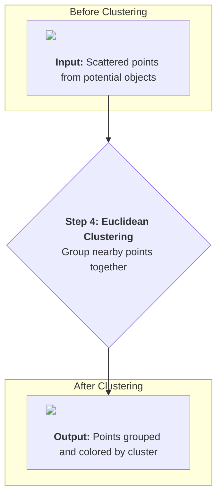
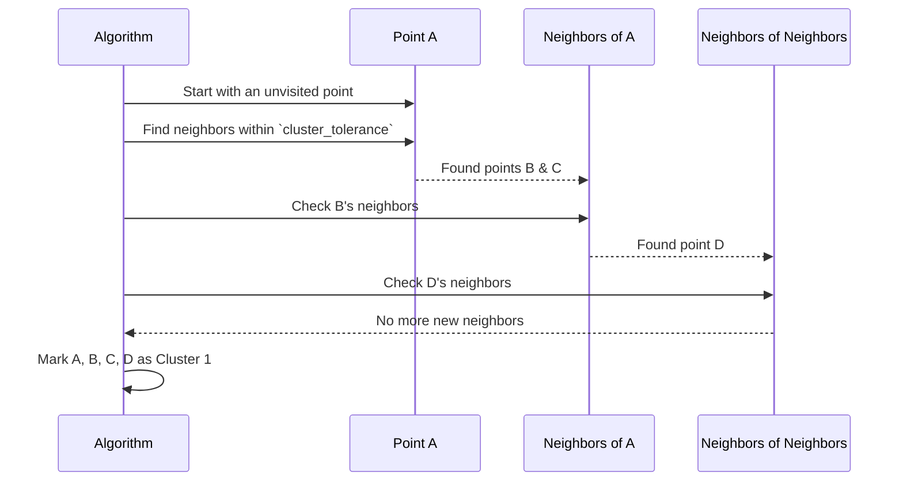

# Chapter 5: Euclidean Clustering

In the [previous chapter](04_planar_segmentation__ground_removal__.md), we did some major cleanup. We used Planar Segmentation to find and remove the massive, flat surface of the water. We went from a beach full of sand and seashells to just the seashells.

Now we face a new challenge. We have a cloud of points, but it's just a jumble. A couple of buoys close to each other might look like one big messy pile of points. How do we teach our robot that this pile is actually two distinct objects? We need to group the points that belong together. This process is called **clustering**.

### Finding Groups at a Party

Imagine you walk into a crowded room. People are standing around in different groups, chatting. Your brain instantly recognizes these groups. You don't see one giant mass of 100 people; you see a group of 5 over here, a group of 3 by the window, and two people talking by the door.

How does your brain do this? You instinctively group people who are standing close to each other.

**Euclidean Clustering** works exactly the same way. It looks at our point cloud (the room full of people) and groups points (people) that are close to each other. Each group it finds becomes a "cluster," which we assume is a single, distinct object.



### The Rules of the Party

To make this work, the algorithm needs a few simple rules. We provide these rules in our `params.yaml` file, which we learned about in [Chapter 1: ROS 2 Parameterization](01_ros_2_parameterization_.md).

1.  **`cluster_tolerance`**: This is the "personal space" rule. How close do two points need to be to be considered part of the same group? If we set this to `0.25` (25 cm), the algorithm will link any two points that are less than 25 cm apart.

2.  **`min_cluster`**: This is the "minimum group size" rule. We might not care about tiny groups. For example, a cluster of only 3 points is probably just random sensor noise, not a real object. We can tell the algorithm to ignore any group with fewer than, say, 20 points.

3.  **`max_cluster`**: This is the "maximum group size" rule. This helps filter out very large objects that we might not have removed properly, like a dock or a pier. We can tell the algorithm to ignore any group with more than, say, 200 points.

By tuning these three parameters, we can precisely control how our robot identifies objects.

### How it Works: A Chain Reaction

The algorithm is surprisingly simple. It's like a game of tag that spreads through a crowd.

1.  **Pick a Point:** The algorithm starts by picking a random point that hasn't been visited yet. Let's call it Point A.
2.  **Find Neighbors:** It then finds all other points within the `cluster_tolerance` distance of Point A. Let's say it finds Point B and Point C.
3.  **Expand the Search:** Now, it does the same thing for B and C. It looks for all of B's neighbors and all of C's neighbors. This might find Point D.
4.  **Keep Going:** This process continues like a chain reaction. It finds neighbors of neighbors, and neighbors of those neighbors, until it can't find any more new points that are close enough.
5.  **Declare a Cluster:** The entire group of connected points (A, B, C, D, and any others it found) is now declared **Cluster 1**. All these points are marked as "visited."
6.  **Repeat:** The algorithm then finds a new, unvisited point in the cloud and starts the whole process over again to find Cluster 2.

This continues until every point has been assigned to a cluster.



### The Code: Putting it into Practice

Let's see how this looks inside our `timer_callback` function. The code follows the same logic: set up the tool, give it the rules, and run it.

**File:** `src/clustering_segmentation.cpp`

#### Step 1: Get the Rules from our Parameters

First, we fetch the values we defined in our `params.yaml` file.

```cpp
// Get the parameter values from the .yaml file
rclcpp::Parameter cluster_tolerance_param = this->get_parameter("cluster_tolerance");
rclcpp::Parameter max_cluster_param = this->get_parameter("max_cluster");
rclcpp::Parameter min_cluster_param = this->get_parameter("min_cluster");

// Convert them to usable variables
float cluster_tolerance = cluster_tolerance_param.as_double();
float max_cluster = max_cluster_param.as_int();
float min_cluster = min_cluster_param.as_int();
```
This code gets our "personal space" and "group size" rules and stores them in variables that our C++ code can use.

#### Step 2: Configure the Clustering Tool

Next, we create the clustering object from the Point Cloud Library (PCL) and give it our rules.

```cpp
// Create the clustering tool
pcl::EuclideanClusterExtraction<PointT> ec;

// Set the rules we just loaded
ec.setClusterTolerance (cluster_tolerance); 
ec.setMinClusterSize (min_cluster);
ec.setMaxClusterSize (max_cluster);
```
This is like telling our party organizer the rules for what constitutes a "group."

#### Step 3: Find the Clusters!

Finally, we give the tool our point cloud (the one with the water already removed) and tell it to run the extraction process.

```cpp
// This vector will store the results
std::vector<pcl::PointIndices> cluster_indices;

// Give the tool the point cloud to search in
ec.setInputCloud (plane_cloud);

// Run the algorithm!
ec.extract (cluster_indices);
```
After this code runs, `cluster_indices` is filled with the results. It doesn't contain the points themselves, but rather a list of *lists of indices*. For example, it might look like: `[[0, 5, 12], [1, 7, 8, 20]]`, which means "the points at index 0, 5, and 12 form the first cluster, and the points at 1, 7, 8, and 20 form the second cluster."

### Conclusion

In this chapter, we brought order to the chaos. We learned how **Euclidean Clustering** works like identifying groups of people at a party. By setting a few key parameters, we can group scattered points into distinct clusters, with each cluster representing a potential obstacle.

We have now successfully:
1.  Cleaned up the raw LiDAR data.
2.  Removed the water surface.
3.  Grouped the remaining points into objects.

Our perception pipeline is almost complete! But a "cluster" of points is still a bit messy for other parts of a robot to understand. We need a simpler, cleaner way to represent these objects. That's where our final step comes in.

[Next Chapter: Bounding Box Visualization](06_bounding_box_visualization_.md)

---

Generated by [AI Codebase Knowledge Builder](https://github.com/The-Pocket/Tutorial-Codebase-Knowledge)