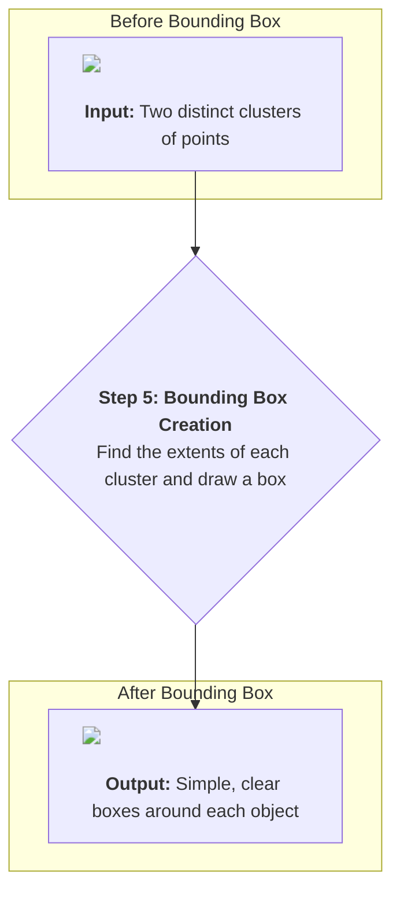

# Chapter 6: Bounding Box Visualization

We've come a long way! In the [previous chapter](05_euclidean_clustering_.md), we successfully taught our robot how to group messy clouds of points into distinct "clusters," just like identifying groups of people at a party. Our system can now say, "I see two groups of points over there."

But we can do even better. A "group of points" is still a bit fuzzy. For a navigation system, it's much more useful to know the exact space an object occupies. We need to put a neat, tidy label on each object. This is the final step in our perception pipeline: **Bounding Box Visualization**.

### From Fuzzy Cloud to Solid Box

Imagine you bought a new toy car. It has a complex shape with curves, wheels, and spoilers. Now, you need to put it in a box for storage. You wouldn't create a custom-molded box that perfectly fits every curve. You'd just find a simple, rectangular shoebox that the entire car fits inside.

This is exactly what we're going to do with our point clusters. A bounding box is the smallest possible "shoebox" that can contain all the points of a detected object.

It turns a messy cluster into a simple, geometric shape that is:
*   **Easy to see:** In a visualization tool like RViz, a clean wireframe box is much clearer than a blob of points.
*   **Lightweight:** Instead of thousands of points, an object is now defined by just its dimensions and position.
*   **Useful:** Other programs can easily use this box to calculate an object's size, position, and whether the robot is on a collision course with it.



### The Secret: Finding the Corners

How do we find the perfect "shoebox" for a cluster of points? The method is surprisingly simple. We just need to find six numbers for each cluster:

*   The smallest x-coordinate (`x_min`)
*   The largest x-coordinate (`x_max`)
*   The smallest y-coordinate (`y_min`)
*   The largest y-coordinate (`y_max`)
*   The smallest z-coordinate (`z_min`)
*   The largest z-coordinate (`z_max`)

These six values define the eight corners of our bounding box! The Point Cloud Library (PCL) has a handy function that does all this work for us.

### The Code: Building the Boxes

This process happens at the end of our `timer_callback` function, right after we've found the clusters. Let's walk through it.

**File:** `src/clustering_segmentation.cpp`

#### Step 1: Loop Through Each Cluster

After clustering, we have a list of clusters. We'll use a `for` loop to process them one by one. For each cluster, we'll create a box.

```cpp
// This loop iterates through every cluster we found in the last chapter.
for (size_t i = 0; i < cluster_indices.size(); i++)
{
    // ... code to process one cluster and create one box ...
}
```
Inside this loop, we'll perform the next steps for each individual object.

#### Step 2: Find the Min and Max Coordinates

We use PCL's `getMinMax3D` function to find the extents of our "shoebox". It looks at all the points in the current cluster and finds the six min/max values we talked about.

```cpp
// Inside the for loop...

// min_pt and max_pt will store the corner coordinates
Eigen::Vector4f min_pt, max_pt;

// This PCL function finds the min/max coordinates for the cluster
pcl::getMinMax3D<PointT>(*reasonable_cluster, min_pt, max_pt);
```
After this code runs, `min_pt` contains (`x_min`, `y_min`, `z_min`) and `max_pt` contains (`x_max`, `y_max`, `z_max`). We now have everything we need to define our box!

#### Step 3: Speaking RViz's Language with Markers

How do we actually draw a box in RViz? We can't just send it corner coordinates. We need to use a special ROS message type designed for visualization: `visualization_msgs::msg::Marker`.

A `Marker` message is like a set of drawing instructions. You can tell it what shape to draw (a cube, a sphere, an arrow, or lines), where to draw it, what color it should be, and how big it should be.

To draw a full box, we can send multiple markers: one for the top square, one for the bottom square, and one for the vertical lines connecting them. We collect all these drawing instructions into a `MarkerArray` message, which is just a list of markers.

```mermaid
sequenceDiagram
    participant C++ Node
    participant PCL
    participant RViz

    C++ Node->>PCL: Here is a cluster of points.
    PCL-->>C++ Node: Here are the min/max coordinates.
    C++ Node->>C++ Node: Create Marker messages (lines, squares) using coordinates.
    C++ Node->>RViz: Publishes a MarkerArray with drawing instructions.
    RViz->>RViz: Renders the boxes on the screen.
```

#### Step 4: Creating the Drawing Instructions

The code to create markers can look a bit long, but it's just setting up the drawing rules. Here's a simplified example of how we create the marker for the top square of the box.

```cpp
// Inside the for loop...

visualization_msgs::msg::Marker top_square_marker;
top_square_marker.header = inp_header; // Use the same timestamp/frame
top_square_marker.id = id++; // Give each marker a unique ID
top_square_marker.type = visualization_msgs::msg::Marker::LINE_STRIP;
top_square_marker.action = visualization_msgs::msg::Marker::ADD;
top_square_marker.scale.x = 0.06; // Line thickness
top_square_marker.color.r = 1.0; // Red color
top_square_marker.color.a = 1.0; // Fully opaque
```
This sets up the properties of our drawing. We're telling RViz, "Get ready to draw a red line strip."

Next, we give it the actual points to connect. A `LINE_STRIP` connects points in the order you provide them. To draw a square, we list the four corners and then list the first corner again to close the loop.

```cpp
// Define the 8 corners of the box using our min/max values
geometry_msgs::msg::Point p1, p2, p3, p4; // Top corners
p1.x = max_pt[0]; p1.y = max_pt[1]; p1.z = max_pt[2];
p2.x = min_pt[0]; p2.y = max_pt[1]; p2.z = max_pt[2];
p3.x = min_pt[0]; p3.y = min_pt[1]; p3.z = max_pt[2];
p4.x = max_pt[0]; p4.y = min_pt[1]; p4.z = max_pt[2];

// Add the points to the marker's point list
top_square_marker.points.push_back(p1);
top_square_marker.points.push_back(p2);
top_square_marker.points.push_back(p3);
top_square_marker.points.push_back(p4);
top_square_marker.points.push_back(p1); // Go back to the start
```
We do a similar process for the bottom square and the connecting lines, and add each of these `Marker` messages to our `marker_array`.

#### Step 5: Publishing the Boxes

Once the `for` loop has finished and we've created markers for every single cluster, we publish the entire array.

```cpp
// After the for loop...

boxes_pub->publish(marker_array);
```
Our `boxes_pub` publisher, which we created in the node's constructor, sends this list of drawing instructions out on the `/boxes_marker_array` topic. RViz is subscribed to this topic, so it immediately receives the instructions and draws our beautiful bounding boxes on the screen!

### Conclusion: From Chaos to Clarity

Congratulations! You have now followed a single LiDAR scan through its entire journey. We started with a chaotic, raw cloud of tens of thousands of points. We then applied a methodical, step-by-step pipeline:

1.  We learned how to make our node configurable using **[ROS 2 Parameterization](01_ros_2_parameterization_.md)**.
2.  We met the **[VoxelGrid_filter ROS 2 Node](02_voxelgrid_filter_ros_2_node_.md)**, the brain of our operation.
3.  We saw the entire **[Point Cloud Processing Pipeline](03_point_cloud_processing_pipeline_.md)** at a high level.
4.  We removed the water using **[Planar Segmentation](04_planar_segmentation__ground_removal__.md)**.
5.  We grouped points into objects with **[Euclidean Clustering](05_euclidean_clustering_.md)**.
6.  And finally, we put a clean, simple box around each object with **Bounding Box Visualization**.

You now understand the fundamental process of turning raw 3D sensor data into meaningful, actionable information. This exact pipeline, or variations of it, is at the heart of perception systems for self-driving cars, delivery drones, and, of course, unmanned surface vehicles. You've taken your first major step into the exciting world of robotics perception

---

Generated by [AI Codebase Knowledge Builder](https://github.com/The-Pocket/Tutorial-Codebase-Knowledge)