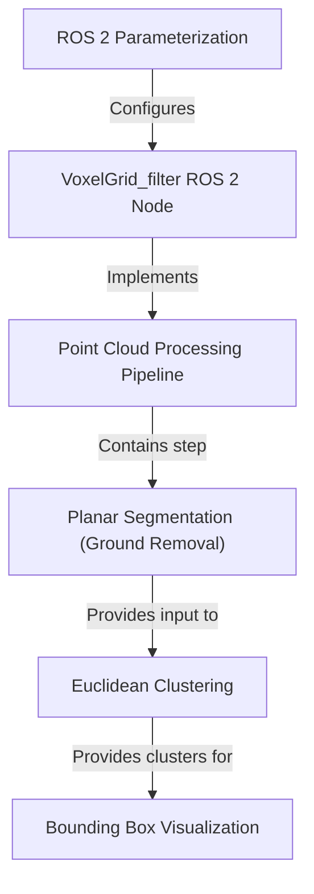

# Tutorial: usv_lidar

This project acts like the *eyes* for a robot, using 3D LiDAR data to **find and identify objects**. It processes the raw sensor data by first cleaning and downsizing it, then digitally removing the ground surface. Finally, it groups the remaining points into distinct objects and draws **3D boxes** around each one so they can be easily visualized in a tool like RViz.

**Source Repository:** [None](None)

## Chapters

1. [ROS 2 Parameterization
](01_ros_2_parameterization_.md)
2. [VoxelGrid_filter ROS 2 Node
](02_voxelgrid_filter_ros_2_node_.md)
3. [Point Cloud Processing Pipeline
](03_point_cloud_processing_pipeline_.md)
4. [Planar Segmentation (Ground Removal)
](04_planar_segmentation__ground_removal__.md)
5. [Euclidean Clustering
](05_euclidean_clustering_.md)
6. [Bounding Box Visualization
](06_bounding_box_visualization_.md)

---

Generated by [AI Codebase Knowledge Builder](https://github.com/The-Pocket/Tutorial-Codebase-Knowledge)