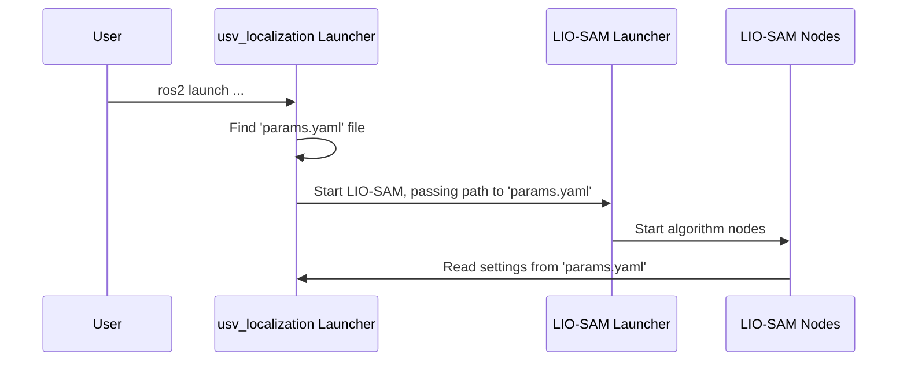

# Chapter 1: SLAM Parameter Configuration

Welcome to the `usv_localization` project! This tutorial will guide you through the key components of our system, starting with the most important file for customization: the parameter configuration.

Imagine you've just bought a new, high-end camera. Before you start shooting, you'd probably go into the settings menu to adjust the resolution, focus mode, and image quality. The SLAM parameter file is exactly that—the central settings panel for our localization algorithm. It lets us fine-tune how the system behaves without touching a single line of complex code.

**Our Goal:** Let's say we've upgraded the LiDAR sensor on our Unmanned Surface Vehicle (USV). The old sensor had 16 lasers, but the new one has 32. How do we tell our software about this hardware change? This chapter will show you exactly how to do that using the parameter configuration file.

### What is `params.yaml`?

At the heart of our configuration is a file named `params.yaml`. This file is written in a simple, human-readable format called YAML. Think of it as a list of instructions and settings that the LIO-SAM algorithm reads when it starts up.

Let's break down the file into a few key sections.

#### 1. Topics: Where to Listen for Data

The first thing our system needs to know is where to find the sensor data. These "locations" are called "topics" in ROS 2.

```yaml
# Topics
pointCloudTopic: "/velodyne_points" # Point cloud data
imuTopic: "/imu/data"               # IMU data
gpsTopic: "odometry/gpsz"           # GPS odometry topic
```

This section is like setting your favorite radio stations.
- `pointCloudTopic`: Tells the system to tune into the `/velodyne_points` channel to "hear" the LiDAR data.
- `imuTopic`: Listens to `/imu/data` for motion information from the Inertial Measurement Unit (IMU).

You can learn more about how these topics are managed in the [Sensor Input Configuration](04_sensor_input_configuration.md) chapter.

#### 2. Frames: Defining the Robot's World

A robot needs to understand space. "Frames" are coordinate systems that define this space. For example, is a detected obstacle 2 meters in front of the LiDAR sensor, or 2 meters in front of the center of the boat?

```yaml
# Frames
lidarFrame: "velodyne"
baselinkFrame: "base_link"
odometryFrame: "odom"
mapFrame: "map"
```

- `baselinkFrame`: Represents the center of the robot itself.
- `mapFrame`: Represents the global map the robot is building.

Think of `base_link` as "you are here" on a mall map, and `map` as the entire mall layout. We will explore this concept in depth in the [Coordinate Frame Definition](05_coordinate_frame_definition.md) chapter.

#### 3. Sensor Settings: Describing Your Hardware

This is where we solve our main goal! This section contains the specific details of our LiDAR sensor.

```yaml
# Sensor Settings
sensor: velodyne      # lidar sensor type
N_SCAN: 16            # number of lidar channels
Horizon_SCAN: 1800    # lidar horizontal resolution
lidarMinRange: 1.0    # minimum lidar range to be used
lidarMaxRange: 1000.0 # maximum lidar range to be used
```

- `N_SCAN`: This is the number of vertical laser beams your LiDAR has. Our old sensor had 16.
- `Horizon_SCAN`: This is the number of points the LiDAR captures in one full horizontal rotation.

To update the system for our new 32-channel LiDAR, we simply change one line:

```yaml
# Sensor Settings
sensor: velodyne
N_SCAN: 32            # Changed from 16 to 32 for our new sensor!
Horizon_SCAN: 1800
# ... other settings
```

That's it! By changing `N_SCAN` from `16` to `32`, you've successfully configured the algorithm to work with the new hardware. The system will now correctly interpret the denser data coming from the upgraded sensor.

#### 4. Tuning Parameters: The Expert Knobs

The rest of the file contains dozens of other parameters that fine-tune the algorithm's performance.

```yaml
# LOAM feature threshold
edgeThreshold: 1.0
surfThreshold: 0.1

# voxel filter paprams
odometrySurfLeafSize: 0.4
mappingCornerLeafSize: 0.2
```

Think of these as the "expert" settings on your camera. They control things like how the algorithm detects edges and flat surfaces (`edgeThreshold`, `surfThreshold`) or how much it simplifies the map to save memory (`odometrySurfLeafSize`). For now, the default values are a great starting point.

### How Does It All Work Under the Hood?

You might be wondering: "I edited a text file. How does the program actually *use* these settings?"

The process is managed by a launch system. When you start the localization, a special script reads your `params.yaml` file and passes it to the main LIO-SAM algorithm.

Here is a simplified view of what happens:



1.  You run the launch command.
2.  Our project's main launch file, which we'll cover in [System Orchestration](02_system_orchestration.md), finds our `config/params.yaml`.
3.  It then calls the core [LIO-SAM Algorithm Launcher](03_lio_sam_algorithm_launcher.md), telling it, "Hey, use this configuration file instead of your default one."
4.  The LIO-SAM nodes (the brains of the operation) start up and read every setting from our file.

Let's peek at the code that makes this happen. This snippet is from `launch/lio_sam_launch.py`.

```python
# --- File: launch/lio_sam_launch.py ---

# Find the path to our custom parameter file
share_dir = get_package_share_directory('usv_localization')
custom_config = os.path.join(share_dir, 'config', 'params.yaml')
```
This code first finds our project's folder and then specifies the exact location of `params.yaml`.

```python
# --- continued ---

# Include the main LIO-SAM launch file
IncludeLaunchDescription(
    # ... details about the file to launch
    # Pass our file as an argument
    launch_arguments={
        'params_file': custom_config,
    }.items()
)
```
This part "includes" the LIO-SAM launch file and, most importantly, passes our `custom_config` path as a `launch_argument`. This overrides the default settings with our own.

### Conclusion

You've just learned about the most powerful tool for customizing the `usv_localization` project: the `params.yaml` file. We saw that it acts as a central control panel where we can define data sources, describe our robot's hardware, and fine-tune performance—all without writing any code.

We successfully solved our use case of upgrading a LiDAR sensor by changing a single number, `N_SCAN`.

Now that we understand the "what" (the settings), let's move on to the "how" (how the system is launched and orchestrated). In the next chapter, we will explore the launch files that read this configuration and bring our system to life.

Next: [Chapter 2: System Orchestration](02_system_orchestration.md)

---

Generated by [AI Codebase Knowledge Builder](https://github.com/The-Pocket/Tutorial-Codebase-Knowledge)