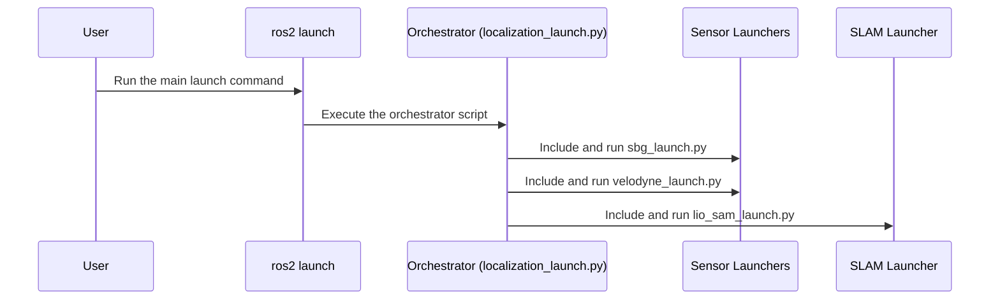

# Chapter 2: System Orchestration

In the [previous chapter](01_slam_parameter_configuration_.md), we learned how to create a "recipe" for our SLAM algorithm using the `params.yaml` file. We configured our new LiDAR sensor and understood how to tune the system's settings. But a recipe is just a list of instructions. We now need a head chef to read that recipe and get everyone in the kitchen working.

This chapter is about that head chef: the system orchestrator. This is the main startup script that brings our entire localization system to life with a single command.

**Our Goal:** We want to start all the necessary software for our USV to begin localizing itself. This includes the LiDAR driver, the IMU/GPS driver, and the main SLAM algorithm. How do we launch all of these components together in a coordinated way?

### What is a Launch File?

Imagine trying to start a car by manually turning on the fuel pump, then the ignition system, then the engine computer, and finally the starter motor. It would be complicated and easy to get wrong! Instead, you just turn a key.

In the world of ROS 2, a **launch file** is that key. It's a script that automates the process of starting multiple programs (called "nodes") at once. Our project's "master key" is a file named `localization_launch.py`. It's the project manager that ensures all the team members—the sensor drivers and the SLAM algorithm—show up for work.

### The Orchestrator: `localization_launch.py`

Let's look at this launch file. Its job is surprisingly simple: it doesn't do any of the hard work itself. Instead, it just calls *other* launch files, each responsible for one part of the system.

Here's a breakdown of the key players our orchestrator manages:

1.  **The IMU/GPS Driver (`sbg_launch.py`):** This starts the software needed to communicate with our SBG sensor, which provides crucial orientation and position data.
2.  **The LiDAR Driver (`velodyne-all-nodes-VLP16-composed-launch.py`):** This starts the driver for our Velodyne LiDAR, which provides the "eyes" of our system by generating a 3D point cloud.
3.  **The SLAM Algorithm (`lio_sam_launch.py`):** This launches the brain of the operation—the LIO-SAM algorithm that fuses all the sensor data together to figure out where we are.

Let's look at the code to see how it works.

#### Step 1: Launching the IMU/GPS Sensor

The first task for our orchestrator is to start the IMU/GPS.

```python
# --- File: launch/localization_launch.py ---

# Find and include the launch file for the SBG sensor
sbg_launch = IncludeLaunchDescription(
    PythonLaunchDescriptionSource([
        PathJoinSubstitution([
            FindPackageShare('usv_control'),
            'launch',
            'sbg_launch.py'
        ])
    ]),
)
```

The key command here is `IncludeLaunchDescription`. Think of this as the project manager saying, "Go find the instruction manual for the 'SBG sensor team' and follow it." It finds the `sbg_launch.py` file and runs it.

#### Step 2: Launching the LiDAR Sensor

Next, we do the exact same thing for our LiDAR.

```python
# --- continued ---

# Find and include the launch file for the Velodyne LiDAR
velodyne_launch = IncludeLaunchDescription(
    PythonLaunchDescriptionSource([
        PathJoinSubstitution([
            FindPackageShare('velodyne'),
            'launch',
            'velodyne-all-nodes-VLP16-composed-launch.py'
        ])
    ]),
)
```

Again, the orchestrator delegates the task. It finds the specific launch file for the Velodyne LiDAR and tells the system to run it.

#### Step 3: Launching the SLAM Algorithm (Our Goal!)

Finally, the orchestrator needs to start the main algorithm. This is the part that will use the `params.yaml` file we configured in the last chapter.

```python
# --- continued ---

# Find and include the launch file for our LIO-SAM setup
lio_sam_launch = IncludeLaunchDescription(
    PythonLaunchDescriptionSource([
        PathJoinSubstitution([
            FindPackageShare('usv_localization'),
            'launch',
            'lio_sam_launch.py'
        ])
    ]),
)
```

This tells the system to run our custom `lio_sam_launch.py`, which we will dive into in the [next chapter](03_lio_sam_algorithm_launcher_.md). This specific launcher is what knows to load our custom `params.yaml`.

#### Step 4: Putting It All Together

The final step is to collect all these tasks and return them as a single launch plan.

```python
# --- continued ---

def generate_launch_description():
    # ... all the 'IncludeLaunchDescription' lines from above

    return LaunchDescription([
        sbg_launch,
        # lio_sam_launch,
        velodyne_launch,
    ])
```

The `LaunchDescription` is a list of all the tasks to be executed. But wait, notice that `lio_sam_launch` is commented out with a `#`!

This is a common practice for debugging. It allows you to start just the sensors to make sure they are publishing data correctly, without starting the computationally heavy SLAM algorithm.

**To solve our goal of starting the full system, you would simply remove the `#`:**

```python
# To run the full system, uncomment the lio_sam_launch line
return LaunchDescription([
    sbg_launch,
    lio_sam_launch, # The '#' is removed!
    velodyne_launch,
])
```

With that one character removed, running this launch file will now bring the entire system online: both sensors and the SLAM algorithm.

### How It All Works Under the Hood

When you type `ros2 launch usv_localization localization_launch.py` in your terminal, a clear sequence of events unfolds.



1.  **You** execute the command to start the main launch file.
2.  The `ros2 launch` tool finds and runs our **Orchestrator** (`localization_launch.py`).
3.  The Orchestrator doesn't start the programs directly. Instead, it reads its list of instructions and delegates.
4.  It first calls the **Sensor Launchers** (`sbg_launch.py` and `velodyne_launch.py`). These files then start the actual driver programs that talk to the hardware.
5.  It then calls the **SLAM Launcher** (`lio_sam_launch.py`). This special launcher, which we'll explore next, is responsible for starting the LIO-SAM algorithm and feeding it our `params.yaml` configuration.

### Conclusion

You've now seen the "master switch" for the entire `usv_localization` system. The `localization_launch.py` file acts as an orchestrator or a project manager. It provides a single, convenient entry point to launch all the necessary components, from sensor drivers to the core algorithm.

We learned that by including other launch files, we can keep our main startup script clean and organized. We also saw how commenting out a single line gives us the flexibility to run only a part of the system, which is incredibly useful for testing and debugging.

But this orchestrator delegates the most important task: launching the SLAM algorithm itself. How does that special launch file work, and how does it load our custom parameters? We'll uncover that in the next chapter.

Next: [Chapter 3: LIO-SAM Algorithm Launcher](03_lio_sam_algorithm_launcher_.md)

---

Generated by [AI Codebase Knowledge Builder](https://github.com/The-Pocket/Tutorial-Codebase-Knowledge)