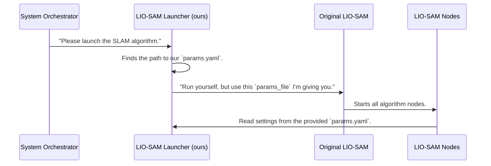

# Chapter 3: LIO-SAM Algorithm Launcher

In the [previous chapter](02_system_orchestration_.md), we met the "head chef" of our project: the `localization_launch.py` orchestrator. We saw how it starts all the different parts of our system, like the sensor drivers. But we also saw that it delegates the most important job—starting the actual SLAM algorithm—to another file.

This chapter dives into that special file. It's a small but crucial piece of the puzzle that acts as a bridge between our project and the powerful, external LIO-SAM algorithm.

**Our Goal:** We've carefully configured our settings in `params.yaml`. How do we make sure that the LIO-SAM software, which is a separate project, actually *uses* our settings instead of its own default ones?

### What is `lio_sam_launch.py`?

Imagine you download a cool new video game. The game has its own default settings for graphics and controls. But you want to use your own custom settings that you've saved in a separate file. You wouldn't want to dig into the game's code to change it. Instead, you'd look for a launcher option that says "load settings from file."

Our `lio_sam_launch.py` file is exactly that. It's a dedicated "adapter" whose only job is to:
1.  Find the main LIO-SAM software.
2.  Find our project's custom `params.yaml` file.
3.  Tell LIO-SAM: "Hey, when you start, use *these* settings, not your own."

It doesn't contain any SLAM logic itself. It's just a smart shortcut that opens a program with our preferred settings already loaded.

### The Adapter in Action: A Code Walkthrough

This launch file is beautifully simple because it has only one job. Let's break it down into two steps.

#### Step 1: Finding Our Custom Recipe

First, the script needs to know the exact location of our `params.yaml` file, which we customized in the [SLAM Parameter Configuration](01_slam_parameter_configuration_.md) chapter.

```python
# --- File: launch/lio_sam_launch.py ---

# Find the path to our custom parameter file
share_dir = get_package_share_directory('usv_localization')
custom_config = os.path.join(share_dir, 'config', 'params.yaml')
```

This code does one thing: it creates a variable `custom_config` that holds the full system path to our `params.yaml`. Think of it as looking up a friend's address and writing it down on a sticky note so you don't forget it.

#### Step 2: Calling LIO-SAM with Our Settings

Now for the magic. With the address of our settings file in hand, the script calls the main LIO-SAM launch file and passes our settings to it.

```python
# --- continued ---

return LaunchDescription([
    IncludeLaunchDescription(
        # ... details on where to find the original LIO-SAM launch file
        # This is where we pass our settings!
        launch_arguments={
            'params_file': custom_config,
        }.items()
    )
])
```

-   `IncludeLaunchDescription`: This is the command to run another launch file. Here, it's running the main `run.launch.py` from the LIO-SAM package.
-   `launch_arguments`: This is the most important part. It's like attaching our sticky note with the address to a delivery request. We are setting the `params_file` argument for LIO-SAM to be the path we found in step 1 (`custom_config`).

This simple `launch_argument` is how we solve our goal. It overrides LIO-SAM's default behavior and forces it to load all its settings from our `params.yaml` file.

### How It All Works Under the Hood

The chain of command is clear and organized. The System Orchestrator we saw in the last chapter calls our adapter, and our adapter calls the real LIO-SAM software with the correct instructions.



1.  The `localization_launch.py` **Orchestrator** decides it's time to start the SLAM system.
2.  It calls our **LIO-SAM Launcher** (`lio_sam_launch.py`).
3.  Our launcher finds our custom `params.yaml` file.
4.  It then calls the **Original LIO-SAM** launch file, but with a special instruction: the `params_file` argument pointing to our configuration.
5.  The **LIO-SAM Nodes** (the programs that do the math) start up. When they need a setting, like `N_SCAN`, they read it directly from our file instead of their own default.

This design is powerful because it lets us completely customize the behavior of an external software package without ever modifying its source code. This makes our system clean, modular, and easy to update.

### Conclusion

You've now learned about the clever adapter that connects our project to the LIO-SAM algorithm. The `lio_sam_launch.py` file is a simple but essential bridge. Its sole responsibility is to launch the external LIO-SAM package while injecting our custom configuration from `params.yaml`. This ensures that the algorithm runs with the exact parameters we need for our specific robot and sensors.

We've covered the "what" (parameters), the "how" (orchestration), and the "bridge" (this launcher). But how does the data from our sensors actually get to the LIO-SAM algorithm in a format it understands? The next chapter will explore how we configure the data streams themselves.

Next: [Chapter 4: Sensor Input Configuration](04_sensor_input_configuration_.md)

---

Generated by [AI Codebase Knowledge Builder](https://github.com/The-Pocket/Tutorial-Codebase-Knowledge)