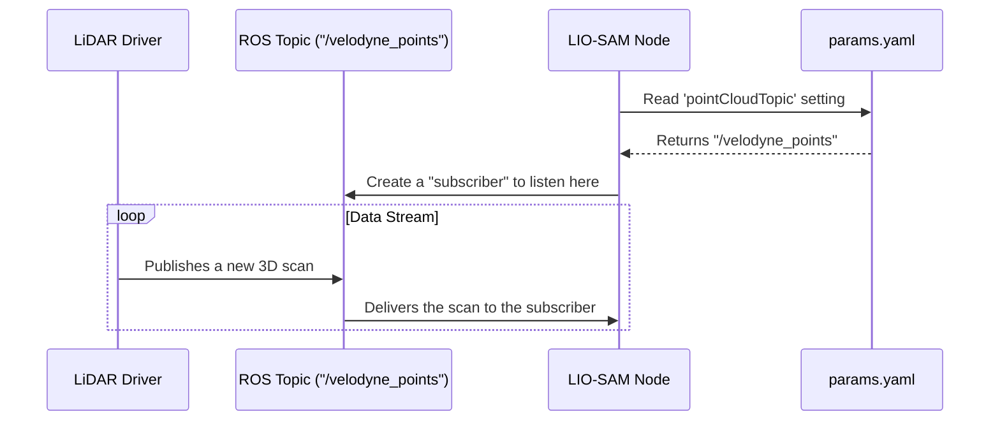

# Chapter 4: Sensor Input Configuration

In the [previous chapter](03_lio_sam_algorithm_launcher_.md), we saw how our special "adapter" launch file tells the LIO-SAM algorithm to use our custom `params.yaml` settings. We've successfully launched the algorithm with our desired configuration. But a running algorithm is like a chef in a kitchen waiting for ingredients. How does it know where to find the LiDAR scans, the IMU data, and the GPS signals?

This chapter explains how we connect the data streams from our sensors to the algorithm. We'll learn how to tell the chef exactly which shelf and container holds each ingredient.

**Our Goal:** Imagine we've just installed a new GPS unit on our USV. The driver for this new GPS publishes its data on a new ROS "topic" (a data channel) called `/gps/fix`. The old GPS used `/odometry/gpsz`. How do we tell our SLAM system to stop listening to the old channel and start listening to the new one?

### What is a ROS Topic? The Robot's Radio Stations

In ROS (Robot Operating System), programs don't talk to each other directly. Instead, they broadcast and listen to public data channels called **topics**.

Think of it like a set of radio stations:
-   Our LiDAR sensor is a radio station broadcasting on `99.5 FM` ("The Point Cloud").
-   Our IMU is another station on `101.1 FM` ("Motion FM").
-   The SLAM algorithm is a radio receiver. To work correctly, it needs to be tuned to the right stations to hear the data it needs.

The "Sensor Input Configuration" is simply the list of radio station presets we give to our SLAM algorithm. We define these presets in our `params.yaml` file.

### Pointing to the Right Data Streams

Let's look at the "Topics" section in our `params.yaml` file. This is where we tell LIO-SAM which "radio stations" to tune into.

```yaml
# --- File: config/params.yaml ---

# Topics
pointCloudTopic: "/velodyne_points" # Point cloud data
imuTopic: "/imu/data"               # IMU data
gpsTopic: "odometry/gpsz"           # GPS odometry topic
```

This short section is incredibly important.
-   `pointCloudTopic`: Tells the algorithm to listen to the `/velodyne_points` channel for 3D scans from the LiDAR.
-   `imuTopic`: Listens to `/imu/data` for acceleration and rotation data from the IMU.
-   `gpsTopic`: Listens to `odometry/gpsz` for position information from the GPS.

#### Solving Our Goal

To solve our use case of switching to a new GPS, we just need to change one line. We'll update the `gpsTopic` to point to the new channel, `/gps/fix`.

```yaml
# --- File: config/params.yaml ---

# Topics
pointCloudTopic: "/velodyne_points"
imuTopic: "/imu/data"
gpsTopic: "/gps/fix" # Changed from "odometry/gpsz" for our new GPS!
```

That's it! When you restart the system, the LIO-SAM algorithm will now ignore the old GPS topic and start listening for data on `/gps/fix`. You've successfully re-wired the data flow of the system without touching a single line of complex code.

### How It Works Under the Hood

When a LIO-SAM node starts, one of the first things it does is read these topic names from your `params.yaml` file. It then creates a "subscriber" for each one. A subscriber is the part of the code that actively listens to a specific channel.

Here’s a step-by-step look at what happens for the LiDAR data:



1.  The **LIO-SAM Node** starts and reads our `params.yaml` file.
2.  It gets the value `/velodyne_points` for the `pointCloudTopic` parameter.
3.  It then tells the ROS system, "I want to **subscribe** to the `/velodyne_points` topic. Let me know whenever new data arrives."
4.  Meanwhile, the **LiDAR Driver** publishes 3D scan data to that same topic.
5.  The ROS system sees the new data and immediately forwards it to the LIO-SAM node's subscriber, which then processes the scan.

Let's peek at a simplified version of the C++ code inside LIO-SAM that makes this happen.

```cpp
// --- Simplified from LIO-SAM's imageProjection.cpp ---

// 1. Read the topic name from our params.yaml file
std::string pointCloudTopic;
this->get_parameter("pointCloudTopic", pointCloudTopic);

// 2. Create a subscriber to listen on that topic
subLaserCloud = create_subscription<PointCloud2>(
    pointCloudTopic, // Uses the name we provided!
    // ... other settings ...
);
```
This code does exactly what our diagram shows. It first fetches the `pointCloudTopic` string from the parameters we passed in. Then, it uses that string variable to create the subscriber. This is the direct link that makes our configuration file so powerful.

### Conclusion

You've now learned how to control the flow of information in our system. The "Sensor Input Configuration" in `params.yaml` acts as a switchboard, allowing us to connect the output of any sensor to the input of our SLAM algorithm simply by changing a line of text. We saw that ROS topics are like radio channels for data, and we used our configuration file to tune our algorithm to the right frequencies.

We've told the algorithm *where* to get its data. But there's another crucial piece of information missing. The algorithm knows it's getting LiDAR data and IMU data, but it doesn't know how those sensors are positioned relative to each other or to the boat itself. Is the LiDAR at the front? Is the IMU upside-down? In the next chapter, we'll learn how to define this spatial layout.

Next: [Chapter 5: Coordinate Frame Definition](05_coordinate_frame_definition_.md)

---

Generated by [AI Codebase Knowledge Builder](https://github.com/The-Pocket/Tutorial-Codebase-Knowledge)