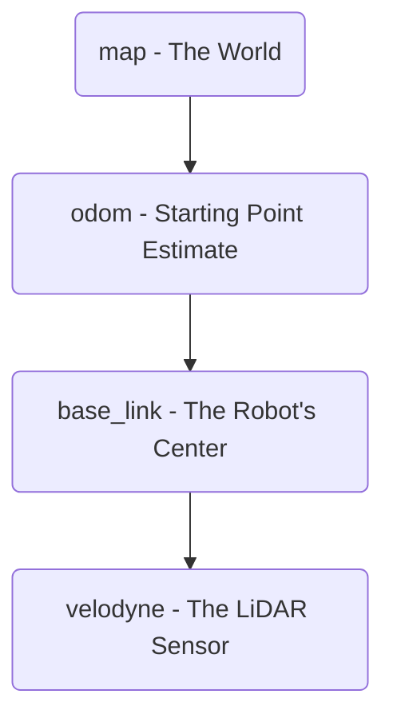
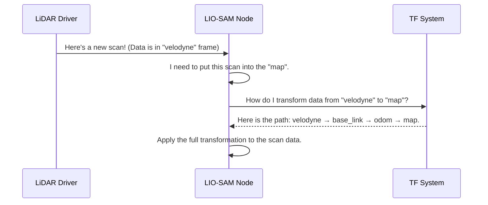

# Chapter 5: Coordinate Frame Definition

In the [previous chapter](04_sensor_input_configuration_.md), we successfully told our SLAM algorithm *where* to listen for sensor data by configuring the ROS topics. The system now knows which "radio stations" to tune into for LiDAR scans and IMU data. But there's a critical piece of the puzzle missing. The LiDAR might report a wall 5 meters away, but 5 meters away from *what*? The sensor itself? The center of the boat? A point on the dock where we started?

This chapter introduces the concept of **Coordinate Frames**, which act as a set of labeled anchors or landmarks. They create a universal language for our robot to understand space, ensuring that every measurement has a clear and unambiguous reference point.

**Our Goal:** We need to establish a standard set of names for the most important locations: the world map, the robot's starting point, the robot's body, and the LiDAR sensor. How do we formally name these "anchors" so that the LIO-SAM algorithm knows what we're talking about?

### What is a Coordinate Frame? The Robot's Map Legend

Imagine you're looking at a pirate map. The map isn't just a drawing; it has key landmarks labeled: "Skull Rock," "The Old Oak Tree," and "Your Ship." These labels give you reference points. You can say things like, "The treasure is 100 paces east of The Old Oak Tree," and everyone understands exactly what that means.

Coordinate frames are the robot's version of these landmarks. They are reference points in 3D space. By defining them, we create a "map legend" for our system. Let's meet the four most important frames in our project:

1.  **`map`:** This is the ultimate, global reference. Think of it as the entire, unmoving pirate map. It represents the world coordinate system. The final map our USV builds will be drawn relative to this frame. It never moves.

2.  **`odom` (Odometry):** This frame tracks the robot's movement from its starting point. It's like pacing out steps from where you first landed on the island. It provides a smooth, continuous estimate of the robot's motion, but it can drift over long distances (like getting tired and your steps getting shorter). This frame is a "local" world that moves along with the robot.

3.  **`base_link`:** This is the center of the robot itself. On our pirate map, this is "Your Ship." It is the anchor point of the USV, and the positions of all sensors (like the LiDAR and IMU) are measured relative to it. When the robot moves, `base_link` moves with it.

4.  **`velodyne`:** This is the specific location of the LiDAR sensor on the robot's body. It's like the "crow's nest" on your ship. When the LiDAR sends a scan, all the points in that scan are measured from this exact origin point.

Here is how they are all related in a hierarchy:



### Defining Our Frames in the Configuration

Now that we understand the concept, how do we tell LIO-SAM what we've decided to name our frames? We do this, once again, in our central control panel: `params.yaml`.

Let's look at the "Frames" section of the file.

```yaml
# --- File: config/params.yaml ---

# Frames
lidarFrame: "velodyne"
baselinkFrame: "base_link"
odometryFrame: "odom"
mapFrame: "map"
```

This section is beautifully simple. It's a list that assigns our chosen names to the roles that LIO-SAM understands.

-   `mapFrame: "map"`: Tells the algorithm, "The name of the global, unmoving world frame is `map`."
-   `odometryFrame: "odom"`: Tells it, "The name for the smooth but drifty motion estimate frame is `odom`."
-   `baselinkFrame: "base_link"`: Says, "The frame attached to the robot's body is called `base_link`."
-   `lidarFrame: "velodyne"`: And finally, "The LiDAR's own reference point is named `velodyne`."

By filling out this section, we have achieved our goal. We've established a clear and consistent naming convention for our spatial anchors. Now, when the system processes data, there is no ambiguity. It knows that a point measured in the `velodyne` frame is different from a point measured in the `base_link` frame, and it knows how all these frames relate to the global `map`.

### How It Works Under the Hood

You might be wondering how the system actually uses these names. These frame names are used by a core ROS system called **TF (Transform Frames)**. Think of TF as a live, constantly updated directory of how to get from any frame to any other frame.

For example, LIO-SAM's job is to calculate the transformation from `odom` to `base_link` (where the robot thinks it is) and from `map` to `odom` (to correct for drift). Other parts of the system provide the transformation from `base_link` to `velodyne` (this is a fixed, physical relationship we'll define in the next chapter).

When the algorithm needs to place a LiDAR scan into the global map, a series of questions are asked and answered behind the scenes:



1.  The **LiDAR Driver** publishes a scan and labels it with the frame ID `velodyne`, just as we specified.
2.  The **LIO-SAM Node** receives this data. Its goal is to place these points onto its master `map`.
3.  It asks the **TF System**, "Can you give me the mathematical transformation to convert coordinates from the `velodyne` frame all the way to the `map` frame?"
4.  The **TF System** looks at all the available connections, chains them together (`velodyne` to `base_link`, `base_link` to `odom`, `odom` to `map`), and provides one final transformation.
5.  LIO-SAM applies this transformation to every point in the scan, correctly placing it in the global world.

Let's look at the simplified code inside LIO-SAM where it reads these names.

```cpp
// --- Simplified from LIO-SAM's utility.h ---

// Read the frame names from our params.yaml file
this->get_parameter("mapFrame", mapFrame);
this->get_parameter("odometryFrame", odometryFrame);
this->get_parameter("baselinkFrame", baselinkFrame);
```
When the program starts, it loads these names from our configuration file into variables.

```cpp
// --- Simplified from LIO-SAM's mapOptmization.cpp ---

// When publishing the robot's final position...
odom_to_map.header.frame_id = mapFrame;       // It's a transform to the "map"
odom_to_map.child_frame_id = odometryFrame; // from the "odom" frame
tf_broadcaster->sendTransform(odom_to_map);
```
Later, when the algorithm calculates something important, like the corrected position of the robot, it uses these variables to label the transformation correctly. This is how our simple text configuration becomes the universal language for the entire system.

### Conclusion

You've now learned about the fundamental concept of coordinate frames—the labeled landmarks that allow a robot to make sense of 3D space. We saw that by defining names for the `map`, `odom`, `base_link`, and `velodyne` frames in our `params.yaml` file, we provide the system with a clear, unambiguous language for positions and orientations.

We've successfully *named* our key reference points. However, we haven't yet defined the *exact spatial relationship* between them. For instance, how does the system know that the `velodyne` frame is 69cm forward and 23cm up from the `base_link` frame? Defining these precise physical offsets is called extrinsic calibration, and it's the subject of our next chapter.

Next: [Chapter 6: Sensor Extrinsic Calibration](06_sensor_extrinsic_calibration_.md)

---

Generated by [AI Codebase Knowledge Builder](https://github.com/The-Pocket/Tutorial-Codebase-Knowledge)