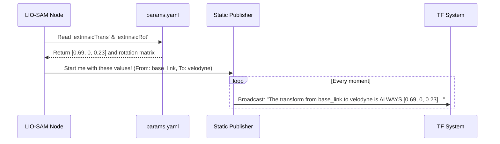

# Chapter 6: Sensor Extrinsic Calibration

In the [previous chapter](05_coordinate_frame_definition_.md), we gave our coordinate frames names like `base_link` and `velodyne`. It's like putting labels on a map for "Your Ship" and "The Crow's Nest." The system now knows these places exist, but it has no idea how they are physically connected. Is the crow's nest at the front or the back of the ship? How high up is it?

This chapter is about providing those exact measurements. We will define the precise 3D position and orientation of our LiDAR sensor relative to the IMU (which we consider the robot's center, or `base_link`). This process is called **Extrinsic Calibration**.

**Our Goal:** We have physically measured the location of our LiDAR sensor on the USV. It is 69cm forward and 23cm up relative to the IMU. How do we program this physical relationship into our system so that the algorithm can accurately fuse the sensor data?

### What is Extrinsic Calibration? Aligning Your Senses

Imagine trying to see with two eyes that are misaligned. Your left eye might be looking forward while your right eye is looking slightly to the side. Your brain wouldn't be able to merge the two images to create a coherent, 3D picture of the world. Your brain works because it knows *exactly* how your eyes are positioned in your head.

Sensor extrinsic calibration provides this same critical information to our robot's "brain." It tells the LIO-SAM algorithm the exact spatial relationship between its "eyes" (the LiDAR) and its sense of "motion" (the IMU). Without this, the system would be combining data from two different perspectives without knowing how to line them up, leading to a blurry, incorrect map.

There are two key components to this relationship:

1.  **Translation (`extrinsicTrans`):** This is the simple X, Y, Z distance between the two sensors. It answers the question, "How far do I have to move from the IMU to get to the LiDAR?"
2.  **Rotation (`extrinsicRot` or `extrinsicRPY`):** This is the orientation difference. It answers the question, "Is the LiDAR tilted up, rolled to the side, or pointed in a different direction compared to the IMU?"

### Defining the Sensor Relationship in `params.yaml`

As with all our other settings, we define these crucial measurements in our main configuration file, `params.yaml`. Let's look at the relevant section.

```yaml
# --- File: config/params.yaml ---

    # ... other settings ...
    imuGravity: 9.80511
    imuRPYWeight: 0.01

    extrinsicTrans:  [ 0.69,  0.0,  0.23 ]
    extrinsicRot:    [-1.0,  0.0,  0.0,
                      0.0,  1.0,  0.0,
                      0.0,  0.0, -1.0 ]
    # ... other settings ...
```

#### Solving Our Goal: Setting the Translation

To solve our goal, we need to edit the `extrinsicTrans` line. This parameter is a list of three numbers: `[X, Y, Z]` in meters.

-   **X** is the forward/backward axis. A positive value means forward.
-   **Y** is the left/right axis. A positive value means left.
-   **Z** is the up/down axis. A positive value means up.

Our measurement was 69cm (0.69m) forward and 23cm (0.23m) up. There was no left or right offset, so Y is 0. This gives us the exact values we see in the file:

```yaml
# These values represent: 0.69m forward, 0.0m sideways, and 0.23m up.
extrinsicTrans:  [ 0.69,  0.0,  0.23 ]
```

By setting this line, we have successfully told the algorithm the precise position of the LiDAR relative to the IMU.

#### Understanding Rotation

The `extrinsicRot` parameter defines the orientation. It's represented as a 3x3 rotation matrix, which can look a little intimidating. For beginners, it's easier to think in terms of Roll, Pitch, and Yaw.

-   **Roll:** Tilting side to side (like a boat in waves).
-   **Pitch:** Tilting forward and back (like a boat going up a wave).
-   **Yaw:** Turning left and right (like steering the boat).

The `extrinsicRot` matrix shown in the configuration file might seem complex, but it represents a specific orientation where the LiDAR's coordinate system is rotated relative to the IMU's. For many setups, if the sensors are mounted perfectly aligned (e.g., both pointing forward and level), the rotation matrix would be the "identity matrix," representing zero rotation.

For our project, the default values are correct for our hardware setup. Unless you mount your sensors in a different orientation, you can usually leave these as they are.

### How It Works Under the Hood

You might think that the system is constantly calculating this relationship. But the position of the LiDAR relative to the IMU is fixed—they are bolted to the boat! This means we only need to tell the system about this relationship *once*.

This is handled by a special ROS tool called a **`static_transform_publisher`**. When our LIO-SAM node starts, it reads our `extrinsicTrans` and `extrinsicRot` values and uses them to launch this tool. The `static_transform_publisher` then continuously broadcasts this fixed relationship to the whole system.

Here’s the sequence of events:



1.  The **LIO-SAM Node** starts and reads the extrinsic parameters from our `params.yaml` file.
2.  It uses these values to launch an internal **Static Publisher**. It tells the publisher the parent frame (`base_link`), the child frame (`velodyne`), and the translation/rotation values that connect them.
3.  The **Static Publisher** then begins its one and only job: it constantly broadcasts this single, unchanging transformation to the **TF System**.
4.  Now, any other part of the program that needs to know how to convert coordinates from the `velodyne` frame to the `base_link` frame can simply ask the TF System and get the answer instantly.

Let's look at a simplified piece of the C++ code inside LIO-SAM that performs this task.

```cpp
// --- Simplified from LIO-SAM's utility.h ---

// 1. Read the translation and rotation from params.yaml
std::vector<double> trans, rot;
this->get_parameter("extrinsicTrans", trans);
this->get_parameter("extrinsicRot",   rot);

// 2. Create a static transform message
geometry_msgs::msg::TransformStamped static_transform_stamped;
static_transform_stamped.header.stamp    = this->get_clock()->now();
static_transform_stamped.header.frame_id = baselinkFrame; // "base_link"
static_transform_stamped.child_frame_id  = lidarFrame;    // "velodyne"

// 3. Fill the message with our values
static_transform_stamped.transform.translation.x = trans[0]; // 0.69
static_transform_stamped.transform.translation.y = trans[1]; // 0.0
static_transform_stamped.transform.translation.z = trans[2]; // 0.23
// ... code to set the rotation ...

// 4. Send it to the broadcaster
static_broadcaster->sendTransform(static_transform_stamped);
```
This code follows our diagram perfectly. It gets the parameters from our file, creates a message, fills it with our exact `[X, Y, Z]` values, labels it with the correct frame names from the [Coordinate Frame Definition](05_coordinate_frame_definition_.md) chapter, and then sends it off to be broadcasted.

### Conclusion

You have now mastered the final and one of the most critical configuration steps: **Sensor Extrinsic Calibration**. You learned that this process defines the exact physical position (`extrinsicTrans`) and orientation (`extrinsicRot`) of the LiDAR relative to the IMU. We saw how a simple list of three numbers in `params.yaml` can precisely describe our USV's hardware layout to the software.

With this last piece of the puzzle in place, you now have a comprehensive understanding of how to set up and customize the `usv_localization` project. You've learned how to:
-   Tune algorithm settings ([Chapter 1](01_slam_parameter_configuration_.md))
-   Launch the entire system ([Chapter 2](02_system_orchestration_.md) & [Chapter 3](03_lio_sam_algorithm_launcher_.md))
-   Direct data streams from sensors ([Chapter 4](04_sensor_input_configuration_.md))
-   Define and name your robot's coordinate system ([Chapter 5](05_coordinate_frame_definition_.md))
-   Calibrate the physical layout of your sensors ([Chapter 6](06_sensor_extrinsic_calibration_.md))

You are now fully equipped to configure the project for your own hardware and are ready to run the system to see it build a map of its environment in real-time

---

Generated by [AI Codebase Knowledge Builder](https://github.com/The-Pocket/Tutorial-Codebase-Knowledge)