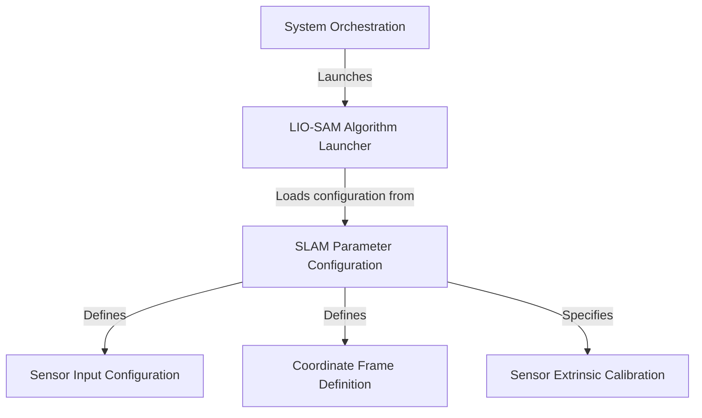

# Tutorial: usv_localization

This project provides a complete system for determining a vehicle's position and orientation by creating a 3D map of its surroundings. It uses a powerful algorithm called *LIO-SAM*, which intelligently fuses data from a **LiDAR** sensor (for seeing) and an **IMU/GPS** (for sensing motion). The entire system is launched from a central script and is highly customizable through a single *configuration file* that sets up sensor details, coordinate frames, and algorithm performance.

**Source Repository:** [None](None)

## Chapters

1. [SLAM Parameter Configuration
](01_slam_parameter_configuration_.md)
2. [System Orchestration
](02_system_orchestration_.md)
3. [LIO-SAM Algorithm Launcher
](03_lio_sam_algorithm_launcher_.md)
4. [Sensor Input Configuration
](04_sensor_input_configuration_.md)
5. [Coordinate Frame Definition
](05_coordinate_frame_definition_.md)
6. [Sensor Extrinsic Calibration
](06_sensor_extrinsic_calibration_.md)

---

Generated by [AI Codebase Knowledge Builder](https://github.com/The-Pocket/Tutorial-Codebase-Knowledge)