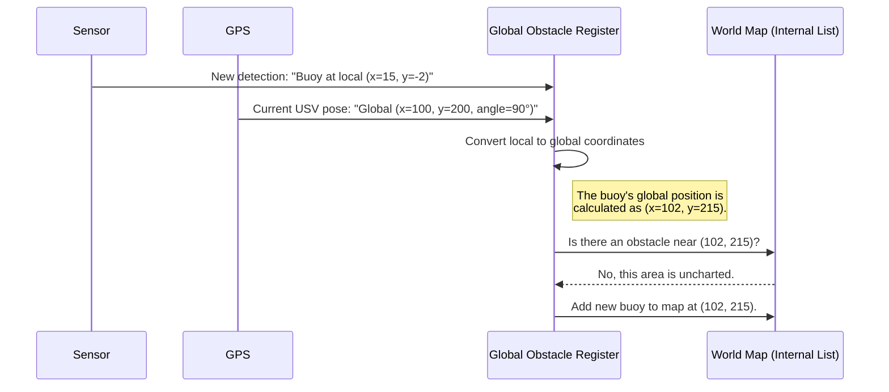

# Chapter 1: Global Obstacle Register (The World Map)

Welcome to your first step in understanding the `src` project! We're going to start with the very foundation of our autonomous system: its memory.

Imagine you're exploring a new city, but you have no map and your memory resets every five seconds. You might see a beautiful fountain in front of you, but as soon as you turn a corner, you'd forget it ever existed. Navigating would be impossible!

Our Unmanned Surface Vehicle (USV) faces a similar problem. Its sensors (like cameras) give it constant, but fleeting, updates about its surroundings. This is where our first hero component comes in: the **Global Obstacle Register**.

Think of it as the USV's cartographer, tirelessly building a master map of the world. It listens to temporary sightings and carefully plots them onto a persistent chart. This "world map" allows the USV to remember where obstacles are, creating a stable view of the environment that the rest of the system can trust.

### From a Lookout's Sighting to a Point on the Map

The main job of this node is to answer one critical question: "An object was just spotted at *this* position relative to the boat. Where is that object on the global map?"

Let's break down how it works.

1.  **Listen for Sightings:** The node constantly listens for messages from the USV's sensors. These messages say things like, "I see a round buoy 15 meters directly ahead and 2 meters to my left." This is a *local* or *vehicle-relative* coordinate.

2.  **Know Thyself:** To place that buoy on a world map, the node must first know where the USV itself is. It listens to another stream of information (like from a GPS) that says, "The USV is at global coordinate (X=50, Y=100) and is facing North."

3.  **Do the Math:** It combines these two pieces of information—the relative position of the buoy and the absolute position of the USV—to calculate the buoy's absolute, *global* position.

4.  **Update the Chart:** It then checks its master list of obstacles.
    *   **Is this a new discovery?** If there are no known obstacles near the calculated global position, it adds a new pin to the map. "A new buoy exists at (X=50, Y=115)!"
    *   **Is this an old friend?** If it sees the buoy is very close to one it has already mapped, it realizes it's the same object. Instead of adding a duplicate, it just updates the existing pin's position. This keeps the map clean and accurate.

### Inputs and Outputs

The `Global Obstacle Register` is a ROS 2 node, which means it communicates with other parts of the system through messages.

*   **Input 1: Sensor Detections (`/inferences`)**: A list of objects currently seen by the sensors, with coordinates relative to the USV.
*   **Input 2: USV's Global Position (`/usv/state/pose`)**: The USV's current X, Y position and orientation (theta) on the world map.

*   **Output: The World Map (`/obj_list_global`)**: A continually updated list of all known obstacles, with their positions in global coordinates. Other nodes can listen to this to get a stable "world view".

For example, if the USV is at `(x=10, y=20, theta=0)` and a sensor reports an object at a local `(x=5, y=0)`, the node will publish that a global obstacle exists at `(x=15, y=20)`.

### A Look Under the Hood

Let's trace the journey of a single sensor detection through the system.



This simple flow is the heart of the node: **Receive, Transform, and Register**.

### Diving into the Code

Let's peek at the code in `global_obstacle_register_node.cpp` to see how this is implemented. Don't worry, we'll only look at small, digestible pieces.

#### 1. Setting up Listeners (Subscriptions)

In the constructor, the node sets up its "ears" to listen for the necessary information.

```cpp
// From the GlobalObstacleRegisterNode constructor
pose_sub_ = this->create_subscription<geometry_msgs::msg::Pose2D>(
    "/usv/state/pose", 10, 
    std::bind(&GlobalObstacleRegisterNode::pose_callback, this, _1));

inferences_sub_ = this->create_subscription<usv_interfaces::msg::ObjectList>(
    "/inferences", 10, 
    std::bind(&GlobalObstacleRegisterNode::inferences_callback, this, _1));
```

This code tells the node:
*   "When a message arrives on the `/usv/state/pose` topic, run the `pose_callback` function."
*   "When a message arrives on the `/inferences` topic, run the `inferences_callback` function."

#### 2. Handling Incoming Data

When a message arrives, its corresponding callback function is executed. The `pose_callback` is very simple; it just stores the USV's latest position.

```cpp
void pose_callback(const geometry_msgs::msg::Pose2D::SharedPtr msg) {
    pose_ = *msg; // Store the most recent USV pose
}
```

The `inferences_callback` receives a list of detected objects and processes each one.

```cpp
void inferences_callback(const usv_interfaces::msg::ObjectList::SharedPtr msg) {
    // Loop through every object the sensor just saw
    for (const auto& inference : msg->obj_list) {
        process_inference(inference); // Handle this single detection
    }
}
```

#### 3. The Core Logic: `process_inference`

This is where the magic happens!

**Step 1: Transform Coordinates**
First, we take the object's local coordinates (`inference.x`, `inference.y`) and convert them to global coordinates using our stored USV `pose_`.

```cpp
// From process_inference()
auto global_pos = local_to_global(inference.x, inference.y);
```

The `local_to_global` function uses some trigonometry to perform this conversion. It adds the USV's global position to the object's local position, while rotating it based on the USV's current heading.

```cpp
// The coordinate transformation helper function
std::pair<double, double> local_to_global(double local_x, double local_y) {
    double global_x = pose_.x + local_x * std::cos(pose_.theta) - local_y * std::sin(pose_.theta);
    double global_y = pose_.y + local_x * std::sin(pose_.theta) + local_y * std::cos(pose_.theta);
    return {global_x, global_y};
}
```

**Step 2: Check for Duplicates**
Next, we loop through our existing `global_obstacles_` list and check if this new detection is too close to an object we've already mapped.

```cpp
// From process_inference()
bool is_new_obstacle = true;
// ... loop through existing obstacles ...
    double distance = std::hypot(
        global_pos.first - obs.x,
        global_pos.second - obs.y
    );
    if (distance < min_obstacle_separation_) {
        is_new_obstacle = false; // It's not new, we've seen it before!
        break;
    }
// ...
```

**Step 3: Add or Update the Map**
Finally, based on whether the obstacle is new or not, we either add it to our list or update the position of the existing one.

```cpp
// From process_inference()
if (is_new_obstacle) {
    // This is a brand new discovery! Add it to our global map.
    usv_interfaces::msg::Object new_obj;
    new_obj.x = global_pos.first;
    new_obj.y = global_pos.second;
    // ... set other properties like color and type
    global_obstacles_.obj_list.push_back(new_obj);
} else {
    // This is an old friend. Just update its last known position.
    auto& obs = global_obstacles_.obj_list[closest_idx];
    obs.x = global_pos.first;
    obs.y = global_pos.second;
}
```

### Conclusion

You've just learned about the brain's memory center! The **Global Obstacle Register** is a fundamental component that creates order out of chaos. It takes fleeting, relative sensor data and builds a stable, persistent world map that the entire USV can rely on for navigation and decision-making.

But a map is only useful if someone reads it. How does the USV use this map to decide what to do next? That's the job of our next component.

In the next chapter, we'll explore the [Mission Handler (The Conductor)](02_mission_handler__the_conductor__.md), which acts as the orchestra's conductor, reading the map and directing the USV's actions.

---

Generated by [AI Codebase Knowledge Builder](https://github.com/The-Pocket/Tutorial-Codebase-Knowledge)