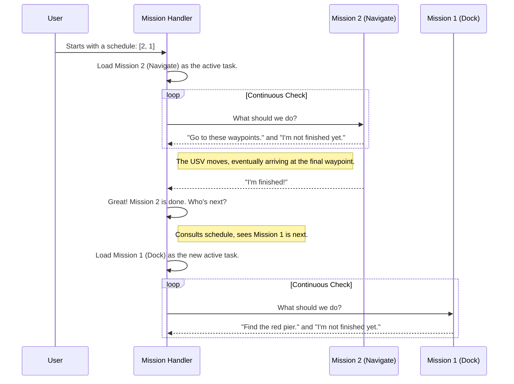

# Chapter 2: Mission Handler (The Conductor)

In the [previous chapter](01_global_obstacle_register__the_world_map__.md), we learned how our USV builds a reliable map of its surroundings. A map is essential, but it doesn't tell you what to *do*. It's like having a perfect chart of an archipelago but no plan for which island to visit first.

This is where our second hero component comes in: the **Mission Handler**.

Think of the Mission Handler as the conductor of an orchestra or the project manager of a construction site. It has the master plan—a schedule of tasks to complete. It doesn't perform the tasks itself, but it knows who should be working, what they should be doing, and when it's time to switch to the next job.

### The To-Do List

At its core, the Mission Handler's job is to manage a to-do list. Let's imagine our USV has a simple day ahead:

1.  Navigate through a channel marked by buoys.
2.  After the channel, find and dock at the red pier.

The Mission Handler is the component that says, "Okay, we're done with step 1, let's start step 2." It manages the transition, ensuring the USV gracefully switches from "channel navigation mode" to "docking mode."

### How It Works: The Main Loop

The Mission Handler is in a constant loop of asking three simple questions:

1.  **What's on the schedule?** It looks at a pre-defined list of tasks, for example `[NavigateChannel, Docking]`.
2.  **What is the current task doing?** It checks in with the currently active task (e.g., `NavigateChannel`).
3.  **Is the current task finished?** It listens for a "I'm done!" signal from the active task.

When it receives that "I'm done!" signal, it crosses the item off its list and activates the next one. This simple but powerful logic is what gives our USV its autonomy.

### Inputs and Outputs

The Mission Handler makes decisions based on information it receives from other parts of the system.

*   **Input 1: The Task Schedule**: A list of mission numbers (e.g., `[2, 1, 3]`) loaded from a configuration file when the node starts. This is the master plan.
*   **Input 2: USV State (`/usv/state/pose`)**: The USV's current global position, so it knows where it is.
*   **Input 3: Task Signals (`/usv/wp_arrived`, `/usv/mission/green_light`)**: Simple "yes/no" messages that tell the handler key events have occurred, like arriving at a destination. These act as cues for the conductor.

Based on these inputs, it gives directions to other parts of the system.

*   **Output 1: Waypoint Goals (`/usv/goals`)**: A list of coordinates for the navigation system to follow. These are provided by the currently active mission.
*   **Output 2: Mission Status (`/usv/mission/id`, `/usv/mission/status`)**: Publishes the ID of the current mission (e.g., "Mission 2 is active") and its status ("Status 1: Finished").

### A Day in the Life of the Conductor

Let's trace how the Mission Handler manages a simple sequence of tasks.



This diagram shows the core responsibility: checking the status of the current task and, upon its completion, loading the next one from the schedule.

### Diving into the Code (`mission_handler_node.cpp`)

Let's see how these ideas are turned into code.

#### 1. Loading the Schedule

When the `MissionHandlerNode` is created, one of its first jobs is to read the task schedule from a parameter file. This is our pre-defined "to-do list."

```cpp
// From the MissionHandlerNode constructor
if(!this->has_parameter("task_schedule")){
    this->declare_parameter("task_schedule", rclcpp::PARAMETER_INTEGER_ARRAY);
}
std::vector<int64_t> task_schedule_og = this->get_parameter("task_schedule").as_integer_array();
// ... code to copy it into our task_schedule vector ...
```

This code snippet checks for a parameter named `task_schedule` and loads it. This makes our USV flexible—we can give it a different list of tasks without rewriting any code!

#### 2. The Main Loop: `timer_callback`

The "heartbeat" of the Mission Handler is the `timer_callback` function, which runs every 100 milliseconds. It's incredibly simple, delegating its work to other functions.

```cpp
void timer_callback() {
    // 1. Check if we need to switch to a new mission.
    check_mission_jump();

    // 2. Get the latest instructions from the *current* mission.
    feedback = vtec->update(pose, update_params);
    
    // 3. Publish the mission's instructions and status.
    wp_pub_->publish(wp_list);
    mission_id_pub_->publish(id);
    // ... more publishers
}
```
Here, `vtec` is a clever name for a smart pointer that holds the currently active mission object.

#### 3. Deciding to Switch Tasks: `check_mission_jump`

This is the decision-making core. It checks if the current mission is complete. If it is, it finds the next mission on the schedule and calls a function to load it.

```cpp
void check_mission_jump(){
    // Is the task schedule non-empty and is the current task reporting "finished" (status.data is true)?
    if(task_schedule.size() > 0 && status.data){
        // Get the ID of the next mission from our list.
        int suitable_id = get_next_known_id();
        
        // ... more logic ...

        // Tell the system to switch to the new mission.
        update_mission_id(suitable_id);
    }
}
```
This is the "conductor seeing the cue" moment. The `status.data` being true is the signal that one part of the symphony is over, and it's time to bring in the next section.

#### 4. Switching the Playbook: `update_mission_id`

This function is like the conductor turning to a new page in the score and pointing at a different section of the orchestra. It receives a mission ID and swaps out the currently active mission logic for a new one.

```cpp
void update_mission_id(int mission_command){
    switch(mission_command){
        case 1:
            vtec = std::make_shared<M1>(); // Load Mission 1 logic
            break;
        case 2:
            vtec = std::make_shared<M2>(); // Load Mission 2 logic
            break;
        case 3:
            vtec = std::make_shared<M3>(); // Load Mission 3 logic
            break;
        default:
            vtec = std::make_shared<M0>(); // Load "standby" logic
            break;
    }
    vtec->re_init(); // Reset the new mission to its starting state
}
```
By creating a new object (`std::make_shared<M1>()`), we are loading a completely different set of behaviors and goals. The rest of the system doesn't need to know the details; it just keeps asking the `vtec` object what to do.

### Conclusion

You've now met the project manager! The **Mission Handler** is the central brain that brings order and purpose to the USV's actions. It doesn't navigate or dock itself, but it reads the master plan (the task schedule) and tells the specialized systems when to start and stop their work.

But this raises a question: what exactly are these "Missions" like `M1` and `M2` that the handler is loading? What's inside them? How do they decide which waypoints to generate?

In the next chapter, we'll open up one of these playbooks and find out. Get ready to learn about the [Mission (The Playbook)](03_mission__the_playbook__.md).

---

Generated by [AI Codebase Knowledge Builder](https://github.com/The-Pocket/Tutorial-Codebase-Knowledge)