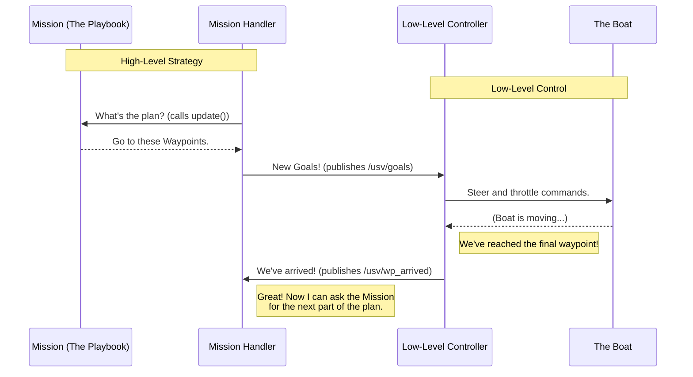

# Chapter 4: Waypoint Navigation

In the [previous chapter](03_mission__the_playbook__.md), we saw how a `Mission` acts like a playbook, generating a strategic plan. This plan takes the form of coordinates on a map—a destination it wants the USV to reach.

But how does a list of coordinates turn into the physical movement of a boat? If you tell your car's GPS "go to the grocery store," the GPS doesn't grab the steering wheel. It provides a path, and the driver follows it. This is exactly how our USV works.

Welcome to the concept of **Waypoint Navigation**, the bridge between high-level planning and low-level control.

### The GPS and the Driver

Imagine you're on a road trip. You, the planner, decide the ultimate destination for the day. You plug this into your GPS. The GPS, a smart system, calculates a series of turns and stretches of road to follow. These are your **waypoints**.

However, the GPS doesn't steer the car, press the gas, or hit the brakes. That's the job of the driver. The driver's task is much simpler: "drive to the *next* instruction on the screen." When the GPS says "turn right in 500 feet," the driver handles the details of slowing down, signaling, and turning the wheel.

In our project:
*   **The Planner:** The [Mission Handler (The Conductor)](02_mission_handler__the_conductor__.md) and the active [Mission (The Playbook)](03_mission__the_playbook__.md) work together to decide on a destination.
*   **The GPS:** The `Mission` calculates a path as a list of points (`Waypoints`) to get there. It publishes this path as a message named `goals`.
*   **The Driver:** A separate, low-level controller (which isn't part of the code we're studying) is always listening for these `goals`. Its only job is to steer the boat to each point in the list, one by one. It handles all the complex physics of boat movement.

This separation is brilliant because it lets our `Mission` logic focus on *what* to do (e.g., "find the center of the gate"), not *how* to do it (e.g., "set rudder angle to 15 degrees and throttle to 50%").

### The Feedback Loop: "Are We There Yet?"

There's one more crucial piece. How does the GPS know when you've made the turn, so it can give you the next instruction? You hear a "ding!" and see the map update.

Our system needs the same feedback. The low-level "driver" sends a simple signal back when it has successfully reached the final waypoint in the list. This signal is a message called `wp_arrived` (Waypoint Arrived). When the Mission Handler sees this signal, it knows the boat has completed the last set of instructions and can now ask the active `Mission` for its next strategic move.

Let's see this whole interaction in a diagram.



This clean separation keeps the high-level logic simple and lets a specialized "driver" node focus on being the best pilot it can be.

### Diving into the Code (`mission_handler_node.cpp`)

The [Mission Handler (The Conductor)](02_mission_handler__the_conductor__.md) is the central coordinator for this process. Let's see how it manages the flow of waypoints and feedback.

#### 1. Publishing the Waypoints

Inside the `timer_callback` loop, the handler gets the latest plan from the active mission and immediately sends it out for the "driver" to follow.

```cpp
// From timer_callback() in mission_handler_node.cpp
feedback = vtec->update(pose, update_params);

if(feedback.goals.size() > 0){
    set_goals(feedback.goals); // Helper to format the message
    wp_pub_->publish(wp_list); // Send the goals to the navigator
}
```

*   `feedback.goals` is the list of waypoints that the `Mission` just calculated.
*   `wp_pub_` is the publisher that sends this list over the `/usv/goals` topic, where the low-level controller is listening.

#### 2. Listening for Arrival

In the constructor of the `MissionHandlerNode`, it sets up its "ear" to listen for the "we've arrived" signal from the driver.

```cpp
// From the MissionHandlerNode constructor
wp_arrived_sub_ = this->create_subscription<std_msgs::msg::Bool>(
    "/usv/wp_arrived", 1,
    [this](const std_msgs::msg::Bool &msg) {
        // Store the "we've arrived" signal for the next mission update.
        update_params.wp_arrived = msg.data;
    });
```
This is the heart of the feedback loop.
*   It subscribes to the `/usv/wp_arrived` topic.
*   When a message (a simple `true` or `false`) comes in, it stores that value in `update_params.wp_arrived`.
*   This `update_params` variable is then passed into the `vtec->update()` function in the main timer loop. This is how the active `Mission` learns that its previous set of waypoints has been reached, and it can begin calculating the next set.

### Conclusion

You've just learned about the elegant abstraction that allows our USV to move. **Waypoint Navigation** cleanly divides the problem of autonomy into two parts:

1.  **Strategy (The "Where"):** Deciding which points on the map to visit. This is the job of the `Mission` classes.
2.  **Execution (The "How"):** The low-level task of physically steering the boat to a given point. This is handled by a separate controller.

The `goals` list is the command, and the `wp_arrived` signal is the confirmation. This simple but powerful interface is what connects our high-level "brain" to the low-level "muscles" of the USV.

We've now seen how the USV perceives the world, makes decisions, and acts on them. But the quality of these decisions depends entirely on the quality of the data. What exactly constitutes an "obstacle" in our system? What information do we need to know about it?

In the next chapter, we'll zoom in on the fundamental unit of data that fuels our entire system: the [Obstacle Data Model](05_obstacle_data_model_.md).

---

Generated by [AI Codebase Knowledge Builder](https://github.com/The-Pocket/Tutorial-Codebase-Knowledge)