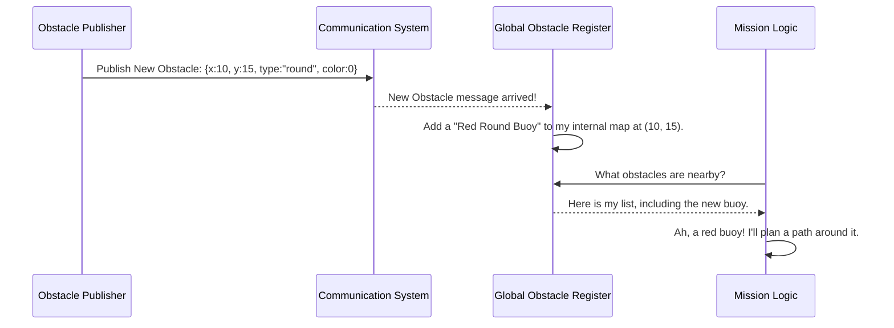

# Chapter 5: Obstacle Data Model

In the [previous chapter](04_waypoint_navigation_.md), we saw how the USV follows a set of coordinates to get from point A to point B. But often, the reason for going to point B is because of something located there—an obstacle, a buoy, a landmark.

To make intelligent decisions about these objects, all the different parts of our system need to speak the same language. If the sensor system says "I see a big, red, round thing," and the mission logic is looking for a "channel marker buoy," they might not realize they're talking about the same object. We need a standardized format for describing things.

This is where the **Obstacle Data Model** comes in. Think of it as a business card for any object of interest in the water.

### The Business Card for Buoys

Imagine you meet someone at a conference. They hand you a business card. It contains all the essential information in a standard format: their name, title, and contact details. You don't need to guess; the information is clear and organized.

Our Obstacle Data Model does the same thing for objects in the water. It's a simple, standardized data structure that contains all the essential information about an obstacle:
*   **Where is it?** Its `x` and `y` coordinates on the global map.
*   **What is it?** Its `type`, such as `"round"` for a buoy or `"marker"` for a post.
*   **What does it look like?** Its `color`, represented by a simple number (e.g., 0 for red, 1 for green).

By forcing all parts of the system to use this same "business card," we ensure perfect communication. A simulated obstacle generator, the world map, and the high-level mission logic can all pass information back and forth without any confusion.

### The Journey of an Obstacle "Business Card"

Let's follow a single piece of obstacle data as it flows through our system.

1.  **Creation:** A component like the [Obstacle Publisher (The Simulator)](06_obstacle_publisher__the_simulator__.md) creates an `Object` data structure. It's like printing a new business card: "Red Round Buoy at position (10, 15)."
2.  **Publication:** The publisher sends this "business card" as a message to the rest of the system.
3.  **Registration:** The [Global Obstacle Register (The World Map)](01_global_obstacle_register__the_world_map__.md) listens for these messages. It takes the card and puts a pin on its map.
4.  **Decision:** The active [Mission (The Playbook)](03_mission__the_playbook__.md) looks at the map, sees the pin for the "Red Round Buoy," and uses that information to decide what to do next.

Here’s what that flow looks like:



The `Object` data structure is the currency of communication for everything related to obstacles.

### Diving into the Code (`mission.h`)

The "business card" is defined as a simple structure in C++. In our project, a version of it is defined in `mission.h` and is used throughout the mission logic. It's beautifully simple.

```cpp
// From mission.h
struct Obstacle {
  double x, y;
  std::string type;
  int color; // 0=red, 1=green, 2=blue, 3=yellow, 4=black
};
```

That's it! This is our entire data model.
*   `x` and `y` are floating-point numbers for the coordinates.
*   `type` is a string of text.
*   `color` is an integer that acts as a code.

The actual message passed between different programs (nodes) is defined in `usv_interfaces/msg/Object.msg`, but it represents the exact same information.

#### Creating an Obstacle

Let's look at a simplified example from the `obstacle_publisher.cpp` file, where a new simulated obstacle is created.

```cpp
// Simplified from obstacle_publisher.cpp
usv_interfaces::msg::Object new_obj;

new_obj.x = 10.0;
new_obj.y = 15.0;
new_obj.color = 0;      // 0 means red
new_obj.type = "round"; // This is a round buoy
```

This code snippet creates an instance of our "business card" and fills it out. It now represents a red, round buoy located at coordinates (10.0, 15.0). This `new_obj` can now be published for other nodes to use.

#### Using an Obstacle

Now let's see how a node like the [Global Obstacle Register (The World Map)](01_global_obstacle_register__the_world_map__.md) might use this information when it receives it.

```cpp
// Simplified from global_obstacle_register_node.cpp
void process_inference(const usv_interfaces::msg::Object& inference) {
    // The 'inference' is the business card we received.
    
    // We can access its data easily:
    RCLCPP_INFO(this->get_logger(), "Saw a %s object of color %d",
        inference.type.c_str(), 
        inference.color);

    auto global_pos = local_to_global(inference.x, inference.y);
    // ... rest of the logic to add it to the map
}
```

The function receives an `Object` (which it calls `inference`). It can then directly read the `type`, `color`, `x`, and `y` fields to understand what was seen and where it is. Because the format is standardized, there's no guesswork.

### Conclusion

You've now learned about the fundamental unit of information in our system: the **Obstacle Data Model**. It's a simple but powerful concept that acts as a common language, or a "business card," for any object our USV encounters.

This standardized structure—containing `x`, `y`, `type`, and `color`—is what allows diverse components like a simulator, a map-builder, and the mission logic to communicate flawlessly.

So far, we've talked about these obstacles as if they magically appear. But where do they come from in our simulation? How do we create a world for our USV to explore?

In the next chapter, we'll meet the component responsible for this: the [Obstacle Publisher (The Simulator)](06_obstacle_publisher__the_simulator__.md).

---

Generated by [AI Codebase Knowledge Builder](https://github.com/The-Pocket/Tutorial-Codebase-Knowledge)