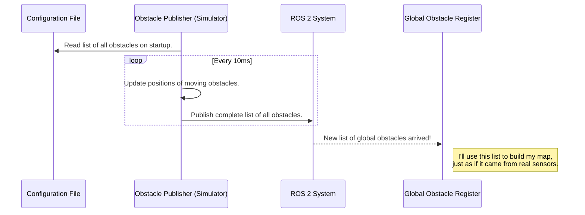

# Chapter 6: Obstacle Publisher (The Simulator)

In the [previous chapter](05_obstacle_data_model_.md), we learned about the **Obstacle Data Model**, the standardized "business card" that every part of our system uses to describe an object. It's the common language that allows our USV's brain to think about its environment.

But this raises a practical question: how do we test this brain without a boat? Putting a real USV in the water is expensive, requires a lot of setup, and is dependent on good weather. If we had to do that for every small code change, development would grind to a halt.

What we need is a flight simulator, but for our boat. A safe, digital playground where we can create any scenario we want and test our code instantly. This is the job of our final core component: the **Obstacle Publisher**.

### The Architect of a Digital World

Think of the Obstacle Publisher as the architect and stage manager for a play. Before the actors (our mission logic) can rehearse, the manager needs to set up the stage. They read a script (a configuration file) that says, "Place a lamppost here, a park bench there, and have an actor walk across the stage from left to right."

The Obstacle Publisher does exactly this for our USV.
1.  **It reads a configuration file** that defines a "world"—the exact positions of buoys, docks, and other obstacles.
2.  **It places these obstacles** into the digital environment.
3.  **It can even simulate movement**, making some obstacles drift or follow a path, just like a stage manager cuing an actor to move.

Crucially, it publishes this information using the *exact same* [Obstacle Data Model](05_obstacle_data_model_.md) that real sensors would use. This means the rest of the system, from the [Global Obstacle Register (The World Map)](01_global_obstacle_register__the_world_map__.md) to the [Mission (The Playbook)](03_mission__the_playbook__.md), doesn't know the difference. It's a perfect simulation.

### The Flow of Simulated Data

The Obstacle Publisher's job is simple but essential. It's the starting point for all information in our testing environment.

1.  **On Startup:** It reads a configuration file that contains a list of every obstacle, its type, color, and location.
2.  **Every Tick:** On a regular timer (e.g., every 10 milliseconds), it does two things:
    *   It updates the positions of any "dynamic" (moving) obstacles.
    *   It broadcasts the complete list of all obstacles to the rest of the system.

This broadcast is what brings our simulated world to life.



### Diving into the Code (`obstacle_publisher.cpp`)

Let's look at how this simulator is built. It's surprisingly straightforward.

#### 1. Reading the "World" from a File

In the constructor, the node reads a list of obstacle definitions from a ROS 2 parameter file. This makes our simulator incredibly flexible. We can design dozens of different test courses just by writing new text files.

```cpp
// Simplified from the ObstaclePublisherNode constructor
// Get the list of all mission areas to load obstacles from.
std::vector<std::string> global_tasks = this->get_parameter("global_tasks").as_string_array();

// Loop through each mission area...
for(std::string &mission_id : global_tasks) {
    // ...and get the names of the obstacles within it.
    std::vector<std::string> n = this->get_parameter(mission_prefix + ".obj_names").as_string_array();
    
    // ... code to load each obstacle's x, y, color, type ...
}
```
This code dynamically loads different "worlds" based on configuration. This is how we can set up a "channel navigation" test and a "docking" test in the same digital space.

#### 2. Bringing the World to Life

The `timer_callback` function is the heartbeat of our simulator. It runs over and over, making sure the world is constantly being broadcast and updated.

```cpp
// From timer_callback()
void timer_callback() {
    // ... some logic to figure out what the USV can "see" ...

    if(dynamic_obs){
        update_dyn(); // Move the dynamic obstacles.
    }

    // Broadcast the list of all obstacles in the world.
    object_list_global_pub_->publish(object_list_global);

    // ... broadcast other lists for visualization ...
}
```
This is the main loop. It calls `update_dyn()` to handle movement and then `publish()` to send the state of the world out to everyone else.

#### 3. Simulating Movement

How do we make an obstacle move? With some very simple physics! The `update_dyn` function is called on every timer tick. It updates each dynamic obstacle's position based on its velocity.

```cpp
// Simplified from update_dyn()
void update_dyn(){
    double dt = 0.01; // Time elapsed since last update (10ms)
    for(int i = 0 ; i < dyn_obs_n ; i++){
        // Update position: new_x = old_x + velocity_x * time
        dyn_obs[i][0] += dyn_obs[i][2]*dt;
        dyn_obs[i][1] += dyn_obs[i][3]*dt;

        // ... logic to make them "bounce" off invisible walls ...

        // Update the actual object in our master list.
        object_list_global.obj_list[dyn_obs_id[i]].x = dyn_obs[i][0];
        object_list_global.obj_list[dyn_obs_id[i]].y = dyn_obs[i][1];
    }
}
```
This is a classic "game loop" update. By repeatedly adding a small velocity vector to the position, we create the illusion of smooth motion.

#### 4. Simulating a Camera's View

A real USV can't see everything in the world at once. Its camera has a limited field of view. Our simulator mimics this. Besides publishing the *global* list of all obstacles, it also calculates and publishes a *local* list of obstacles that are currently "visible" to the USV.

The function `fill_local_list` does this by checking two things for every obstacle in the world:
1.  Is it close enough to the USV? (e.g., within 10 meters)
2.  Is it in front of the USV? (e.g., within the camera's field of view)

```cpp
// Simplified from fill_local_list()
d_tmp = std::sqrt(std::pow(x_tmp,2) + std::pow(y_tmp,2));

// Is the object in front, within 10 meters, and inside a 1-radian field of view?
if(poseR(0) > 0 && d_tmp < 10 && std::fabs(std::atan2(poseR(1),poseR(0))) < 1){
    // If yes, add it to the list of "visible" objects.
    object_list.obj_list.push_back(obj);
}
```
This local list is published on a topic like `/inferences` and is what the [Global Obstacle Register (The World Map)](01_global_obstacle_register__the_world_map__.md) would typically listen to in a real-world scenario, perfectly mimicking how a real sensor works.

### Conclusion: The Complete Picture

Congratulations! You have now toured all the major components of the `src` project. The **Obstacle Publisher** is the final piece of the puzzle, providing the critical ability to test our entire system in a controlled, simulated environment.

Let's take a step back and see how everything fits together:

1.  The **Obstacle Publisher** creates a digital world and acts as the USV's "eyes."
2.  The **Global Obstacle Register** takes these sightings and builds a stable **World Map**.
3.  The **Mission Handler** acts as the "conductor," consulting a schedule to decide which task to perform.
4.  It loads a specific **Mission**, the "playbook" with the strategy for that task.
5.  The Mission analyzes the World Map and generates a series of destinations for **Waypoint Navigation**.
6.  All communication about obstacles relies on the simple and robust **Obstacle Data Model**.

From simulated perception to high-level decision-making and finally to action, you now understand the full loop of autonomy in the `src` project. You're ready to explore the code, experiment with the simulator, and maybe even design a new mission of your own

---

Generated by [AI Codebase Knowledge Builder](https://github.com/The-Pocket/Tutorial-Codebase-Knowledge)