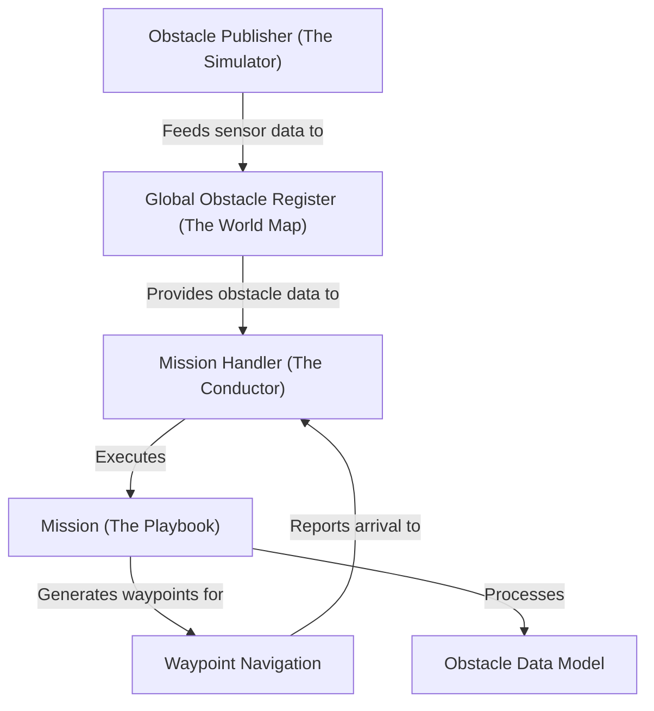

# Tutorial: src

This project powers an autonomous boat, or *Unmanned Surface Vehicle (USV)*. The central **Mission Handler** acts as the boat's brain, deciding which task to perform from a schedule. Each task, like navigating a channel or docking, is defined by a **Mission** playbook.

To understand its surroundings, the boat builds a **Global Obstacle Register**, which is a persistent *world map* of buoys and other objects. This map is built from sensor data, which can be faked by the **Obstacle Publisher** for easy testing. When a mission runs, it generates a path using **Waypoint Navigation**, and all components communicate about objects using a shared **Obstacle Data Model**.

**Source Repository:** [None](None)

## Chapters

1. [Global Obstacle Register (The World Map)
](01_global_obstacle_register__the_world_map__.md)
2. [Mission Handler (The Conductor)
](02_mission_handler__the_conductor__.md)
3. [Mission (The Playbook)
](03_mission__the_playbook__.md)
4. [Waypoint Navigation
](04_waypoint_navigation_.md)
5. [Obstacle Data Model
](05_obstacle_data_model_.md)
6. [Obstacle Publisher (The Simulator)
](06_obstacle_publisher__the_simulator__.md)

---

Generated by [AI Codebase Knowledge Builder](https://github.com/The-Pocket/Tutorial-Codebase-Knowledge)