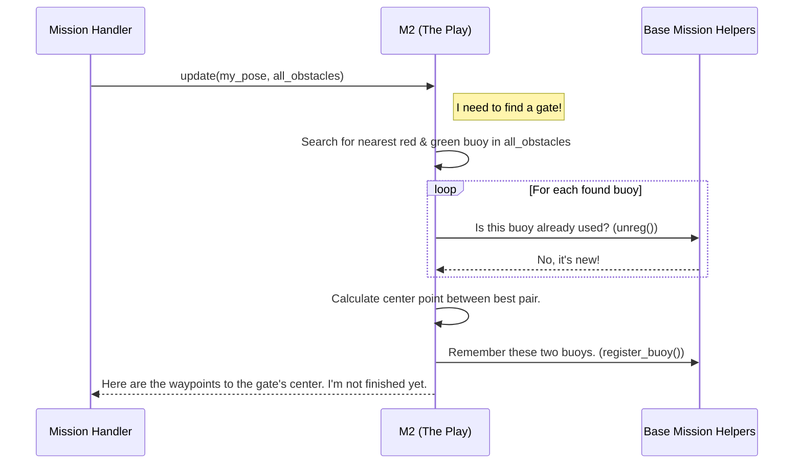

# Chapter 3: Mission (The Playbook)

In the [previous chapter](02_mission_handler__the_conductor__.md), we met the **Mission Handler**, the conductor who decides *which* task the USV should work on. It manages a schedule, switching from "Mission 1" to "Mission 2" when the time is right.

But that left us with a big question: what *is* a "Mission"? If the Mission Handler is the coach of a football team, what does a specific play in their playbook look like?

This is where our third component comes in: the **Mission** class, which is the template for our playbook.

### A Play for Every Situation

Imagine a coach wants to design a new play. They don't start from scratch. They know the basic rules of the game: the field dimensions, how to score, what a foul is. They just need to define the specific strategy: "The quarterback throws to the wide receiver, who runs this specific route."

In our USV, it's the same idea. We have different tasks:
*   Navigate through a channel of red and green buoys (`M2: Follow the Path`).
*   Find a specific colored symbol on a wall and dock in front of it (`M3: Docking`).
*   Race through a slalom course as fast as possible (`M4: Speed Challenge`).

Each of these tasks requires a unique strategy. But they all share common needs, like "how to calculate the distance between two points" or "how to remember which buoys I've already passed."

The **Mission** abstraction solves this by creating a "contract":
1.  **The Rulebook (Base `Mission` Class):** A base template that provides a common toolbox of functions (e.g., `distance`, `transform_coordinates`) and defines the rules. The most important rule is: "Every play must have an `update` function that tells the USV what to do."
2.  **The Plays (e.g., `M2`, `M3` classes):** These are the specific strategies. They follow the rules from the base class and fill in the details of their `update` function with their unique logic.

This design is powerful because the [Mission Handler (The Conductor)](02_mission_handler__the_conductor__.md) can run *any* play without needing to know its secret strategy. It just says, "Hey, active play, `update` yourself!" and trusts the play to provide the right instructions.

### The Contract: `mission.h`

Let's look at the contract that every mission must sign. This is defined in the `mission.h` file. Don't worry about the details; focus on the big picture.

```cpp
// From mission.h
class Mission {
 public:
  // The "contract": Every mission MUST provide an update function.
  virtual USVOutput update(const Eigen::Vector3f &pose, const  USVUpdate &params) = 0;

 protected:
  // The "toolbox": Helpful functions for all missions.
  double dist(const Eigen::Vector3f &p1, const Eigen::Vector3f &p2);
  void register_buoy(Eigen::Vector3f buoy);
  bool unreg(Eigen::Vector3f buoy);
  // ... and many more helpers!
};
```

*   `virtual ... update(...) = 0;` is the key. In C++, this means, "I'm not providing the code for this function. Any class that inherits from me *must* provide its own version." This is the mandatory part of the contract.
*   The `protected:` section contains the shared toolbox. Functions like `dist` (calculate distance) or `register_buoy` (remember a buoy we've already used) are available to all specific mission classes, so we don't have to write them over and over.

### A Specific Play: `M2 - Follow the Path`

Now let's see how a specific play, `M2`, implements this contract. `M2`'s job is to find pairs of red and green buoys that form a "gate" and navigate through the center of them, one after another.

Here's how `M2`'s `update` function works in plain English:

1.  **Ask:** "Is this the first gate I'm looking for?"
2.  **Look:** Scan the list of all visible obstacles provided by the [Global Obstacle Register (The World Map)](01_global_obstacle_register__the_world_map__.md).
3.  **Find:** Search for the nearest red and green buoy that I haven't used before.
4.  **Calculate:** Determine the center point between them. This is my goal!
5.  **Remember:** Mark those two buoys as "used" so I don't try to go through the same gate again.
6.  **Report:** Return the calculated goal waypoint to the Mission Handler. Also, tell the handler if the entire "Follow the Path" mission is finished.

Let's see this in a diagram.



### Diving into the Code (`m2.cpp`)

Now let's peek at the code that makes this happen.

#### 1. The `update` Function (The Brains of the Play)

The `update` function in `m2.cpp` is a state machine. It uses a `switch` statement to keep track of its progress. This is like a mini-checklist: "Step 0: Find first gate. Step 1: Find next gate. Step 2: Done."

```cpp
// From m2.cpp
USVOutput M2::update(const Eigen::Vector3f &pose, const  USVUpdate &params)
{
  // ...
  switch(outMsg.state){
    case 0: // Find the very first gate
      goal = get_goal(params.obs_list);

      if(goal.norm() > 0.01){ // If we found a valid goal...
        outMsg.state = 1; // ...move to the next state!
        outMsg.goals = pack_goal(pose, goal, 1.);
      }
      break;
    // ... more cases for subsequent gates ...
  }
  return outMsg;
}
```
This function is the core of the `M2` play. It calls a helper function, `get_goal`, to do the hard work of finding the buoys. If `get_goal` succeeds, `M2` updates its internal state (`outMsg.state = 1`) and packages the `goal` into a list of waypoints for the navigation system.

#### 2. The `get_goal` Function (The Eyes of the Play)

This is where the actual strategy for "Follow the Path" lives. It loops through all the obstacles the USV sees and implements the logic to find a gate. Here is a simplified version:

```cpp
// Simplified from m2.cpp
Eigen::Vector3f M2::get_goal(std::vector<Obstacle> obs_list){
  // ... variables for nearest red and green buoys ...

  // 1. Search for nearest UNREGISTERED buoys
  for(const auto& obs : obs_list){
    // Is this buoy new to us? Call the toolbox function!
    if(unreg(global_position_of_obs)){
      // ... logic to find the closest red and green ones ...
    }
  }

  // 2. If we found a pair, calculate the goal
  Eigen::Vector3f goal = (red_buoy + green_buoy) / 2.0;

  // 3. Register them so we don't use them again
  register_buoy(red_buoy);
  register_buoy(green_buoy);
  
  return goal;
}
```
Notice how it calls `unreg()` and `register_buoy()`? It's using the common toolbox provided by the base `Mission` class! This is the "play" following the "rules of the game." `M3` (Docking) will have its own, completely different `get_goal` function, but it will still use the same shared tools.

### Conclusion

You've just looked inside the playbook! The **Mission** design pattern is a cornerstone of our project. It lets us create self-contained, interchangeable "plays" (`M1`, `M2`, `M3`, etc.) for every task the USV might face.

*   The base **`Mission` class** acts as the **rulebook and toolbox**.
*   Specific classes like **`M2`** are the **individual plays** with unique strategies.
*   The **`MissionHandlerNode`** is the **coach** who calls the plays but doesn't need to know their inner workings.

This keeps our code organized, reusable, and easy to extend. We can add a brand new `M7` mission tomorrow without touching the Mission Handler or any of the other missions.

So, the Mission Handler calls a play, and the play generates a list of goal coordinates (waypoints). But how does the boat actually *get* there? How does it steer itself to follow those coordinates? That's the job of our final core component.

In the next chapter, we'll explore [Waypoint Navigation](04_waypoint_navigation_.md), the system that turns a list of destinations into steering commands.

---

Generated by [AI Codebase Knowledge Builder](https://github.com/The-Pocket/Tutorial-Codebase-Knowledge)