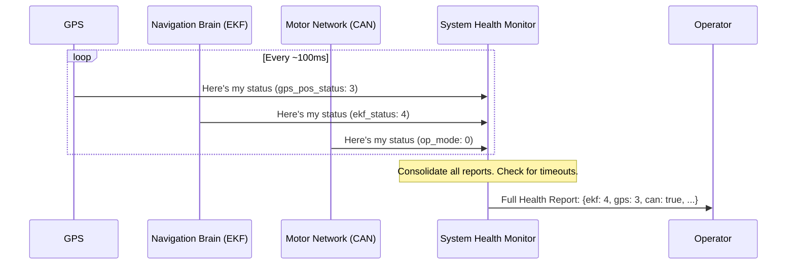

# Chapter 3: System Health Monitor

In the [previous chapter](02_simulation_control_switch_.md), we learned how the [Simulation Control Switch](02_simulation_control_switch_.md) gives us a big "GO" button to start our boat's autonomous behavior. But before we press "GO," how do we know if the boat is even ready? What if the GPS doesn't have a signal, or a motor controller isn't responding?

This is where the **System Health Monitor** comes in. It's the USV's "check engine" light.

## Your Pre-Flight Checklist

Imagine you're a pilot about to take off. You don't just jump in and fly; you go through a pre-flight checklist. "Engine status? Check. Fuel level? Check. Navigation systems online? Check."

The System Health Monitor does this for our robotic boat. It constantly listens to vital signs from the most important hardware components:
*   The **GPS**, for location.
*   The **EKF** (our navigation brain), to make sure it's calculating the boat's position correctly.
*   The **CAN bus**, the network that talks to the motors.

It gathers all this information and combines it into a single, simple status report. This lets an operator (or another automated system) quickly confirm that everything is working before and during a mission.


*The Health Monitor is like a dashboard, showing the status of all critical systems at a glance.*

## How to Check the Boat's Vitals

The System Health Monitor node (`system_validation_node`) starts automatically when you launch the boat's software. It constantly publishes the boat's health report to a specific ROS 2 topic called `/usv/status`.

To see this report in real-time, you can "listen" to this topic using a simple command in your terminal:

```bash
ros2 topic echo /usv/status
```

**What happens when you run this?**

You'll see a stream of messages that look like this, updating about ten times per second:

```yaml
ekf_status: 4          # Status from the navigation brain
gps_pos_status: 3      # Status of the main GPS position
gps_hdt_status: 40     # Status of the GPS heading (direction)
op_mode: 0             # Current operating mode from the motor controller
can_stm_status: true   # Is the motor controller communicating?
---
```

This output is your live dashboard!
*   A `can_stm_status` of `false` would immediately tell you there's a problem with the motor communication.
*   The different status numbers correspond to specific codes from the hardware manuals (e.g., for the GPS, `3` might mean "Full GPS Fix").

With one command, you can verify that all essential systems are online and healthy.

## Under the Hood: The Central Information Hub

How does the node collect all this information and put it in one place? It acts as a central hub that subscribes to status messages from all the other components.



1.  The **GPS**, **Navigation Brain**, and **Motor Network** each publish their own status on their own separate topics.
2.  The **System Health Monitor** is subscribed to all of them. It listens patiently.
3.  Every time a message arrives from a component, the Monitor updates its internal copy of the overall system health.
4.  It also runs a special check: if it hasn't heard from a critical component (like the motor network) in a while, it flags a problem. This is how it detects a "lost connection."
5.  Finally, it bundles everything into a single `SystemStatus` message and publishes it for the **Operator** (or any other node) to see.

### A Look at the Code

Let's see how this is implemented in `src/system_validation_node.cpp`.

First, in the constructor, the node sets up "listeners" (subscriptions) for each component it needs to monitor. Here's a simplified example for the navigation brain (EKF):

```cpp
// File: src/system_validation_node.cpp

// Listen for navigation status messages
sbg_ekf_nav_sub_ = this->create_subscription<sbg_driver::msg::SbgEkfNav>(
    "/sbg/ekf_nav", 10,
    [this](const sbg_driver::msg::SbgEkfNav &msg){
        // When a message arrives, update our summary
        out.ekf_status = msg.status.solution_mode;
    });
```
This code tells the node: "Listen on the `/sbg/ekf_nav` topic. When a message comes in, grab the `solution_mode` value from it and store it in our `out.ekf_status` variable." It does the same thing for the GPS and other components.

One of the most important jobs is to detect if a component has gone silent. The node uses a timer that runs a function every 100 milliseconds to check for this.

```cpp
// File: src/system_validation_node.cpp

// This function runs 10 times per second
void timer_callback() {
    // Calculate how long it's been since the last CAN message
    rclcpp::Duration diff = this->now() - last_recev;
    int elapsed_ms = diff.nanoseconds() / 1000000;

    // If it's been over half a second, flag an error
    if(elapsed_ms > 500){
        out.can_stm_status = false;
    } else {
        out.can_stm_status = true;
    }
}
```
This `timer_callback` function checks the time. If more than 500 milliseconds have passed since the last message from the CAN bus (motor network), it sets `out.can_stm_status` to `false`. This is our "lost connection" alarm!

Finally, after updating the statuses, the node publishes the complete summary message.

```cpp
// File: src/system_validation_node.cpp

// ... inside the timer_callback() function

    // Publish the complete, updated status report
    system_status_pub_->publish(out);
```
This line takes the `out` object, which contains the complete health report, and sends it out on the `/usv/status` topic for everyone else to see.

## Conclusion

You now understand the critical role of the **System Health Monitor**! It's our robot's "check engine" light, providing peace of mind and essential diagnostic information. You've learned:

-   It acts as a **central hub**, collecting status reports from critical components like the GPS and motor controllers.
-   It aggregates this data into a **single, simple status message**.
-   You can easily view this live health report by running `ros2 topic echo /usv/status`.
-   It can even detect **lost connections** by checking if a component has stopped sending updates.

Now that we know our systems are healthy, we need to make sure we understand the data they're producing. The GPS and EKF both tell us the boat's position and orientation, but is their data in a format that the rest of the robot can use?

We'll tackle this in the next chapter, where we explore [State Estimation Standardization](04_state_estimation_standardization_.md).

---

Generated by [AI Codebase Knowledge Builder](https://github.com/The-Pocket/Tutorial-Codebase-Knowledge)