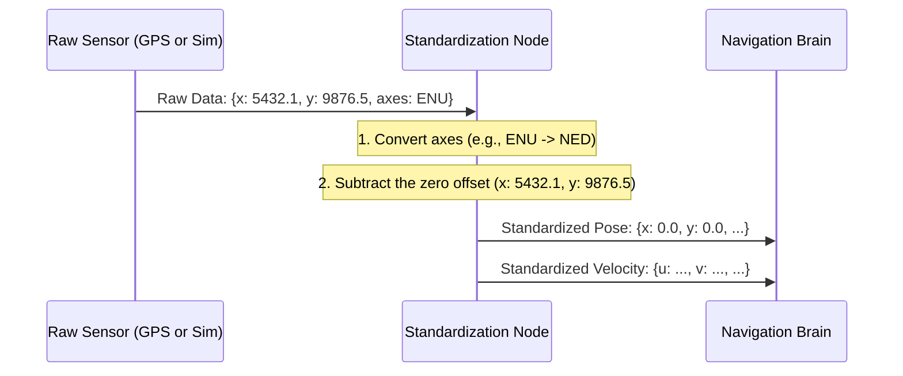

# Chapter 4: State Estimation Standardization

In the [previous chapter](03_system_health_monitor_.md), we learned how the [System Health Monitor](03_system_health_monitor_.md) acts as a "check engine" light, confirming that all our critical hardware is online and healthy. We know our GPS is working, but what is it actually telling us?

The data from our sensors—like the GPS and IMU (Inertial Measurement Unit)—is raw. The GPS might give us a global latitude and longitude, while a simulator gives us an (x, y) position starting from a random point. Furthermore, their definitions of "forward" or "up" might be different. If our navigation system tries to use this conflicting information, it would be like trying to read a map where every city uses its own unique compass directions. It would be impossible!

This is the problem that **State Estimation Standardization** solves. It's a universal translator for all our position, orientation, and velocity data.

## The Universal Translator for Location

Imagine you're managing an international construction project. Your American architect sends you blueprints with measurements in feet and inches. Your European engineer sends you material specifications in meters and centimeters. And your local surveyor gives you landmark positions using a compass. Before you can start building, you need one person to take all this information and convert it into a single, consistent standard—for example, everything in meters, relative to the northeast corner of the property.

Our **State Estimation Standardization** node is that project manager for the robot. It takes location data from any source—the real boat's advanced GPS or a computer simulator—and translates it into a single, easy-to-understand format.

This process involves two key steps:
1.  **Zeroing:** Establishing a common origin point (0, 0) right where the boat starts.
2.  **Coordinate System Conversion:** Making sure everyone agrees on which way is "forward," "left," and "up."


*The Standardization node converts messy, inconsistent raw data into a clean, unified format for the rest of the system.*

## How to Use the "Translator"

This node is a quiet worker. It starts automatically with the rest of the system and does its job in the background. The main way you might interact with it is to tell it: "Your current position is now the new 'start' line." This is called **zeroing**.

While the system does this automatically when it first starts, you can also trigger it manually at any time. To reset the boat's origin point to its current location, you can run this command in a terminal:

```bash
ros2 service call /zero_imu std_srvs/srv/Empty
```

**What happens when you run this?**

The node will take its current position reading (e.g., x=5432.1, y=9876.5) and internally store these values as the "zero offset." From that moment on, it will subtract this offset from all future readings. You'll see a confirmation in the terminal where the node is running:

```
[imu_converter_node-1] [INFO] [167...]: Setting x: 5432.100000 y: 9876.500000 as new zero
```

Now, the boat's official position is (0, 0), and all future movements will be measured from this new starting point.

## Under the Hood: The Translation Process

Let's follow a piece of data as it gets translated. The node subscribes to the raw sensor data and publishes the clean, standardized version.



1.  The **Raw Sensor** (either the real GPS or the simulator) sends a message with its position and orientation data. This data is in its own native format (e.g., ENU - East, North, Up axes).
2.  The **Standardization Node** receives this message.
3.  First, it performs **coordinate conversion**. It might swap the x and y axes or invert an angle to make sure the data conforms to the robot's internal standard (e.g., NED - North, East, Down).
4.  Next, it performs **zeroing**. It subtracts the stored `zero_x` and `zero_y` values from the position.
5.  Finally, it publishes the fully translated data to topics that the **Navigation Brain** and other components are listening to. Now, the rest of the software sees a simple, predictable position starting from (0,0).

### A Look at the Code

We have two different "translator" nodes: `imu_converter_node.cpp` for the real boat's hardware and `odom_converter_node.cpp` for the simulator. Let's look at simplified snippets from `odom_converter_node.cpp`.

First, the node needs to listen for raw data from the simulator. This is set up in the constructor.

```cpp
// File: src/odom_converter_node.cpp

// Listen for odometry messages from the simulator
odomSub = this->create_subscription<nav_msgs::msg::Odometry>("/gz_sim/odometry", 10,
  std::bind(&OdomConverterNode::odom_cb, this, _1));
```
This line tells the node, "Listen to the `/gz_sim/odometry` topic. When a message arrives, run the `odom_cb` function."

The `zero_imu` service handler is responsible for storing the new origin point.

```cpp
// File: src/odom_converter_node.cpp

void zero_imu(...) {
  // Store the current position as the new zero offset
  zero_x = last_odom.pose.pose.position.x + zero_x;
  zero_y = last_odom.pose.pose.position.y + zero_y;
  RCLCPP_INFO(get_logger(), "Setting x: %f y: %f as new zero", zero_x, zero_y);
}
```
When you call the service, this function takes the last known position and saves it in the `zero_x` and `zero_y` variables.

Finally, the `odom_cb` function does the actual translation every time a new message arrives.

```cpp
// File: src/odom_converter_node.cpp

void odom_cb(const nav_msgs::msg::Odometry::SharedPtr msg){
  // ...
  // Swap X and Y for coordinate conversion (e.g., ENU to NED)
  // and subtract the zero offset.
  newOdom.pose.pose.position.x = msg->pose.pose.position.y - zero_x;
  newOdom.pose.pose.position.y = msg->pose.pose.position.x - zero_y;
  // ...
}
```
Here, the node creates a new message (`newOdom`). It sets the new x-position by taking the incoming y-position (the axis swap for conversion) and subtracting the `zero_x` offset. It does the same for the y-position.

After converting the velocities and orientation as well, it publishes the clean data for everyone else to use.

```cpp
// File: src/odom_converter_node.cpp

// ... at the end of odom_cb()
  posePub->publish(pose);
  velocityPub->publish(velocity);
```
This sends the final, standardized pose and velocity out to the rest of the system.

## Conclusion

You now understand the crucial, behind-the-scenes role of **State Estimation Standardization**! It is the universal translator that makes our robot's navigation system possible. You've learned:

-   It converts raw position, orientation, and velocity data from different sources into a **single, consistent format**.
-   It performs two key actions: **zeroing** (setting a common start point) and **coordinate system conversion** (agreeing on directions).
-   This ensures that all software components are "speaking the same language" about the boat's state.

With our boat's systems healthy and its understanding of its own position standardized, it's time to look outward. How does the boat see the world around it? In the next chapter, we'll explore how it identifies and tracks potential dangers with [Obstacle Processing](05_obstacle_processing_.md).

---

Generated by [AI Codebase Knowledge Builder](https://github.com/The-Pocket/Tutorial-Codebase-Knowledge)