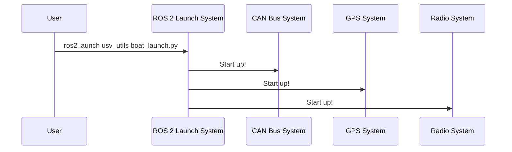

# Chapter 1: System Orchestration

Welcome to the `usv_utils` tutorial! We're excited to have you on board. In this first chapter, we'll explore the foundational concept that brings our robotic boat to life: **System Orchestration**.

## The Conductor of the Orchestra

Imagine you're ready to deploy our Unmanned Surface Vehicle (USV) for a mission on the water. The boat has many different electronic parts: a GPS for location, a CAN bus to talk to the motors, a radio for communication, and more. Each of these components has its own dedicated piece of software.

So, how do we start all these different software programs at once? And more importantly, how do we make sure they all start correctly and can work together?

This is where **System Orchestration** comes in. It's the master plan, or the "conductor," that launches and coordinates all the individual software components (we'll call them "nodes"). It doesn't perform a specific task like reading GPS data itself. Instead, it ensures that every "musician" (each software node) starts on time and plays in harmony to create a fully functional robot.


*Our orchestrator is like a conductor, ensuring every part of the system works together.*

## What is a "Launch File"?

In the world of ROS 2 (the framework we use), this orchestration is handled by special files called **launch files**. A launch file is a script (in our case, written in Python) that tells the system which software nodes to run for a specific scenario.

For example, we have one launch file for operating the real boat and another launch file for running a computer simulation.

### Using the Launch File

To start all the software needed for the real boat, you run a single command in your terminal:

```bash
ros2 launch usv_utils boat_launch.py
```

**What happens when you run this?**

You won't get a simple number or text as output. Instead, you'll see a series of log messages telling you that various nodes are starting up. This command is like the conductor tapping their baton: it signals the start of the performance. Once it's finished, all the necessary software for the boat is running in the background, ready for a mission.

## Under the Hood: How Orchestration Works

Let's peek behind the curtain to see what the `boat_launch.py` file is actually doing.

### The Step-by-Step Process

When you execute the `ros2 launch` command, a sequence of events is triggered.



1.  **You** run the command.
2.  The **ROS 2 Launch System** reads and understands the instructions inside `boat_launch.py`.
3.  The launch file contains a list of nodes to start. The system begins launching them one by one.
4.  For example, it might first launch the **CAN Bus System** (which controls motors), then the **GPS System**, and then the **Radio System**.
5.  Once all the nodes are running, our boat's software is fully operational.

### A Look at the Code

Let's examine a simplified version of `usv_utils/launch/boat_launch.py` to see how this is written in code.

First, we define a special function that the launch system knows to look for.

```python
# File: launch/boat_launch.py

from launch import LaunchDescription
from launch_ros.actions import Node
# ... other imports skipped for simplicity

def generate_launch_description():
    # ... instructions to launch nodes go here ...
```

This `generate_launch_description` function is the entry point. Its job is to create a list of all the things we want to launch.

#### Including Other Launch Files

Sometimes, a component like our GPS is complex and has its own launch file. We can include it directly. This is like a conductor telling an entire section of the orchestra (e.g., the brass section) to start playing their pre-arranged part.

```python
# ... inside generate_launch_description()

# This action finds and includes the launch file for the CAN bus.
can_launch = IncludeLaunchDescription(
    # ... details on where to find the file ...
)

# This action finds and includes the launch file for the SBG GPS.
sbg_launch = IncludeLaunchDescription(
    # ... details on where to find the file ...
)
```

Here, `can_launch` and `sbg_launch` are instructions to run other, more specific launch files.

#### Launching a Single Node

We can also launch a single, specific node. This is like the conductor pointing to a single musician, like the lead violinist.

For instance, we have a node that validates the whole system is working correctly. We'll learn more about this in the [System Health Monitor](03_system_health_monitor_.md) chapter.

```python
# ... inside generate_launch_description()

# This action starts our system validation node.
system_validation_node = Node(
    package="usv_utils",
    executable="system_validation_node",
)
```

The `Node` action tells the system to run the `system_validation_node` executable from the `usv_utils` package.

#### Putting It All Together

Finally, the function must return a `LaunchDescription`, which is the final list of all the actions to perform. This is the complete musical score for our conductor.

```python
# ... inside generate_launch_description()

    return LaunchDescription([
        can_launch,
        sbg_launch,
        system_validation_node,
        # ... other nodes would be listed here ...
    ])
```

This tells the launch system: "Please run the CAN launch file, the SBG GPS launch file, and the system validation node."

## Conclusion

You now understand the core concept of **System Orchestration**! You've learned that:

-   It's a "master plan" that starts all the software components (nodes) for our robot.
-   This plan is defined in a Python **launch file**.
-   Running `ros2 launch ...` is like a conductor starting an orchestra, bringing the robot's software to life.

But what if we don't have the real boat with us? How can we test our code in a simulation? And how do we switch between the "real boat" setup and the "simulation" setup?

We'll answer that in the next chapter, where we explore the [Simulation Control Switch](02_simulation_control_switch_.md).

---

Generated by [AI Codebase Knowledge Builder](https://github.com/The-Pocket/Tutorial-Codebase-Knowledge)