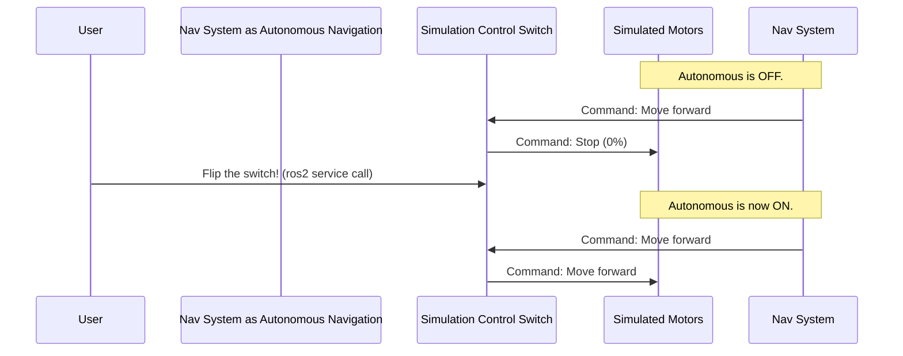

# Chapter 2: Simulation Control Switch

In the [previous chapter](01_system_orchestration_.md), we learned how **System Orchestration** launches all the software needed to run our real USV. But what if we want to test a new navigation algorithm without putting the actual boat in the water? The answer is simulation!

However, testing in a simulation brings its own challenges. When you start the simulation, you don't want the boat to immediately speed off on its own. You need a way to control exactly when the autonomous behavior begins. This is where the **Simulation Control Switch** comes in.

## The Big Red "GO" Button

Imagine you have a powerful, self-driving race car. Even if the car's computer has a route planned, you wouldn't want it to start driving the second you turn the key. You'd want a big "GO" button to press when you're ready.

The Simulation Control Switch is exactly that: a "GO" button for our simulated boat. It acts as a safety gatekeeper. The boat's navigation brain might be calculating thruster commands, but the Control Switch decides whether to actually send those commands to the virtual motors.


*The Control Switch is like a remote control that lets you toggle between Manual (Off) and Autonomous (On) modes.*

It has a simple on/off toggle. When it's "off," the boat sits still. When you flip it "on," it allows the autonomous commands to pass through, and the boat begins its mission. This gives you, the developer, complete control during testing.

## How to Use the Switch

The Control Switch node is started automatically when you run the simulation launch file. The main way you'll interact with it is by "flipping the switch."

In ROS 2, this kind of on/off toggle is often implemented as a "service." You can "call" the service from your terminal to trigger an action.

To turn autonomous mode **on** (or **off** if it's already on), you run this simple command in a new terminal:

```bash
ros2 service call /auto std_srvs/srv/Empty
```

**What happens when you run this?**

1.  **If the boat was sitting still:** The command flips the switch to "ON." The node will start passing thruster commands to the simulated motors, and you'll see the boat begin to move in the simulation window.
2.  **If the boat was already moving:** The command flips the switch to "OFF." The node will stop the flow of commands, and the boat will come to a halt.

You'll also see a confirmation message in the terminal where the Control Switch node is running:

```
[killswitch_sim_node-1] [INFO] [167...]: Setting autonomous as: true
```

This simple command gives you an easy and reliable way to start and stop your tests.

## Under the Hood: How the Gatekeeper Works

Let's peek inside to see the step-by-step logic of the Control Switch.

### The Flow of Commands

The node sits between the autonomous navigation system and the simulated motors, acting as a gate.



1.  The **Autonomous Navigation** system constantly calculates where the boat should go and sends commands (e.g., "left thruster at 50%").
2.  These commands arrive at the **Simulation Control Switch**.
3.  The Switch checks its internal state. Is autonomous mode "ON" or "OFF"?
4.  If "OFF", it ignores the command from the navigation system and sends a "0" command to the **Simulated Motors**, telling them to stay put.
5.  When you, the **User**, run the `ros2 service call` command, the Switch flips its state to "ON".
6.  Now, when the next command arrives from the navigation system, the Switch sees that it's "ON" and passes the command directly to the motors. The boat starts moving!

### A Look at the Code

Let's see how this logic is implemented in the `src/killswitch_node.cpp` file.

First, the node needs to listen for commands and be ready to talk to the motors. This is set up in the constructor.

```cpp
// File: src/killswitch_node.cpp

// Listen for commands from the navigation system
leftSub = this->create_subscription<...>(
  "/usv/left_thruster", 10, ...);

// Prepare to send commands to the simulated motors
leftPub = this->create_publisher<...>(
  "/model/.../cmd_thrust", 10);
```
This code sets up the communication channels. It subscribes to `/usv/left_thruster` to get commands and creates a publisher to send commands to the simulation's motor topic.

Next, it creates the service that lets us toggle the switch.

```cpp
// File: src/killswitch_node.cpp

// Creates the callable service named "auto"
service = this->create_service<std_srvs::srv::Empty>(
  "auto", std::bind(&KillSwitchSimNode::autonomous, ...));
```
This line of code creates the `/auto` service that we can call from the command line. When called, it runs the `autonomous` function.

The `autonomous` function itself is very simple. It just flips a boolean variable.

```cpp
// File: src/killswitch_node.cpp

void autonomous(...) {
  // Flip the switch from on-to-off or off-to-on
  this->autonomous_on = !this->autonomous_on;

  RCLCPP_INFO(get_logger(), "Setting autonomous as: %s",
    autonomous_on ? "true" : "false");
}
```
If `autonomous_on` was `false`, it becomes `true`. If it was `true`, it becomes `false`. It then prints the message we see in the terminal.

Finally, the `update` function runs repeatedly and contains the core gatekeeper logic. Here's a simplified view of what it does:

```cpp
// File: src/killswitch_node.cpp

void update() {
  if (this->autonomous_on) {
    // If ON, pass the commands through.
    leftPub->publish(this->right);
    rightPub->publish(this->left);
  } else {
    // If OFF, send zero to stop the motors.
    leftPub->publish(zero);
    rightPub->publish(zero);
  }
}
```
This function continuously checks the `autonomous_on` flag. If it's `true`, it publishes the thruster commands it received. If it's `false`, it publishes `0` to keep the boat stationary. Simple and effective!

(Note: You might notice `leftPub` publishes `this->right` and vice-versa. This is an intentional swap due to how the simulation model is configured!)

## Conclusion

You now understand the role of the **Simulation Control Switch**! It's a simple but crucial component that provides safety and control when testing in a simulation. You've learned:

-   It acts as a **safety gatekeeper** for the simulated motors.
-   It allows you to **toggle autonomous behavior on and off** with a simple command-line call.
-   The internal logic is just an **if-statement** that checks whether the switch is on before passing commands.

This switch helps us test our autonomous system safely. But what happens if a component like the GPS fails during a real mission? How does the robot know that something is wrong and it should stop?

We'll explore that very question in the next chapter, where we dive into the [System Health Monitor](03_system_health_monitor_.md).

---

Generated by [AI Codebase Knowledge Builder](https://github.com/The-Pocket/Tutorial-Codebase-Knowledge)