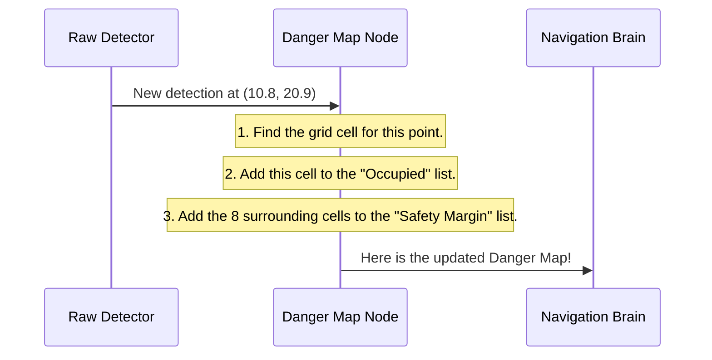
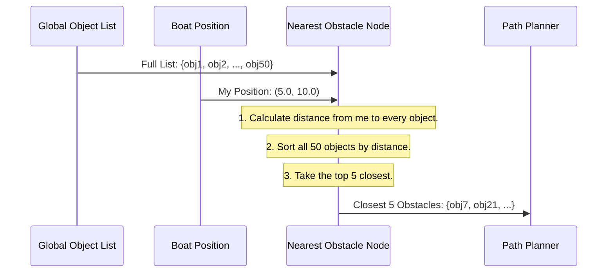

# Chapter 5: Obstacle Processing

In the [previous chapter](04_state_estimation_standardization_.md), we learned how [State Estimation Standardization](04_state_estimation_standardization_.md) gives our boat a clear and consistent understanding of its own position. Now that the boat knows *where it is*, it needs to understand *what's around it*.

A USV's sensors, like LiDAR, can generate thousands of data points every second, describing everything they see—other boats, buoys, docks, or even just waves. This flood of raw data is overwhelming. The boat's navigation system can't make smart decisions if it has to analyze every single point individually.

This is the job of **Obstacle Processing**. It acts as the boat's situational awareness, taking this flood of raw sensor data and turning it into a clear, actionable picture of the immediate environment.

## The Brain's Visual Cortex

Imagine you're driving a car in heavy traffic. Your eyes see hundreds of details: other cars, traffic lights, signs, pedestrians. But your brain doesn't treat all this information equally. It automatically filters it and highlights what's important:
*   The car directly in front of you.
*   The motorcycle trying to merge into your lane.
*   The red light up ahead.

You also mentally create a "safety bubble" around these key objects. You don't just see a car; you see the car and the space around it that you need to avoid.

**Obstacle Processing** does the same thing for our USV. It has two main jobs:
1.  **Create a Danger Map:** It takes individual obstacle points and builds a simple grid map, marking not only where the obstacles are but also adding a safety margin around them.
2.  **Find the Closest Threats:** It takes a long list of all detected objects and filters it down to just the few that are closest and most relevant to the boat right now.


*Obstacle Processing turns a messy cloud of sensor data into a clean map and a short list of important objects.*

## Seeing the Processed World

These processing nodes run automatically in the background, constantly interpreting sensor data. The best way to "see" their work is to look at the clean information they publish.

### 1. The Danger Map

The `obstacle_viewer_node` creates a grid map of occupied spaces and safety margins. You can visualize this in a tool like RViz2, or you can "echo" the raw data directly from the terminal.

To see the grid cells for the safety margins, run:
```bash
ros2 topic echo /usv/obstacle_margins_map
```
**What happens when you run this?**

You'll see a stream of messages listing the coordinates of all the grid cells that are part of the "safety bubble."

```yaml
header:
  frame_id: world
cell_width: 0.5
cell_height: 0.5
cells:
- x: 10.5
  y: 20.5
  z: 0.0
- x: 10.5
  y: 21.0
  z: 0.0
- x: 11.0
  y: 20.5
  z: 0.0
# ... and many more points
---
```
This tells our navigation system, "These specific squares on our map are part of a safety zone—don't enter them!"

### 2. The Closest Obstacles

The `obstacle_nearest_publisher` filters a long list of potential objects down to the 5 closest ones. To see this short, prioritized list, run:

```bash
ros2 topic echo /obj_n_nearest_list
```

You'll get a clean list of the five most immediate objects.

```yaml
obj_list:
- x: 15.2
  y: 30.8
  uuid: 'buoy_1'
- x: 25.0
  y: 12.1
  uuid: 'boat_A'
- x: 0.0
  y: 0.0
  uuid: '' # Padded with empty objects if fewer than 5 are found
# ... up to 5 objects
---
```
Instead of dealing with 100 objects, the path planner now only has to consider these 5, making its job much faster and simpler.

## Under the Hood: How Situational Awareness Works

Let's look at how these two nodes process raw data into useful information.

### Creating the Danger Map

The `obstacle_viewer_node` listens for raw detections and builds the grid map.


For every new obstacle, the node not only marks its location but also "inflates" it by adding a buffer of cells around it, creating the safety margin.

#### A Look at the Code

Let's see how this is done in `src/obstacle_viewer_node.cpp`.

First, the node subscribes to the raw obstacle detections.

```cpp
// File: src/obstacle_viewer_node.cpp

// Listen for raw detections (as a list of markers)
marker_arr_sub_ = this->create_subscription<...>(
    "/marker_array", 10,
    [this](const visualization_msgs::msg::MarkerArray &msg) {
        // ... process the new markers ...
    });
```
When a new list of obstacles arrives on `/marker_array`, the code inside the brackets is executed.

Inside, for each new obstacle, it adds the point to its map and then calls a helper function to calculate the safety margin.

```cpp
// File: src/obstacle_viewer_node.cpp

// ... inside the subscription callback
if(!found){ // If this is a new obstacle
    obstacle_map_msg.cells.push_back(msg.markers[i].pose.position);
    
    // Calculate the safety bubble around the new obstacle
    std::vector<geometry_msgs::msg::Point> margin_points = 
        get_margin_points(...);
    
    // Add these safety points to our margin map
    obstacle_margins_map_msg.cells.insert(...);
}
```
The core logic for creating the safety margin is in the `get_margin_points` function. It simply creates a 3x3 square of grid cells centered on the obstacle.

```cpp
// File: src/obstacle_viewer_node.cpp

std::vector<geometry_msgs::msg::Point> get_margin_points(...) {
    std::vector<geometry_msgs::msg::Point> out;
    // Loop from -1 to 1 for both i (x-axis) and j (y-axis)
    for(int i = -1 ; i < 2 ; i++){
        for(int j = -1 ; j < 2 ; j++){
            // Create a point in each of the 9 cells
            out.push_back(...);
        }
    }
    return out;
}
```
This simple double `for` loop efficiently creates the 9-cell "danger zone" around every detected obstacle point.

### Finding the Nearest Obstacles

The `obstacle_nearest_publisher` takes a potentially huge list of objects and filters it down to the most important ones.



#### A Look at the Code

Let's look at `src/obstacle_nearest_publisher.cpp`.

The node subscribes to the full list of all known objects and the boat's current position.

```cpp
// File: src/obstacle_nearest_publisher.cpp

// Listen for the full list of objects
obstacle_list_sub_ = this->create_subscription<...>(
    "/obj_list_global", 10, ...);

// Listen for the boat's current position
pose_sub_ = this->create_subscription<...>(
    "/usv/state/pose", 10, ...);
```
When a new list of objects arrives, it calculates the distance to each one.

```cpp
// File: src/obstacle_nearest_publisher.cpp

// For every object in the full list...
for(int i = 0 ; i < msg.obj_list.size() ; i++){
    // Calculate its distance from the boat and store it
    obj_dist_v.push_back(
        std::pair<double, int>{obj_dist(msg.obj_list[i], pose), i});
}
```
The `obj_dist` function is just a simple implementation of the distance formula (an application of the Pythagorean theorem).

```cpp
// File: src/obstacle_nearest_publisher.cpp

double obj_dist(usv_interfaces::msg::Object obj, ...) {
    return sqrt((obj.x-p.x)*(obj.x-p.x) + (obj.y-p.y)*(obj.y-p.y));
}
```
After calculating all the distances, it sorts the list from nearest to farthest and keeps only the top 5.

```cpp
// File: src/obstacle_nearest_publisher.cpp

// Sort the vector of pairs by distance (the first element)
std::sort(obj_dist_v.begin(),obj_dist_v.end());

// Clear the old output list
out.obj_list.clear();
// Add the 5 closest objects to the output list
for(int i = 0 ; i < obj_dist_v.size() ; i++){
    if(out.obj_list.size() < 5){
        out.obj_list.push_back(...);
    }
}
```
This final, filtered list is then published for the rest of the system to use.

## Conclusion

Congratulations on completing the `usv_utils` tutorial! You now understand the key concepts behind our USV's core software stack, from launching the system to perceiving the world around it.

In this final chapter on **Obstacle Processing**, you've learned that:
- It acts as the boat's **situational awareness**, turning a flood of raw sensor data into actionable intelligence.
- It can create a **"danger map"** by marking where obstacles are and adding a safety margin around them.
- It can filter a long list of objects down to the **few closest and most relevant ones**.

You've journeyed through the entire system:
1.  Starting everything with [System Orchestration](01_system_orchestration_.md).
2.  Controlling the simulation with the [Simulation Control Switch](02_simulation_control_switch_.md).
3.  Ensuring everything is working with the [System Health Monitor](03_system_health_monitor_.md).
4.  Creating a common frame of reference with [State Estimation Standardization](04_state_estimation_standardization_.md).
5.  And finally, understanding the environment with **Obstacle Processing**.

Each of these pieces is a crucial building block, working together to create a capable and robust autonomous boat. We hope this tutorial has given you a solid foundation for understanding, using, and contributing to the `usv_utils` project

---

Generated by [AI Codebase Knowledge Builder](https://github.com/The-Pocket/Tutorial-Codebase-Knowledge)