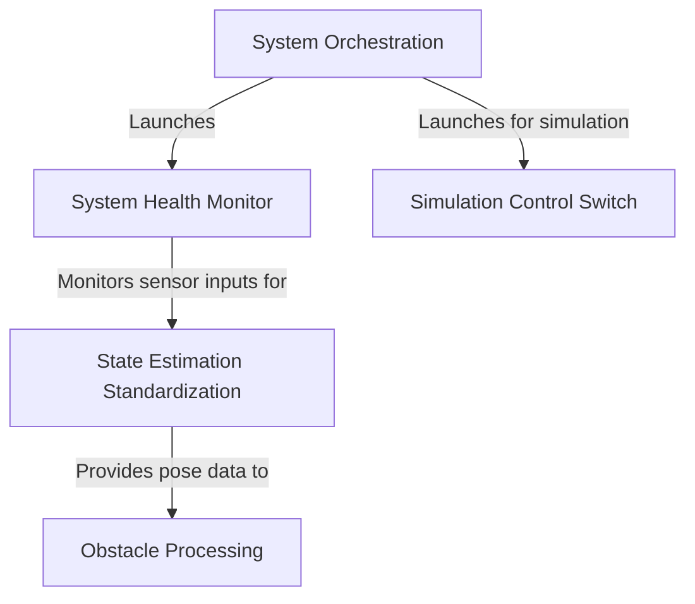

# Tutorial: usv_utils

This project provides the essential software for an *autonomous robotic boat (USV)*. It acts as the boat's central nervous system, taking in raw data from sensors like GPS and making sense of it. The software helps the boat understand **where it is** and how it's moving, keeps track of **nearby obstacles** to avoid collisions, and constantly runs a **health check** on all its critical components. It includes tools to launch all these processes, as well as a *safety switch* for testing in simulation.

**Source Repository:** [None](None)

## Chapters

1. [System Orchestration
](01_system_orchestration_.md)
2. [Simulation Control Switch
](02_simulation_control_switch_.md)
3. [System Health Monitor
](03_system_health_monitor_.md)
4. [State Estimation Standardization
](04_state_estimation_standardization_.md)
5. [Obstacle Processing
](05_obstacle_processing_.md)

---

Generated by [AI Codebase Knowledge Builder](https://github.com/The-Pocket/Tutorial-Codebase-Knowledge)