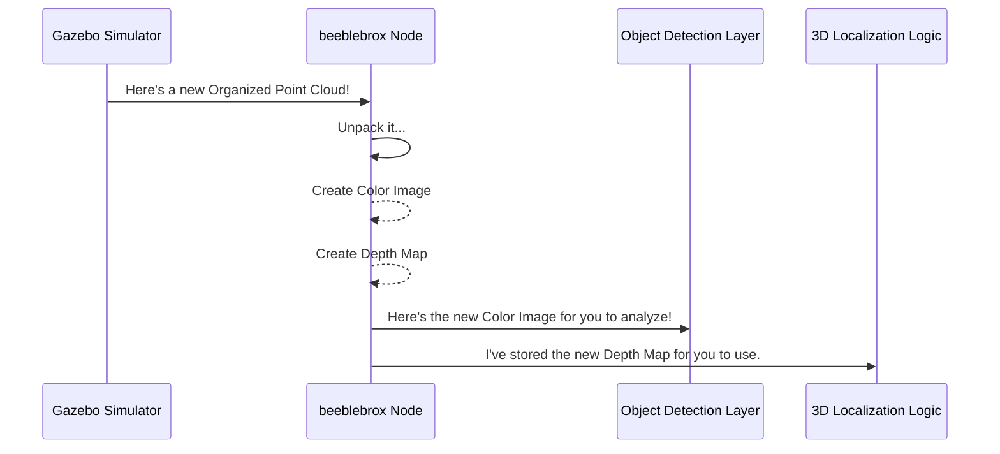

# Chapter 5: Organized Point Cloud Processing

In the [previous chapter](04_3d_object_localization_from_depth_.md), we unlocked our robot's "superpower": the ability to calculate an object's 3D position by combining a 2D detection with a depth map. This works great for the real robot, which gets a color image and a depth map directly from its ZED camera.

But this raises a crucial question: how does this work in simulation? Our simulator doesn't give us two separate images. It gives us a single, complex piece of data called a **point cloud**. How do we turn that point cloud into the color image and depth map that the rest of our system needs?

This chapter is about the clever data-processing step that acts as the perfect translator. We'll explore "Organized Point Clouds" and the process of "unpacking" them, which is the bridge that makes our simulation look just like the real world to our software.

### From Sequin Fabric to Two Separate Pictures

First, what is a point cloud? Imagine you took a 3D scan of a room. A standard point cloud is like a big, disorganized bag of tiny colored dust particles. Each dust particle has a 3D coordinate (X, Y, Z) and a color, but they are all just jumbled together. It's hard to make a picture out of it.

An **organized point cloud** is different. It's more like a fabric woven with sequins. The sequins are still tiny 3D points with color, but they are arranged in a perfect grid, just like the pixels in a photograph.


In simulation, our virtual camera gives us this "sequin fabric." Our job is to perform a simple but critical task:

1.  Create a blank canvas for a **color image**.
2.  Create a blank canvas for a **depth map**.
3.  Go through the sequin fabric one "pixel" at a time. For each pixel, we pull off the color and place it on our color image canvas. Then, we take its distance (`z` value) and place it on our depth map canvas.

When we're done, we have two perfectly aligned images, just as if they came from the real ZED camera. This is how `visionsystemx` makes the simulated world and the real world interchangeable.

### How it Works: The Data Flow

The entire process happens inside the `beeblebrox` node whenever `simulation_mode` is set to `true`.



1.  The Gazebo simulator publishes a new organized point cloud message.
2.  The `beeblebrox` node, which is listening for this message, receives it.
3.  A special function inside `beeblebrox`, `process_organized_pointcloud`, is triggered.
4.  This function "unpacks" the data, creating a color image and a depth map.
5.  It publishes the color image for the [Object Detection Layer](03_object_detection_layer_.md) to see.
6.  It stores the depth map internally, ready for the [3D Object Localization from Depth](04_3d_object_localization_from_depth_.md) logic to use.

### Under the Hood: Unpacking the Point Cloud

Let's look at how this is implemented in the code. First, when `beeblebrox` starts in simulation mode, it subscribes to the point cloud topic from the simulator.

```cpp
// src/beeblebrox.cpp (inside the DetectorInterface constructor)

if (simulation_mode) {
    // We are in simulation! Listen for point cloud data from Gazebo.
    this->pointcloud_sub = this->create_subscription<...>(
        pointcloud_topic, // e.g., "/zed_rgbd/points"
        ...,
        // When a message arrives, call our 'receive_pointcloud' function
        std::bind(&DetectorInterface::receive_pointcloud, this, _1)
    );
}
```
This tells our node, "Hey, whenever you hear a message on the `/zed_rgbd/points` channel, run this specific function."

The callback function, `receive_pointcloud`, then calls our main unpacking function, `process_organized_pointcloud`. Let's break down what that function does.

#### Step 1: Prepare the Canvases

First, it gets the dimensions (`width` and `height`) from the incoming point cloud and creates two empty images in OpenCV format to hold our unpacked data.

```cpp
// src/beeblebrox.cpp (inside process_organized_pointcloud)

// Get the grid dimensions from the point cloud message
int width = cloud_msg->width;
int height = cloud_msg->height;

// Create empty canvases for our images
cv::Mat rgb_img(height, width, CV_8UC3);
cv::Mat depth_img(height, width, CV_32FC1);
```
- `rgb_img` is a standard 3-channel color image.
- `depth_img` is a single-channel image where each pixel can hold a floating-point number (our depth value).

#### Step 2: Loop Through Every "Pixel"

Next, the code iterates through every single point in the organized grid, just like scanning a picture from top-to-bottom, left-to-right.

```cpp
// src/beeblebrox.cpp (inside process_organized_pointcloud)

// Loop through every row and column of the point cloud grid
for (uint32_t row = 0; row < height; ++row) {
    for (uint32_t col = 0; col < width; ++col) {
        // ... unpacking logic goes here ...
    }
}
```

#### Step 3: Extract Depth and Color

Inside the loop, for each point, we read its raw data. The raw data is just a sequence of bytes, but we know exactly where the `z` value and the `rgb` values are located.

```cpp
// src/beeblebrox.cpp (inside the loop)

// Read the 'z' value for the point at this (row, col)
float z = ...; // (simplified from memcpy)
// Read the 'r,g,b' values for the point
uint8_t r = ...;
uint8_t g = ...;
uint8_t b = ...;
```

#### Step 4: Paint the Canvases

Finally, we place the extracted values onto our two canvases at the correct pixel location.

```cpp
// src/beeblebrox.cpp (inside the loop)

// Place the depth value in our depth image
depth_img.at<float>(row, col) = z;

// Place the color pixel in our color image
rgb_img.at<cv::Vec3b>(row, col) = cv::Vec3b(r, g, b);
```

#### Step 5: Store and Publish

After the loops finish, our `rgb_img` and `depth_img` are complete! The node stores them for later use and publishes the color image for the detectors.

```cpp
// src/beeblebrox.cpp (after the loop)

// Store the results for 3D localization
latest_image = rgb_img;
latest_depth = depth_img;

// Publish the color image for object detectors to see
this->ip.publish(...);
```
Now, the rest of the system has exactly what it needs, and it never had to know that the data started its life as a complicated point cloud.

### Conclusion

In this chapter, we've pulled back the curtain on a key piece of engineering that makes simulation in `visionsystemx` so effective.

-   **We learned that** an **organized point cloud** is a grid of 3D points, which is the native data format from our simulated camera.
-   **We saw how** `beeblebrox` "unpacks" this data structure, separating it into two standard outputs: a **color image** and a **depth map**.
-   **We understood that** this unpacking process is the critical bridge that makes simulated sensor data identical to real-world sensor data, allowing the rest of our software to work seamlessly in both modes.

This concept is fundamental to our project's simulation-first development strategy. We have now mastered how our system uses camera-like sensors. But what if we want to use a completely different type of sensor, like a LiDAR, which sees the world in a 360-degree view? How can we combine its data with our camera's view?

In the next chapter, we will explore this very question: [LiDAR-Camera Projection](06_lidar_camera_projection_.md).

---

Generated by [AI Codebase Knowledge Builder](https://github.com/The-Pocket/Tutorial-Codebase-Knowledge)