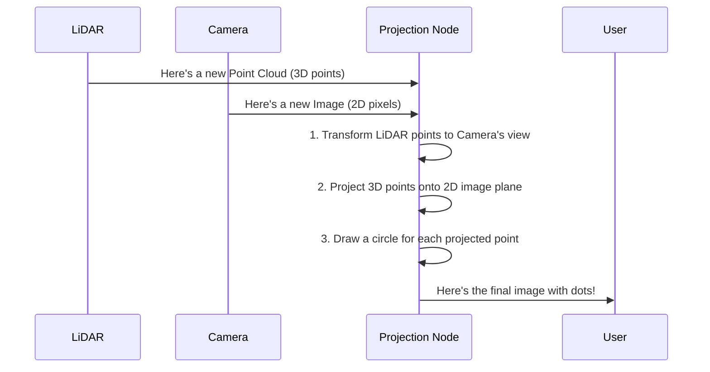

# Chapter 6: LiDAR-Camera Projection

In the [previous chapter](05_organized_point_cloud_processing_.md), we saw how `visionsystemx` cleverly unpacks data from a simulated sensor to create a color image and a depth map, perfectly mimicking a real-world stereo camera. This works beautifully for camera-based perception.

But what happens when we introduce a totally different kind of sensor, like a LiDAR? A LiDAR gives us a rich, 360-degree view of the world as a "cloud" of 3D points, but it doesn't produce a picture. A camera gives us a beautiful picture, but only of what's in front of it. How can we be sure that these two very different sensors are seeing the world from the same, perfectly aligned perspective?

This is where LiDAR-Camera Projection comes in. It's not a detection tool, but a powerful **visualization and calibration tool**. Think of it as an augmented reality overlay. It takes the invisible 3D points from the LiDAR and "paints" them as colored dots onto our 2D camera image. If our sensors are aligned correctly, the dots will land exactly on the real-world objects they represent.

### The Big Idea: Are We Looking at the Same Thing?

Imagine you and a friend are standing back-to-back in a park. Your friend (the LiDAR) has their eyes closed but can reach out and touch everything in a full circle around you, calling out, "Tree here! Bench here! Path here!" You (the camera) can only see what's directly in front of you, but you see it in full, vivid color.

To make sure you're both perfectly oriented, you give your friend a can of glow-in-the-dark spray paint. You ask them to spray a dot on everything they touch. Then, you look at the scene in front of you. If the glowing dot your friend sprayed on the tree trunk appears exactly on the tree trunk in your vision, you know your positions are aligned. If the glowing dot appears to be floating in the air two feet to the left of the tree, something is wrong—your "calibration" is off.

LiDAR-Camera Projection is our "glow-in-the-dark spray paint." It lets a human operator instantly see if the LiDAR's 3D sense of the world matches the camera's 2D view.

### The Projection Pipeline: From 3D Point to 2D Pixel

The process of projecting LiDAR points onto a camera image involves a few clear steps, all handled by a dedicated ROS 2 node.



1.  **Synchronize Data:** The node receives a point cloud from the LiDAR and an image from the camera that were captured at roughly the same time.
2.  **Transform Coordinates:** This is the magic step. The node uses a pre-calculated **extrinsic matrix**—a 4x4 grid of numbers that describes the exact position and rotation of the LiDAR relative to the camera. It multiplies every 3D point from the LiDAR by this matrix, effectively "moving" the point from the LiDAR's perspective into the camera's perspective.
3.  **Project to 2D:** Now that the points are in the camera's 3D space, a standard camera math formula (`cv2.projectPoints`) is used to figure out where each 3D point would land on the camera's 2D image sensor.
4.  **Draw and Publish:** The node takes the original camera image and draws a small, bright green circle at the calculated 2D pixel location for every valid LiDAR point. This new, augmented image is then published for a user to view.

### Under the Hood: A Look at the Python Code

Let's look at `scripts/lidar_camera.py` to see how this is done.

#### 1. Loading the "Magic Formula"

The most important piece of information is the extrinsic matrix. It's our "translation key" between the two sensors. We load it from a configuration file when the node starts.

```python
# scripts/lidar_camera.py

# ... (inside __init__) ...
# Load the 4x4 transformation matrix from a config file
matrix_list = config_file['extrinsic_matrix']
self.T_lidar_to_cam = np.array(matrix_list, dtype=np.float64)

# We also need the camera's own properties (intrinsic matrix)
self.camera_matrix = np.array([[527.8, 0.0, 658.6], ...])
```
The `T_lidar_to_cam` matrix holds the secret to translating between the sensors. The `camera_matrix` describes the camera's lens and sensor properties.

#### 2. Synchronizing the Sensors

We need to make sure the LiDAR data and camera image are from the same moment. ROS 2 provides a wonderful tool for this called `ApproximateTimeSynchronizer`.

```python
# scripts/lidar_camera.py

# Listen for images and LiDAR points
self.image_sub = Subscriber(self, Image, image_topic)
self.lidar_sub = Subscriber(self, PointCloud2, lidar_topic)

# The synchronizer waits for a message from both topics
self.ts = ApproximateTimeSynchronizer(
    [self.image_sub, self.lidar_sub], queue_size=5, slop=0.07
)
# When it gets a matching pair, it calls our main function
self.ts.registerCallback(self.sync_callback)
```

#### 3. The Main Callback: Where the Work Happens

The `sync_callback` function runs every time we get a matched pair of data.

First, we get our data into a usable format.

```python
# scripts/lidar_camera.py (inside sync_callback)

# Convert the ROS image message into an OpenCV image
cv_image = self.bridge.imgmsg_to_cv2(image_msg, 'bgr8')

# Convert the ROS point cloud message into a simple NumPy array
xyz_lidar = pointcloud2_to_xyz_array_fast(lidar_msg)
```

Next, we perform the coordinate transformation. This is the core mathematical step.

```python
# scripts/lidar_camera.py (inside sync_callback)

# Add a '1' to each point for matrix math
ones = np.ones((n_points, 1))
xyz_lidar_h = np.hstack((xyz_lidar, ones))

# This is it! The transformation!
# We multiply every point by our extrinsic matrix
xyz_cam_h = xyz_lidar_h @ self.T_lidar_to_cam.T
xyz_cam = xyz_cam_h[:, :3] # Remove the '1's
```
After this single line of matrix multiplication, `xyz_cam` now contains all the LiDAR points, but as if they were seen from the camera's location.

Now, we filter out points that aren't in front of the camera.

```python
# scripts/lidar_camera.py (inside sync_callback)

# A point is in front if its 'z' value is positive
mask_in_front = (xyz_cam[:, 2] > 0.0)
xyz_cam_front = xyz_cam[mask_in_front]
```

Finally, we project these 3D points onto the 2D image and draw them.

```python
# scripts/lidar_camera.py (inside sync_callback)

# Use OpenCV's magic function to get the 2D pixel locations
image_points, _ = cv2.projectPoints(
    xyz_cam_front, rvec, tvec, self.camera_matrix, self.dist_coeffs
)

# Loop through the results and draw a green circle on the image
for (u, v) in image_points.reshape(-1, 2):
    cv2.circle(cv_image, (int(u), int(v)), 2, (0, 255, 0), -1)

# Publish the final, augmented image
self.pub_image.publish(...)
```

### The Final Result: A Visual Sanity Check

When a user views the output topic `/bebblebrox/video/projected`, they see their normal camera feed, but with a constellation of green dots overlaid.

If the calibration is good, the world looks like this:
*   The dots corresponding to the ground will form a carpet on the floor in the image.
*   The dots corresponding to a wall will form a neat plane on that wall in the image.
*   The dots corresponding to a buoy will appear directly on top of that buoy in the image.

If the dots are all shifted to one side, or seem to be floating above or below the objects they represent, the operator knows immediately that the `extrinsic_matrix` in the configuration file is incorrect and must be recalibrated.

### Conclusion

Congratulations! You've reached the end of the `visionsystemx` introductory tutorials. In this chapter, you've learned about a critical utility for multi-sensor robotics.

*   **We learned that** LiDAR-Camera Projection is a vital **visualization tool** used to verify sensor calibration.
*   **We saw that** its purpose is to "paint" 3D LiDAR points onto a 2D camera image.
*   **We understood the process:** It transforms LiDAR points into the camera's coordinate system using an **extrinsic matrix** and then projects them onto the image plane.
*   **We know that** a correct calibration results in dots that perfectly overlay the real-world objects in the camera feed.

Across these chapters, you have journeyed through the entire `visionsystemx` pipeline. You've seen how we handle [Simulation vs. Real-World Mode](01_simulation_vs__real_world_mode_.md), how [Bebblebrox (The Fusion Core)](02_bebblebrox__the_fusion_core__.md) fuses data, how the [Object Detection Layer](03_object_detection_layer_.md) finds targets, how we achieve [3D Object Localization from Depth](04_3d_object_localization_from_depth_.md), and how we process different sensor data like [Organized Point Cloud Processing](05_organized_point_cloud_processing_.md) and LiDAR points.

You now have a solid foundation to understand, use, and build upon the `visionsystemx` project. Happy coding

---

Generated by [AI Codebase Knowledge Builder](https://github.com/The-Pocket/Tutorial-Codebase-Knowledge)