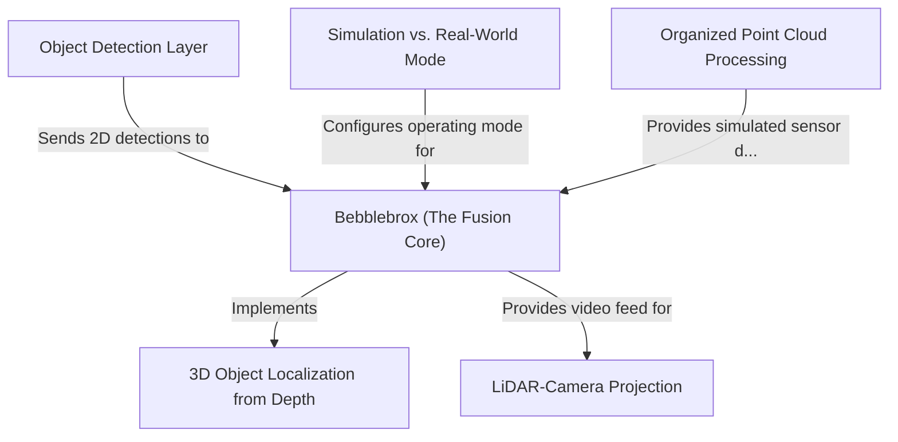

# Tutorial: visionsystemx

`visionsystemx` is a comprehensive robotic vision system designed to **see and understand** its environment. It uses an *Object Detection Layer*, featuring models like YOLO, to find items such as buoys in a 2D camera feed. The system's core, **Bebblebrox**, then cleverly uses depth information to calculate the precise *3D real-world coordinates* of these objects. A critical feature is its dual-mode architecture, allowing it to operate with either a **physical ZED camera** on a real robot or with data from a **Gazebo simulation**, making it highly flexible for development and testing.

**Source Repository:** [None](None)

## Chapters

1. [Simulation vs. Real-World Mode
](01_simulation_vs__real_world_mode_.md)
2. [Bebblebrox (The Fusion Core)
](02_bebblebrox__the_fusion_core__.md)
3. [Object Detection Layer
](03_object_detection_layer_.md)
4. [3D Object Localization from Depth
](04_3d_object_localization_from_depth_.md)
5. [Organized Point Cloud Processing
](05_organized_point_cloud_processing_.md)
6. [LiDAR-Camera Projection
](06_lidar_camera_projection_.md)

---

Generated by [AI Codebase Knowledge Builder](https://github.com/The-Pocket/Tutorial-Codebase-Knowledge)