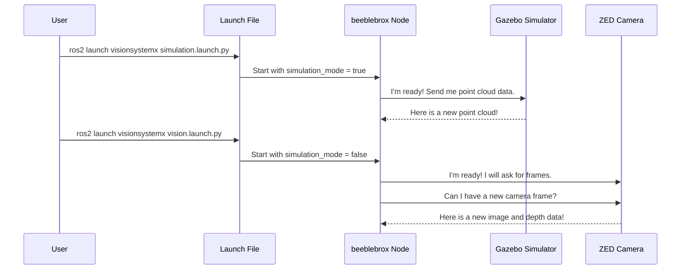

# Chapter 1: Simulation vs. Real-World Mode

Welcome to the `visionsystemx` project! In this first chapter, we're going to explore a foundational concept that makes developing and testing robotics software much easier, safer, and faster: the ability to switch between **Simulation Mode** and **Real-World Mode**.

Imagine you're learning to fly an airplane. Would you rather take your very first lesson in a real Boeing 747, or in a hyper-realistic flight simulator?


Most people would choose the simulator! It's safe. You can crash a thousand times without any real-world consequences. You can practice in any weather condition, at any time of day, all from the comfort of a chair.

This is exactly why `visionsystemx` has two operating modes.

*   **Real-World Mode:** The system connects to the physical robot's hardware, like its ZED stereo camera and LiDAR sensor. It sees and interacts with the real world.
*   **Simulation Mode:** The system connects to a virtual robot in a simulated environment, like the Gazebo simulator. It gets all its data from this virtual world.

This duality allows us to develop and test almost our entire software stack on a laptop, without needing the physical robot. We can write code to detect virtual buoys in a simulated lake before ever putting the real robot in the water.

### The Magic Switch: Launch Files

So, how do we switch between flying the "simulator" and the "real aircraft"? You might think it requires complex code changes, but the magic is handled by a single, simple switch in our **launch files**.

Launch files are scripts that tell ROS 2 which programs (nodes) to run and what settings (parameters) to give them.

Let's look at the launch file for simulation mode.

```python
# launch/simulation.launch.py

# ... (other setup code) ...
video_feed = Node(
    package='visionsystemx',
    executable='beeblebrox',
    name='beeblebrox',
    parameters=[
        # The magic switch is here!
        {'simulation_mode': True},
        # ... (other parameters) ...
    ],
)
# ... (other nodes) ...
```

This file starts our main vision node, `beeblebrox`. The most important line is `{'simulation_mode': True}`. This tells `beeblebrox` to prepare for data coming from our simulator.

Now, let's look at the launch file for running on the real robot.

```python
# launch/vision.launch.py

# ... (other setup code) ...
video_feed = Node(
    package='visionsystemx',
    executable='beeblebrox',
    name='beeblebrox',
    parameters=[
        # We set the switch to False for the real robot.
        {'simulation_mode': False},
        # ... (other parameters) ...
    ],
)
# ... (other nodes) ...
```

It's almost identical! The only difference is that we've flipped the switch to `{'simulation_mode': False}`. This tells `beeblebrox` to connect to the real ZED camera hardware.

That's it! By choosing which launch file to run, we control the entire system's operating mode.

### How It Works Under the Hood

The `simulation_mode` parameter acts as a fork in the road inside our `beeblebrox` node. Let's trace the flow of data in both scenarios.



As you can see, the `beeblebrox` node changes its behavior based on that one simple parameter. It either listens for data from the simulator or actively pulls data from the real camera.

### A Peek at the Code

Let's see how this "fork in the road" is implemented in the C++ code of the `beeblebrox` node.

**1. Reading the Parameter**

First, when the `beeblebrox` node starts, its constructor reads the `simulation_mode` parameter we set in the launch file.

```cpp
// src/beeblebrox.cpp (inside the DetectorInterface constructor)

// Declare the parameter with a default value of 'false'
this->declare_parameter("simulation_mode", false);
// Read the value from the launch file and store it
simulation_mode = this->get_parameter("simulation_mode").as_bool();
```

The node now has a variable `simulation_mode` which is either `true` or `false`.

**2. Choosing the Data Source**

Next, it uses a simple `if` statement to decide what to do based on that variable.

```cpp
// src/beeblebrox.cpp (inside the DetectorInterface constructor)

if (simulation_mode) {
    // We are in simulation! Listen for point cloud data from Gazebo.
    this->pointcloud_sub = this->create_subscription<...>(
        // ... details on listening for data ...
    );
} else {
    // We are in the real world! Start a timer to grab camera frames.
    timer = this->create_wall_timer(
        // ... details on running a function periodically ...
    );
}
```

- If `simulation_mode` is `true`, it creates a **subscriber**. A subscriber in ROS 2 is like putting on headphones to listen to a specific radio channel. In this case, it listens for point cloud data broadcast by the simulator.
- If `simulation_mode` is `false`, it creates a **timer**. The timer calls a function every 100 milliseconds to actively grab a new frame from the real ZED camera.

### Different Data, Same Result

The most beautiful part of this design is that no matter where the data comes from—a simulated point cloud or a real ZED camera—the `beeblebrox` node processes it to produce the same kind of output: an image and depth information.

- In **Simulation Mode**, data arrives as an "organized point cloud". Think of this as a grid of 3D points, neatly arranged just like the pixels in a photo. A special function, `process_organized_pointcloud`, turns this grid into a regular color image and a depth map. We'll cover this in detail in the [Organized Point Cloud Processing](05_organized_point_cloud_processing_.md) chapter.

- In **Real-World Mode**, the `frame_send` function grabs data directly from the ZED camera's SDK, which already provides a color image and a depth map.

This means that the other parts of our system, like the [Object Detection Layer](03_object_detection_layer_.md), don't need to know or care if they are looking at a real lake or a simulated one. They just get an image and do their job. This separation makes our code much cleaner and easier to manage.

### Conclusion

You've just learned about one of the most powerful architectural features of `visionsystemx`: the distinction between simulation and real-world modes.

- **We learned that** this duality allows for safe, rapid, and convenient development.
- **We saw how** a simple `simulation_mode` parameter in a launch file acts as the master switch.
- **We peeked under the hood** to see how the `beeblebrox` node uses this switch to choose its data source.

This core concept allows the rest of the system to be built on a stable foundation, unaware of the complexities of the physical world vs. the virtual one.

Now that we understand how we get our sensor data, let's zoom in on the node at the center of it all. In the next chapter, we'll explore [Bebblebrox (The Fusion Core)](02_bebblebrox__the_fusion_core__.md).

---

Generated by [AI Codebase Knowledge Builder](https://github.com/The-Pocket/Tutorial-Codebase-Knowledge)