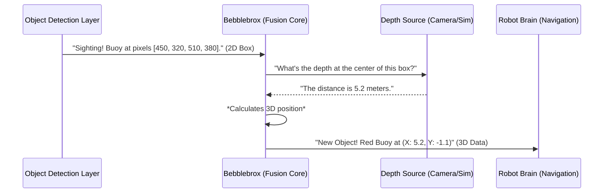

# Chapter 2: Bebblebrox (The Fusion Core)

In the [previous chapter](01_simulation_vs__real_world_mode_.md), we learned how `visionsystemx` can cleverly switch between a safe simulated world and the real world using a single setting. Now, let's meet the mastermind behind that switch and the central hub of our entire vision system: `Bebblebrox`.

Imagine you're a general in an army. You have spies all over the field, and they send you reports like, "I see an enemy tank on the east road" or "There's a supply truck near the bridge." These are great, but they're just sightings. To make a decision, you need to know their *exact* location on your 3D map of the battlefield.

Bebblebrox is our robot's "intelligence officer." It receives 2D "sighting reports" from our spies (the object detectors) and fuses them with a 3D "map" (depth data from a camera) to pinpoint the exact real-world location of every object.

### The Job of an Intelligence Officer

Bebblebrox has a few critical responsibilities that make it the heart of our vision system:

1.  **Receiving 2D Sighting Reports:** It listens for messages from various detectors. For example, our YOLO detector might send a message saying, "I found a buoy at pixel coordinates (450, 320) in the camera image."
2.  **Accessing Depth Information:** It constantly has access to the latest depth data, whether it's from the real robot's ZED camera or from the simulated world's point cloud.
3.  **Fusing Data (The Magic Step):** This is the core task. Bebblebrox takes the 2D pixel coordinate (450, 320) and looks up the distance to that point in its depth data. With this information, it can calculate the object's precise 3D (X, Y, Z) position relative to the robot.
4.  **Publishing Actionable Intelligence:** It broadcasts a final, clean report saying, "There is a round, red buoy located at X=5.2, Y=-1.1, Z=0.0 meters." Other parts of the robot, like the navigation system, can then use this information to steer towards the buoy.

### A Walkthrough: From 2D Sighting to 3D Action

Let's trace the journey of a single detection to see how Bebblebrox works its magic.



1.  An [Object Detection Layer](03_object_detection_layer_.md) (like YOLO) analyzes the camera feed and finds a buoy. It publishes a message containing the 2D bounding box (the pixel coordinates of the rectangle around the buoy).
2.  Bebblebrox receives this 2D bounding box message.
3.  It finds the center of the box and checks its stored depth map for the distance at that exact pixel.
4.  Using some simple math (which we'll explore in the [3D Object Localization from Depth](04_3d_object_localization_from_depth_.md) chapter), it converts the 2D pixel location and its depth into a 3D coordinate.
5.  Finally, it packages this 3D coordinate along with the object's type (e.g., "round", "red") into a new message and publishes it for the rest of the robot to use.

### Under the Hood: Code and Callbacks

So how does this work in the code? The process is built around ROS 2's elegant system of subscribers and publishers.

#### 1. Subscribing to Sightings

First, when Bebblebrox starts up, it tells the ROS 2 system that it wants to listen for messages from our detectors.

```cpp
// src/beeblebrox.cpp (inside the DetectorInterface constructor)

// Create a subscriber that listens on the "/yolo/detections" topic
this->yolo_sub = this->create_subscription<usv_interfaces::msg::ZbboxArray>(
    yolo_sub_topic,
    ...,
    // When a message arrives, call the 'receive_yolo' function
    std::bind(&DetectorInterface::receive_yolo, this, _1)
);
```

This code snippet sets up a "listener" on the topic where our YOLO detector publishes its findings. It says, "Whenever a new message appears on this topic, please run my `receive_yolo` function."

#### 2. The Callback: Reacting to News

The `receive_yolo` function is the heart of the operation. It's the code that runs every single time a new 2D detection arrives.

```cpp
// src/beeblebrox.cpp

void receive_yolo(const usv_interfaces::msg::ZbboxArray::SharedPtr dets) {
    // A list to hold our final 3D objects
    usv_interfaces::msg::ObjectList detections;

    // Loop through every 2D box in the message
    for (const auto& det : dets->boxes) {
        // ... fusion logic goes here ...
    }

    // Publish the final list of 3D objects
    this->yolo_pub->publish(detections);
}
```

This function receives the list of 2D bounding boxes (`dets`) and prepares to turn them into a list of 3D objects (`detections`).

#### 3. The Fusion: Calculating 3D Position

Inside the loop, for each 2D box, Bebblebrox performs the fusion. Here we show the simplified logic for simulation mode.

```cpp
// src/beeblebrox.cpp (inside the 'receive_yolo' loop)

// Get the 3D position using the 2D box (`det`)
auto position = get_position_from_simulation(det);

// Create a new 3D object message
usv_interfaces::msg::Object obj;
obj.x = position[0]; // The real-world X coordinate
obj.y = position[1]; // The real-world Y coordinate
// ... set obj.color and obj.type based on the detection label ...

// Add the new 3D object to our list
detections.obj_list.push_back(obj);
```

The key line is `get_position_from_simulation(det)`. This helper function is the "magic box" that takes the 2D detection, looks up the depth from the simulated point cloud, and returns the 3D `position`. A different function is used in real-life mode with the ZED camera, but the *idea* is identical.

This process is repeated for every single detection that comes in. If YOLO sees five buoys, this loop runs five times, and five 3D objects are added to our final list.

### Conclusion

You've now met `Bebblebrox`, the fusion core of `visionsystemx`. You've learned that:

-   **Bebblebrox acts as a central intelligence officer**, turning simple 2D sightings into actionable 3D intelligence.
-   It **subscribes** to 2D detection messages from detectors like YOLO.
-   It **fuses** these 2D detections with depth data to calculate precise 3D positions.
-   It **publishes** a final list of 3D objects that the robot's navigation system can understand and act upon.
-   This entire process is the same whether in **simulation or real-life mode**; only the source of the depth data changes.

Bebblebrox sits at the crossroads of perception and action. But it can't do its job without the initial "sighting reports." In the next chapter, we'll investigate where these reports come from by exploring the [Object Detection Layer](03_object_detection_layer_.md).

---

Generated by [AI Codebase Knowledge Builder](https://github.com/The-Pocket/Tutorial-Codebase-Knowledge)