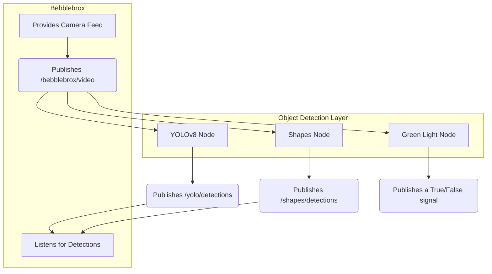

# Chapter 3: Object Detection Layer

In the [previous chapter](02_bebblebrox__the_fusion_core__.md), we met `Bebblebrox`, our system's "intelligence officer." We learned that its main job is to take 2D "sighting reports" and turn them into actionable 3D intelligence for the robot. But where do these initial sightings come from?

Welcome to the Object Detection Layer—the "eyes" of our system. Or, more accurately, the team of specialized spies who do the actual looking.

Imagine you're trying to find things in a busy city. You wouldn't send one person to find everything. You'd send a team:
*   One spy is an expert at recognizing faces in a crowd.
*   Another is great at spotting specific types of cars.
*   A third is simply looking for traffic lights changing to green.

The Object Detection Layer in `visionsystemx` works the same way. It's not a single, monolithic "eye." It is a **modular layer of independent detectors**, each with a specific job. This design makes our system flexible and powerful. We can add, remove, or update a detector without breaking the rest of the system.

### Meet the Team: Our Specialist Detectors

Our detection layer is made up of a few key specialists, each running as its own program (a ROS 2 node). Let's meet them.

#### 1. The Super-Spy: YOLOv8 with TensorRT

This is our primary, most powerful detector. It's like a highly-trained secret agent who can instantly recognize dozens of different objects—buoys, course markers, and other important items.

*   **Its Brain:** It uses a state-of-the-art model called **YOLOv8**. YOLO stands for "You Only Look Once," and it's famous for being incredibly fast and accurate.
*   **Its Rocket Boots:** We supercharge YOLO with **NVIDIA's TensorRT**. If YOLO is the smart brain, TensorRT is a set of rocket boots that makes it run at blazing-fast speeds on the robot's hardware. This is crucial for a robot that needs to react to its environment in real-time.

This is our go-to detector for complex and varied objects.

#### 2. The Shape-and-Color Specialist: Classical Vision

Sometimes, you don't need a super-spy; you just need a security guard to check for a simple ID badge. This detector is our "security guard." It doesn't use a complex AI model. Instead, it uses traditional computer vision techniques to find simple, well-defined things.

*   **Its Job:** Find basic geometric shapes (circles, squares, triangles) of specific colors (red, green, blue, yellow).
*   **Its Method:** It works by filtering the image for a specific color (e.g., "show me only the red pixels") and then looks for shapes within that filtered area. It's simple, lightweight, and perfect for tasks where the targets are unambiguous.

#### 3. The Signal-Watcher: The "Green Light" Detector

This detector has one, and only one, job: to watch for a "go" signal, which in our case is a green square.

*   **Its Job:** To answer the simple question: "Is there a green square visible right now?"
*   **Its Method:** It uses a special kind of AI called a "zero-shot" model. This is like telling a spy, "Go find me a purple elephant." Even if the spy has never been shown a purple elephant before, they understand the *concept* of "purple" and "elephant" and can find it. We simply give our detector the text prompt `"a green square."` and it looks for that in the image.

### How They Work Together

The beauty of this modular system is how elegantly all the detectors cooperate without even knowing about each other. They all follow the same simple pattern:

1.  **Watch:** Every detector subscribes to the same video feed published by [Bebblebrox (The Fusion Core)](02_bebblebrox__the_fusion_core__.md).
2.  **Detect:** Each detector runs its own specialized logic on the video frame to find what it's looking for.
3.  **Report:** Each detector publishes its findings as a standard message. Most of them publish a list of 2D bounding boxes (the coordinates of the rectangle around the found object).

This architecture is illustrated below:



As you can see, `Bebblebrox` acts as both the source of information (the video feed) and the consumer of the final reports.

### Under the Hood: The YOLOv8 Detector

Let's take a closer look at our main C++ detector node to see how it works. Its goal is to take an image and produce a list of bounding boxes.

**1. Initialization**

When the node starts, it loads its parameters, including the path to the super-fast TensorRT model file.

```cpp
// src/detectors/yolo_tensorrt/yolo_tensorrt_node.cpp
YoloDetector() : Node("yolo")
{
    // Get the path to our AI model file from the launch parameters
    this->declare_parameter("engine_path", "model.engine");
    engine_path = this->get_parameter("engine_path").as_string();

    // ... other parameters for topics, etc. ...

    // Load the TensorRT engine into memory
    detector_engine = std::make_unique<YOLOv8>(engine_path, ...);
}
```

**2. Subscribing to Video**

Next, it tells ROS 2 that it wants to receive images from `Bebblebrox`.

```cpp
// src/detectors/yolo_tensorrt/yolo_tensorrt_node.cpp
void init() {
    // ...
    // Listen for images on the "/bebblebrox/video" topic
    it->subscribe(
        video_topic, 10,
        // When an image arrives, call our `frame` function
        std::bind(&YoloDetector::frame, this, _1)
    );
    // ...
}
```

**3. Processing Each Frame**

The `frame` function is the core of the node. It runs every time a new image arrives.

```cpp
// src/detectors/yolo_tensorrt/yolo_tensorrt_node.cpp
void frame(const sensor_msgs::msg::Image::ConstSharedPtr &msg)
{
    // 1. Convert the ROS message into an OpenCV image
    auto cv_ptr = cv_bridge::toCvCopy(msg, "bgr8");
    cv::Mat img = cv_ptr->image;

    // 2. Run the AI model on the image
    detector_engine->infer();

    // 3. Get the list of found objects (bounding boxes)
    usv_interfaces::msg::ZbboxArray objs = detector_engine->postprocess();

    // 4. Publish the list for Bebblebrox to hear
    this->dets->publish(objs);
}
```
This loop happens many times per second: `receive -> infer -> publish`.

### Under the Hood: The Shapes Detector

Now let's contrast the C++ YOLO node with our simpler Python-based shapes detector. The goal is the same, but the method is different.

**1. Initialization**

The Python node also sets up its subscription and a publisher for its reports.

```python
# src/detectors/shapes/shapes.py
class Shapes(Node):
    def __init__(self):
        super().__init__('shapes')
        # Listen for images from Bebblebrox
        self.create_subscription(Image, '/bebblebrox/video', self.frame, 10)
        
        # Prepare to publish our findings
        self.publisher_ = self.create_publisher(
            ZbboxArray, '/shapes/detections', 10)
```

**2. Processing Each Frame**

The callback function uses classical computer vision, not a neural network.

```python
# src/detectors/shapes/shapes.py
def frame(self, msg):
    # 1. Convert ROS image to an OpenCV image
    frame = self.bridge.imgmsg_to_cv2(msg, "bgr8")

    # 2. Create masks to find pixels of certain colors
    self.red_mask = self.createMask(frame, 0, 0, 255)
    # ... create masks for other colors ...

    # 3. Find shapes (contours) within those color masks
    objs = self.find_shape([self.red_mask, ...])
    
    # 4. Publish the list of found shapes
    self.publisher_.publish(objs)
```
Even though the internal logic is completely different from the YOLO node, the final output—a list of bounding boxes—is in the same standard format, making it easy for `Bebblebrox` to understand.

### Conclusion

In this chapter, you've learned about the flexible and powerful "eyes" of `visionsystemx`.

*   **We learned that** the Object Detection Layer is a **modular collection of independent detectors**, not a single program.
*   **We met the team:** a powerful **YOLO+TensorRT** detector for complex objects, a simple **classical vision** detector for shapes and colors, and a specialized **"green light"** signal-watcher.
*   **We saw how** they all watch the same video feed and report their findings in a standardized way, allowing `Bebblebrox` to listen to all of them.

We now understand how our robot sees the world and creates 2D "sighting reports." But how does it know how *far away* those objects are? The final piece of the puzzle is turning a 2D box on a screen into a 3D point in the real world.

In the next chapter, we will uncover that magic by diving into [3D Object Localization from Depth](04_3d_object_localization_from_depth_.md).

---

Generated by [AI Codebase Knowledge Builder](https://github.com/The-Pocket/Tutorial-Codebase-Knowledge)