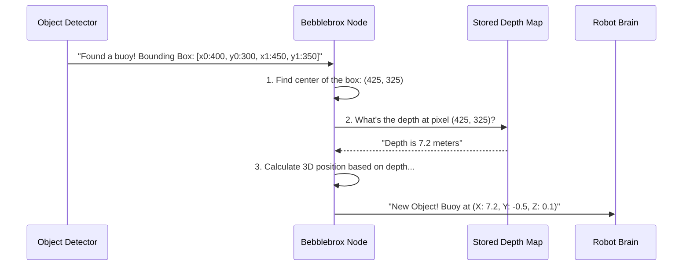

# Chapter 4: 3D Object Localization from Depth

In the [previous chapter](03_object_detection_layer_.md), we met our team of "spies"—the different object detectors that can find things like buoys and course markers in a 2D video feed. They give us a report like, "I see a red buoy inside this rectangle on the screen." This is great, but for a robot, it's only half the story. The robot needs to know not just *what* it sees, but *where* it is in the real world. Is that buoy 5 meters away or 50

This chapter is about the magic step that gives our robot true depth perception. We'll learn how `visionsystemx` takes a flat, 2D rectangle from a detector and calculates the object's precise 3D (X, Y, Z) coordinates. It’s the difference between looking at a photograph and having a 3D model of the scene you can measure.

### The Big Idea: Combining What We See with How Far It Is

Imagine you have two pieces of information:

1.  A normal color photograph of a buoy in the water.
2.  A special "depth map" of the same scene. A depth map is like a grayscale photo, but instead of color, each pixel's brightness tells you its distance from the camera. Darker pixels might be far away, and brighter pixels might be very close.

If you can find the buoy in the color photo, you can then look at the *exact same spot* in the depth map to find out how far away it is. This is the core idea behind 3D object localization.

We have exactly these two pieces of data in `visionsystemx`:
*   The **2D bounding box** comes from the [Object Detection Layer](03_object_detection_layer_.md).
*   The **depth map** comes from our sensor, either the real ZED stereo camera or the simulated sensor in Gazebo which provides an [Organized Point Cloud Processing](05_organized_point_cloud_processing_.md).

By fusing these two pieces of data, we can pinpoint any object in 3D space.

### From 2D Box to 3D Point: A Step-by-Step Guide

Let's walk through the exact process. Our goal is to take a 2D detection and produce a 3D coordinate. The entire process happens inside the `Bebblebrox` node.



1.  **Receive a 2D Box:** An object detector (like YOLO) publishes a message with the coordinates of a bounding box around an object.
2.  **Find the Center:** `Bebblebrox` calculates the pixel at the very center of this box. This gives us a single (x, y) point that represents the object's location on the screen.
3.  **Look Up Depth:** `Bebblebrox` looks at its most recent depth map and finds the distance value stored at that center pixel. This value is our **Z coordinate** (the distance straight out from the camera).
4.  **Calculate X and Y:** Using the Z coordinate and some simple camera math, it calculates the **X** (left/right) and **Y** (up/down) coordinates in meters.
5.  **Publish 3D Point:** `Bebblebrox` publishes a final message with the object's label (e.g., "red buoy") and its newly calculated 3D position.

### Diving Into the Code

This logic is implemented in `beeblebrox` and is surprisingly straightforward, especially in simulation mode. The core of this process is a function called `get_position_from_simulation`. Let's break it down piece by piece.

This function lives in `src/beeblebrox.cpp`.

#### Step 1: Find the Center of the Box

First, we take the incoming bounding box (`bbox`) and calculate its center pixel.

```cpp
// src/beeblebrox.cpp (inside get_position_from_simulation)

// get center point of bounding box
int center_x = (bbox.x0 + bbox.x1) / 2;
int center_y = (bbox.y0 + bbox.y1) / 2;
```
This is just a simple average of the top-left and bottom-right corners of the box to find the middle.

#### Step 2: Look Up the Depth

Next, we use our `center_x` and `center_y` coordinates to look up the depth value in the `latest_depth` map, which `Bebblebrox` keeps updated.

```cpp
// src/beeblebrox.cpp (inside get_position_from_simulation)

// direct access to depth from the organized pointcloud
float depth = latest_depth.at<float>(center_y, center_x);
```
Think of `latest_depth` as a spreadsheet. The `.at<float>(row, col)` command is just like getting the value from a specific cell—in this case, `row` is `center_y` and `col` is `center_x`.

#### A Clever Trick: What if the Center is Empty?

Sometimes, the exact center pixel might not have a valid depth reading (maybe it was shiny and reflected the sensor's light weirdly). If we just gave up, we'd lose the detection. Instead, the code does something smarter: it averages the depth of *all valid points* inside the whole bounding box.

```cpp
// src/beeblebrox.cpp (inside get_position_from_simulation)

if (depth <= 0 || std::isnan(depth)) {
    // if center has no valid depth, try to find a valid depth
    // point within the bounding box
    // ... (code to loop through all pixels in the box) ...
    // ... (and calculate the average depth) ...
}
```
This makes our system much more robust. If the center is bad, we can still get a good estimate from its neighbors inside the box.

#### Step 3: Calculate the Final 3D Position

Once we have a valid depth, we have our `Z` coordinate! The final step is to calculate `X` and `Y`.

```cpp
// src/beeblebrox.cpp (inside get_position_from_simulation)

float z = depth;
float x = ((center_x - ... ) * z) / ... ; // Simplified formula
float y = ((center_y - ... ) * z) / ... ; // Simplified formula

return {x, y, z};
```
These formulas look a bit complex, but the idea is simple. They use the object's pixel location (`center_x`, `center_y`) and its distance (`z`) to project that 2D screen point into a 3D world coordinate. The result is a clean `(X, Y, Z)` position in meters.

### How it All Connects

This `get_position_from_simulation` function is called inside the `receive_yolo` and `receive_shapes` callbacks we saw in the [Bebblebrox (The Fusion Core)](02_bebblebrox__the_fusion_core__.md) chapter.

```cpp
// src/beeblebrox.cpp

void receive_yolo(const ...::SharedPtr dets) {
    // ...
    for (const auto& det : dets->boxes) {
        // Here's the magic call!
        auto position = get_position_from_simulation(det);
        
        usv_interfaces::msg::Object obj;
        obj.x = position[0]; // The real-world X
        obj.y = position[1]; // The real-world Y
        
        // ... publish the 3D object ...
    }
}
```
For every 2D box that comes in, we call our function to get its 3D position and then package it up for the rest of the robot to use.

### What about the Real World?

You might be wondering if this is just for simulation. The answer is no! The beauty of the `visionsystemx` design is that the *idea* is identical for the real robot.

*   In **Simulation Mode**, we use our `get_position_from_simulation` function.
*   In **Real-World Mode**, we use a highly-optimized function from the ZED camera's own software (`zed_interface.cam.retrieveObjects`).

The ZED SDK handles the depth lookup and 3D calculation for us, but it's doing the exact same thing under the hood: fusing a 2D box with a depth map. Thanks to the `simulation_mode` switch we learned about in [Chapter 1](01_simulation_vs__real_world_mode_.md), `Bebblebrox` automatically knows which function to call.

### Conclusion

You've just unlocked the secret to the robot's "depth perception"!

*   **We learned that** `visionsystemx` calculates 3D positions by fusing 2D bounding boxes with depth data.
*   **We walked through the process:** find the box's center, look up its depth (`Z`), and use that to calculate its `X` and `Y` coordinates.
*   **We saw the code** in `beeblebrox.cpp` that implements this logic for simulation mode.
*   **We understand that** this fundamental principle works for both the simulator and the real-world ZED camera.

So far, we've mentioned "depth maps" and "organized point clouds" a few times, especially when talking about simulation. But what is an organized point cloud, and how do we get our precious image and depth data from it? We'll explore that in the next chapter.

Up next: [Organized Point Cloud Processing](05_organized_point_cloud_processing_.md).

---

Generated by [AI Codebase Knowledge Builder](https://github.com/The-Pocket/Tutorial-Codebase-Knowledge)