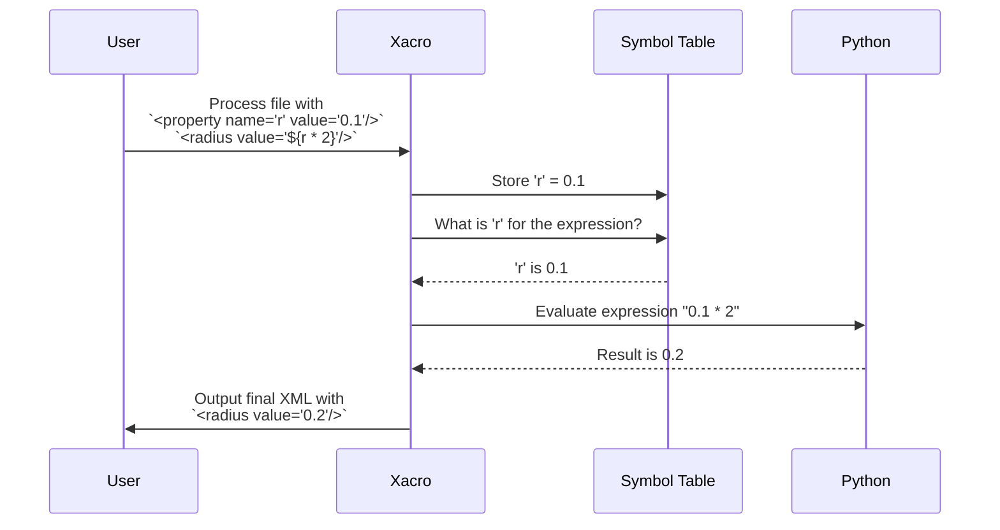

# Chapter 1: Property & Expression Evaluation

Welcome to the world of `xacro`! If you've ever built a robot model in XML, you might have wished for a way to avoid repeating yourself or to make calculations directly within your file. That's exactly what `xacro` is for.

In this first chapter, we'll explore the most fundamental feature of `xacro`: defining variables (called "properties") and using them in mathematical expressions.

### Why Do We Need This?

Imagine you're designing a simple two-wheeled robot. The wheels have a specific radius, say `0.1` meters. You'll need to use this `0.1` value in at least two places: once for the wheel's visual appearance and once for its collision shape (so the physics engine knows how big it is).

Here's how that might look in a standard XML file:

```xml
<!-- A standard XML file (not xacro yet!) -->
<link name="left_wheel">
  <visual>
    <geometry>
      <cylinder radius="0.1" length="0.05" />
    </geometry>
  </visual>
  <collision>
    <geometry>
      <cylinder radius="0.1" length="0.05" />
    </geometry>
  </collision>
</link>
```

Now, what if you decide the wheels are too small and want to change the radius to `0.15`? You'd have to find and replace every single occurrence of `0.1`. On a complex robot, this can be dozens of places! It's tedious and easy to make a mistake.

This is the problem that properties solve. They let you define a value once and reuse it everywhere.

### The Solution: Properties and Expressions

`xacro` gives you two powerful tools:

1.  **Properties (`<xacro:property>`)**: Think of these as variables for your XML document. You give them a name and a value.
2.  **Expressions (`${...}`)**: This is a special syntax that lets you use your properties and even do math with them, like having a calculator embedded in your file.

Let's fix our wheel example using these tools.

#### 1. Defining a Property

First, we define a property for our wheel radius using the `<xacro:property>` tag. It's common to define these at the top of the file.

```xml
<!-- This is a .xacro file -->
<robot xmlns:xacro="http://www.ros.org/wiki/xacro">

  <!-- Define a variable named 'wheel_radius' with a value of 0.1 -->
  <xacro:property name="wheel_radius" value="0.1" />

  <!-- ... robot definition follows ... -->
```

We've just created a variable named `wheel_radius` and stored the value `0.1` in it. The `xmlns:xacro` part in the `<robot>` tag is important—it tells parsers that we're using special `xacro` tags.

#### 2. Using a Property with an Expression

Now, we can use our new property anywhere we need it using the `${...}` syntax.

```xml
<link name="left_wheel">
  <visual>
    <geometry>
      <!-- Use the property here -->
      <cylinder radius="${wheel_radius}" length="0.05" />
    </geometry>
  </visual>
  <collision>
    <geometry>
      <!-- And use it again here -->
      <cylinder radius="${wheel_radius}" length="0.05" />
    </geometry>
  </collision>
</link>
```

Now, if we want to change the wheel radius to `0.15`, we only have to change it in **one place**: in the `<xacro:property>` definition. Every `${wheel_radius}` will automatically get the new value.

#### 3. Taking it Further: The Built-in Calculator

The `${...}` syntax is more than just a variable placeholder; it can evaluate Python expressions. Let's say we want our robot's body to be slightly wider than two wheels. We can define a new property that calculates this for us.

```xml
<!-- Define properties for wheel dimensions -->
<xacro:property name="wheel_radius" value="0.1" />
<xacro:property name="wheel_width" value="0.05" />

<!-- Calculate the chassis width based on wheel width -->
<xacro:property name="chassis_width" value="${wheel_width * 2 + 0.02}" />

<!-- Now we can use chassis_width somewhere in our robot -->
<link name="base_link">
  <visual>
    <geometry>
      <box size="0.5 ${chassis_width} 0.1" />
    </geometry>
  </visual>
</link>
```

When `xacro` processes this file, it will first calculate `0.05 * 2 + 0.02`, which is `0.12`. Then it will substitute this result into the `<box>` tag.

**Input (`robot.xacro`)**
```xml
<robot xmlns:xacro="http://www.ros.org/wiki/xacro">
  <xacro:property name="wheel_radius" value="0.1" />
  <link name="left_wheel">
    <collision>
      <geometry>
        <cylinder radius="${wheel_radius}" length="0.05" />
      </geometry>
    </collision>
  </link>
</robot>
```

**Output (after running `xacro robot.xacro`)**
```xml
<?xml version="1.0" ?>
<!-- ... auto-generated banner ... -->
<robot>
  <link name="left_wheel">
    <collision>
      <geometry>
        <cylinder radius="0.1" length="0.05" />
      </geometry>
    </collision>
  </link>
</robot>
```
Notice how the `<xacro:property>` tag is gone and `${wheel_radius}` has been replaced with its value, `0.1`. `xacro` has done the work for us, leaving a clean, standard XML file.

### How Does It Work Under the Hood?

You don't need to know the internals to use `xacro`, but a little peek can make things clearer.

When you run `xacro`, it reads your file from top to bottom. It maintains a "symbol table," which is just a fancy name for a dictionary where it stores your properties.

Here's a step-by-step walkthrough:

1.  `xacro` starts reading your `.xacro` file.
2.  It sees `<xacro:property name="wheel_radius" value="0.1" />`. It says, "Aha! A new variable," and adds `wheel_radius: 0.1` to its internal symbol table.
3.  It continues reading until it finds an attribute like `radius="${wheel_radius}"`.
4.  It recognizes the `${...}` pattern and looks inside: `wheel_radius`.
5.  It looks up `wheel_radius` in its symbol table and finds the value `0.1`.
6.  If it's a mathematical expression like `${wheel_width * 2 + 0.02}`, it first looks up `wheel_width`, then passes the full expression (e.g., `0.05 * 2 + 0.02`) to a safe Python evaluator.
7.  Finally, it replaces the entire `${...}` expression with the final result (`0.1` or `0.12`) in the output.

This process is visualized in the diagram below:



#### A Glimpse at the Code

The logic for this is found in `xacro/__init__.py`.

When the parser encounters a `<xacro:property>` tag, it calls the `grab_property` function. This function reads the `name` and `value` attributes and stores them in a dictionary-like object called a `Table`.

```python
# A simplified view from xacro/__init__.py
def grab_property(elt, table):
    # ...
    name, value, ... = check_attrs(elt, ['name'], ['value', ...])
    # ...
    target_table = table
    target_table._setitem(name, value, unevaluated=True)
```
This is how `xacro` "remembers" your variables. `table` here is our Symbol Table.

The "magic" of evaluating `${...}` happens in the `eval_text` function. It uses a regular expression to find all occurrences of `${...}` and `$(...)` in your text.

```python
# A simplified view from xacro/__init__.py
def eval_text(text, symbols):
    # ... uses a lexer to split text into parts ...
    # For each part that is an expression like ${...}
    def handle_expr(s):
        try:
            # It evaluates the string using the stored symbols
            return safe_eval(s, symbols)
        except Exception as e:
            # ... error handling ...

    # ... combines the results back into a string ...
```
The `safe_eval` function is a wrapper around Python's `eval()` that ensures only safe mathematical and logical operations can be performed. This prevents expressions from doing anything dangerous, like deleting files.

### Conclusion

You've just learned the most important concept in `xacro`!

-   **Properties (`<xacro:property>`)** act like variables to store values.
-   **Expressions (`${...}`)** allow you to use those variables and perform calculations.

Together, these tools help you create robot models that are cleaner, easier to read, and much simpler to modify.

Now that we can control *values* in our document, what if we want to control entire *blocks* of XML? For example, what if you want to add a camera to your robot model only if a certain property is `true`? That's where our next topic comes in.

Next, we'll dive into [Conditional Blocks](02_conditional_blocks_.md), which let you include or exclude parts of your file based on a condition.

---

Generated by [AI Codebase Knowledge Builder](https://github.com/The-Pocket/Tutorial-Codebase-Knowledge)