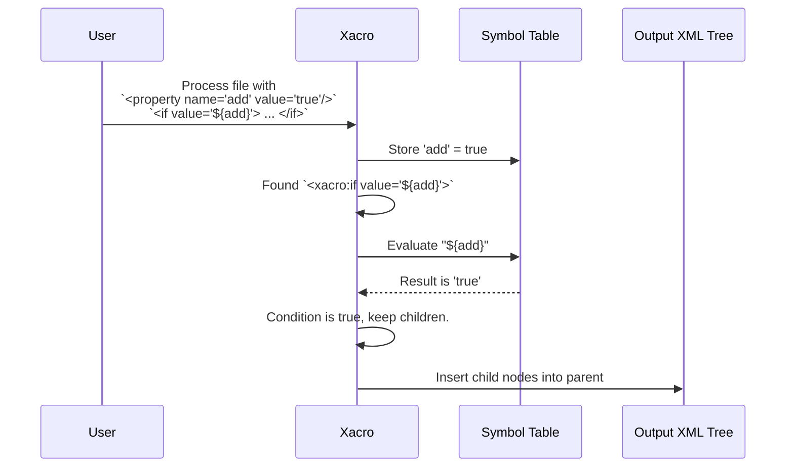

# Chapter 2: Conditional Blocks

In the [previous chapter](01_property___expression_evaluation_.md), we learned how to use properties and expressions to control *values* in our robot model. This is great for managing numbers and text, but what if we want to control entire *sections* of our robot? For example, how can we create a single robot description file that can optionally include a camera, a laser scanner, or neither?

This is where conditional blocks come in. They are `xacro`'s way of letting you include or exclude whole chunks of XML based on a simple true/false condition.

### Why Do We Need This?

Imagine you're building a mobile robot. The base robot is always the same, but depending on the task, you might attach different sensors.
-   For navigation, you might add a 2D LiDAR scanner.
-   For object recognition, you might add a 3D camera.

Without `xacro`, you'd need to maintain separate files: `robot_with_lidar.urdf`, `robot_with_camera.urdf`, and `robot_base.urdf`. If you wanted to change the wheel size, you'd have to edit all three files! This is exactly the kind of problem conditional blocks solve. They let you keep everything in one file, managed by simple switches.

### The Solution: `<xacro:if>` and `<xacro:unless>`

`xacro` provides two tags for this job, and they work just like you'd expect:

-   **`<xacro:if value="CONDITION">`**: Includes the block of XML inside it **if** the condition is true.
-   **`<xacro:unless value="CONDITION">`**: Includes the block of XML inside it **unless** the condition is true (i.e., if it's false).

Think of it like a switch on a railroad track. The `value` is the switch. If it's `true`, the train (our XML processor) goes down one track and processes the block. If it's `false`, it skips that track entirely.

Let's build a simple robot model that can optionally have a sensor.

#### 1. Setting Up the "Switch"

First, we'll create a property that will act as our on/off switch. This is just a normal property like we learned about in [Chapter 1](01_property___expression_evaluation_.md), but we'll give it a boolean (`true`/`false`) value.

```xml
<robot xmlns:xacro="http://www.ros.org/wiki/xacro">

  <!-- Our on/off switch for the sensor -->
  <xacro:property name="add_sensor" value="true" />

  <!-- The main body of the robot is always here -->
  <link name="base_link">
    <!-- ... geometry, etc. ... -->
  </link>
```

Here, we've decided we want to add the sensor, so we set `add_sensor` to `true`.

#### 2. Using `<xacro:if>` to Add the Sensor

Now, we wrap the XML that defines our sensor (its link and joint) inside an `<xacro:if>` block.

```xml
  <!-- This whole block is conditional -->
  <xacro:if value="${add_sensor}">
    <link name="sensor_link">
      <!-- ... sensor visual and collision shapes ... -->
    </link>

    <joint name="sensor_joint" type="fixed">
      <parent link="base_link"/>
      <child link="sensor_link"/>
    </joint>
  </xacro:if>

</robot>
```
The expression `${add_sensor}` inside the `value` attribute is the key. `xacro` will evaluate it, find that its value is `true`, and therefore include everything between `<xacro:if ...>` and `</xacro:if>`.

**Input (`robot.xacro` with `add_sensor="true"`)**
```xml
<robot xmlns:xacro="http://www.ros.org/wiki/xacro">
  <xacro:property name="add_sensor" value="true" />
  <link name="base_link" />

  <xacro:if value="${add_sensor}">
    <link name="sensor_link" />
    <joint name="sensor_joint" type="fixed">
      <parent link="base_link"/><child link="sensor_link"/>
    </joint>
  </xacro:if>
</robot>
```

**Output (after running `xacro`)**
```xml
<?xml version="1.0" ?>
<!-- ... auto-generated banner ... -->
<robot>
  <link name="base_link" />

  <link name="sensor_link" />
  <joint name="sensor_joint" type="fixed">
    <parent link="base_link"/><child link="sensor_link"/>
  </joint>
</robot>
```
Notice how the `<xacro:if>` tag is gone, and its contents are now part of the final XML.

Now, what if we flip the switch to `false`?

**Input (`robot.xacro` with `add_sensor="false"`)**
```xml
<robot xmlns:xacro="http://www.ros.org/wiki/xacro">
  <xacro:property name="add_sensor" value="false" />
  <link name="base_link" />

  <xacro:if value="${add_sensor}">
    <link name="sensor_link" />
    <joint name="sensor_joint" type="fixed">
      <parent link="base_link"/><child link="sensor_link"/>
    </joint>
  </xacro:if>
</robot>
```

**Output (after running `xacro`)**
```xml
<?xml version="1.0" ?>
<!-- ... auto-generated banner ... -->
<robot>
  <link name="base_link" />

  <!-- The sensor link and joint are GONE! -->
</robot>
```
The entire block was discarded, just as we wanted!

#### 3. Using `<xacro:unless>` for the Opposite Case

The `<xacro:unless>` tag is the perfect partner to `if`. It includes its content only when the condition is `false`. Let's add a placeholder geometry to our robot *unless* we are adding the real sensor.

```xml
  <!-- Add a placeholder box ONLY if the sensor is NOT being added -->
  <xacro:unless value="${add_sensor}">
    <link name="sensor_placeholder">
      <visual>
        <geometry><box size="0.01 0.01 0.01" /></geometry>
      </visual>
    </link>
    <joint name="placeholder_joint" type="fixed">
       <parent link="base_link"/>
       <child link="sensor_placeholder"/>
    </joint>
  </xacro:unless>
```
Now, if `add_sensor` is `false`, the real sensor is skipped (`if` fails) but this placeholder block is included (`unless` succeeds).

### How Does It Work Under the Hood?

The process is very straightforward. As `xacro` walks through your XML tree, it checks the name of each tag.

1.  `xacro` encounters an `<xacro:if>` or `<xacro:unless>` tag.
2.  It pauses and looks at the `value` attribute.
3.  It evaluates the expression inside the `value`, just like it does for any other attribute, using the [Symbol Table](07_symbol_table___scoping_.md) to look up properties.
4.  The result of the expression is converted to a boolean (True/False). `xacro` is smart enough to understand that `1`, `1.0`, and `"true"` all mean `True`, while `0`, `0.0`, and `"false"` mean `False`.
5.  If it's an `<xacro:if>` tag and the result is `True`, it replaces the `<xacro:if>` tag with its child elements. If `False`, it deletes the tag and everything inside it.
6.  If it's an `<xacro:unless>` tag, it does the opposite.

This logic is illustrated in the diagram below.



#### A Glimpse at the Code

This logic resides in the `eval_all` function within `xacro/__init__.py`. This function traverses the XML document, and when it finds a conditional tag, it executes a specific block of code.

Here is a simplified version of what it does:

```python
# A simplified view from xacro/__init__.py
def eval_all(node, macros, symbols):
    # ... loop through all child nodes ...
    if node.tagName in ['xacro:if', 'xacro:unless']:
        # 1. Get the condition string, e.g., "${add_sensor}"
        cond_string, = check_attrs(node, ['value'], [])

        # 2. Evaluate it to a raw value (e.g., "true", "1")
        raw_value = eval_text(cond_string, symbols)

        # 3. Convert the raw value to a strict True/False
        keep = get_boolean_value(raw_value, cond_string)

        # 4. If it's an 'unless' tag, flip the boolean
        if node.tagName.endswith('unless'):
            keep = not keep

        # 5. Replace the node or delete it
        if keep:
            # Replace the <xacro:if> tag with its children
            replace_node(node, by=node, content_only=True)
        else:
            # Delete the <xacro:if> tag and all its children
            replace_node(node, by=None)
```
The `get_boolean_value` function is a small but important helper that handles the conversion from strings like `"true"` or numbers like `1` into a Python boolean. The `replace_node` function then does the final work of either swapping the conditional tag for its contents or removing it from the document entirely.

### Conclusion

You've now mastered conditional blocks!

-   **`<xacro:if>`** includes a block of XML if a condition is `true`.
-   **`<xacro:unless>`** includes a block if a condition is `false`.
-   This allows you to create highly configurable robot models from a single source file, keeping your project clean and easy to manage.

We can now define variables and use them to turn entire sections of our model on and off. But what if we want to reuse a section, like adding two identical cameras to our robot but in different locations? Copy-pasting the XML block would defeat the purpose of `xacro`!

That's the perfect lead-in to our next topic: making reusable chunks of code. Next, we'll explore [Macro Expansion](03_macro_expansion_.md).

---

Generated by [AI Codebase Knowledge Builder](https://github.com/The-Pocket/Tutorial-Codebase-Knowledge)