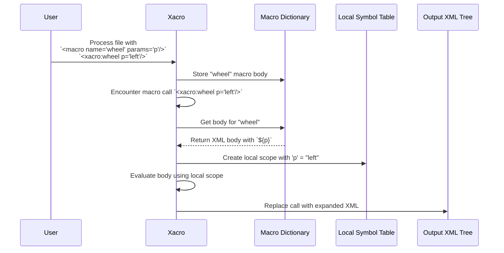

# Chapter 3: Macro Expansion

In the [previous chapter](02_conditional_blocks_.md), we learned how to use conditional blocks to turn entire sections of our robot on and off. We now have a powerful toolkit: variables for values ([Properties](01_property___expression_evaluation_.md)) and switches for XML blocks ([Conditionals](02_conditional_blocks_.md)).

But what if you need to reuse the same block of XML over and over again, maybe with slight variations? This chapter introduces the core feature of `xacro`: **macros**.

### Why Do We Need This?

Let's go back to our simple two-wheeled robot. Each wheel is composed of a `<link>` (its physical shape) and a `<joint>` (how it connects to the robot's body). A simplified definition for the left wheel might look like this:

```xml
<!-- XML for the left wheel -->
<link name="left_wheel_link">
  <!-- visual, collision, etc. -->
</link>

<joint name="left_wheel_joint" type="continuous">
  <parent link="base_link"/>
  <child link="left_wheel_link"/>
  <origin xyz="0 0.1 0" />
</joint>
```

Now, how do we add the right wheel? The most obvious way is to copy, paste, and edit:

```xml
<!-- XML for the right wheel (copy-pasted!) -->
<link name="right_wheel_link">
  <!-- visual, collision, etc. -->
</link>

<joint name="right_wheel_joint" type="continuous">
  <parent link="base_link"/>
  <child link="right_wheel_link"/>
  <!-- Note the changed Y coordinate for the right side -->
  <origin xyz="0 -0.1 0" />
</joint>
```

This works, but it's a maintenance nightmare. If you decide to change the wheel's shape, you have to remember to change it in *both* places. For a robot with four identical legs, this becomes a huge source of errors. We need a way to define the "template" for a wheel once and then reuse it.

### The Solution: The Rubber Stamp Analogy

This is where `xacro` macros come in. Think of a macro like a **rubber stamp**.
1.  **You design the stamp once**: This is the `<xacro:macro>` definition, where you create the XML template.
2.  **You can customize parts of the stamp**: You can define "parameters" which are like little empty boxes on your stamp that you fill in with ink each time you use it.
3.  **You can use it anywhere**: To apply the pattern, you just "press the stamp" onto the page. This is the macro call.

Let's fix our wheel problem using this "rubber stamp" approach.

#### 1. Designing the Stamp (`<xacro:macro>`)

First, we define a generic "wheel" template inside a `<xacro:macro>` tag. We give it a name (`wheel`) and specify the parameters we want to customize: a `prefix` (like "left" or "right") and the `y_position` (for its location).

```xml
<xacro:macro name="wheel" params="prefix y_position">
  <link name="${prefix}_wheel_link">
    <!-- ... visual, collision, etc. ... -->
  </link>

  <joint name="${prefix}_wheel_joint" type="continuous">
    <parent link="base_link"/>
    <child link="${prefix}_wheel_link"/>
    <origin xyz="0 ${y_position} 0" />
  </joint>
</xacro:macro>
```
Look closely at what we did:
-   The `name="wheel"` gives our stamp a name.
-   `params="prefix y_position"` declares that anyone using this stamp *must* provide a value for `prefix` and `y_position`.
-   Inside the macro, we use `${prefix}` and `${y_position}` just like we used properties in Chapter 1. These are placeholders that will be filled in when we use the macro.

#### 2. Using the Stamp (Macro Call)

Now that we've designed our `wheel` stamp, using it is incredibly simple. A macro call looks just like a normal XML tag, but it uses the `xacro:` prefix and the macro's name.

```xml
<robot xmlns:xacro="http://www.ros.org/wiki/xacro">
  <!-- The main body of the robot is always here -->
  <link name="base_link">
    <!-- ... geometry, etc. ... -->
  </link>

  <!-- ... (The macro definition from above goes here) ... -->
  
  <!-- Stamp the left wheel -->
  <xacro:wheel prefix="left" y_position="0.1" />

  <!-- Stamp the right wheel -->
  <xacro:wheel prefix="right" y_position="-0.1" />
</robot>
```
This is much cleaner! We've captured the pattern of a wheel in one place. If we need to change the wheel's joint type or visual shape, we only edit the macro definition, and the change will apply to both wheels automatically.

**Input (`robot.xacro`)**
```xml
<robot xmlns:xacro="http://www.ros.org/wiki/xacro">
  <link name="base_link" />

  <xacro:macro name="wheel" params="prefix y_position">
    <link name="${prefix}_wheel_link" />
    <joint name="${prefix}_wheel_joint" type="continuous">
      <parent link="base_link" />
      <child link="${prefix}_wheel_link" />
      <origin xyz="0 ${y_position} 0" />
    </joint>
  </xacro:macro>

  <xacro:wheel prefix="left" y_position="0.1" />
  <xacro:wheel prefix="right" y_position="-0.1" />
</robot>
```

**Output (after running `xacro`)**
```xml
<?xml version="1.0" ?>
<!-- ... auto-generated banner ... -->
<robot>
  <link name="base_link" />

  <link name="left_wheel_link" />
  <joint name="left_wheel_joint" type="continuous">
    <parent link="base_link" />
    <child link="left_wheel_link" />
    <origin xyz="0 0.1 0" />
  </joint>
  
  <link name="right_wheel_link" />
  <joint name="right_wheel_joint" type="continuous">
    <parent link="base_link" />
    <child link="right_wheel_link" />
    <origin xyz="0 -0.1 0" />
  </joint>
</robot>
```
The final output is pure, clean XML. The `<xacro:macro>` definition is gone, and the `<xacro:wheel>` calls have been replaced by the fully expanded XML content.

### How Does It Work Under the Hood?

Macro expansion is a two-step process: definition and execution.

1.  **Grabbing Macros**: As `xacro` first reads your file, it looks for `<xacro:macro>` tags. When it finds one, it doesn't process the content inside. Instead, it takes the whole block, stores it in a dictionary (let's call it the "Macro Dictionary"), and associates it with its name (e.g., `wheel`).

2.  **Handling a Macro Call**: Later, when `xacro` encounters a macro call like `<xacro:wheel ...>`, it performs a series of steps:
    *   It looks up "wheel" in its Macro Dictionary.
    *   It creates a new, temporary [Symbol Table](07_symbol_table___scoping_.md) just for this call.
    *   It populates this new table with the parameters from the call (e.g., `prefix: "left"`, `y_position: "0.1"`).
    *   It makes a copy of the macro's body XML.
    *   It processes this copy, but uses the new temporary symbol table to evaluate all the `${...}` expressions. This is how `${prefix}` becomes `"left"`.
    *   Finally, it replaces the `<xacro:wheel ...>` tag in the document with the fully processed XML block.

This process ensures that parameters from one macro call (like for the left wheel) don't leak and affect another call (like for the right wheel).



#### A Glimpse at the Code

The logic for this is primarily in two functions within `xacro/__init__.py`.

First, `grab_macro` is responsible for finding and storing macro definitions. It reads the `name` and `params` attributes and saves the entire XML element for later.

```python
# A simplified view from xacro/__init__.py
def grab_macro(elt, macros):
    # 'macros' is our Macro Dictionary
    name, params = check_attrs(elt, ['name'], ['params'])
    
    # Create a new Macro object to hold the body and parameter info
    macro = macros.get(name, Macro())
    macro.body = elt  # Store the raw XML content
    macro.params = [...] # Parse the 'params' string
    
    macros[name] = macro
    replace_node(elt, by=None) # Remove the definition from the output
```

Second, `handle_macro_call` does the expansion work. This is where the magic happens.

```python
# A simplified view from xacro/__init__.py
def handle_macro_call(node, macros, symbols):
    name = node.tagName[6:] # e.g., "wheel"
    m = macros[name] # Look up the macro definition
    body = m.body.cloneNode(deep=True) # Make a fresh copy of the body

    # Create a new, temporary symbol table for this call
    scoped_symbols = Table(symbols)

    # Fill the temporary table with parameters from the call
    for name, value in node.attributes.items():
        # Evaluate the value (e.g., "0.1") and store it
        scoped_symbols[name] = eval_text(value, symbols)

    # Process the copied body using the temporary symbols
    eval_all(body, macros, scoped_symbols)

    # Replace the <xacro:wheel> call with the final XML
    replace_node(node, by=body, content_only=True)
```
The key takeaway is the creation of `scoped_symbols`. This temporary "scope" is what makes macros self-contained and reusable.

### Conclusion

Macros are the heart of `xacro`. They are the ultimate tool for practicing the "Don't Repeat Yourself" (DRY) principle in your XML files.

-   **`<xacro:macro>`** defines a reusable XML template, much like a function in a programming language.
-   **`params`** allow you to customize each use of the macro.
-   Macro calls (`<xacro:your_macro_name ...>`) are replaced with the expanded, customized XML.

You've now seen all the core building blocks: properties, conditionals, and macros. But in what order does `xacro` do everything? The next chapter will put all the pieces together.

Next, we'll look at the [XACRO Processing Pipeline](04_xacro_processing_pipeline_.md) to understand the step-by-step order of operations.

---

Generated by [AI Codebase Knowledge Builder](https://github.com/The-Pocket/Tutorial-Codebase-Knowledge)