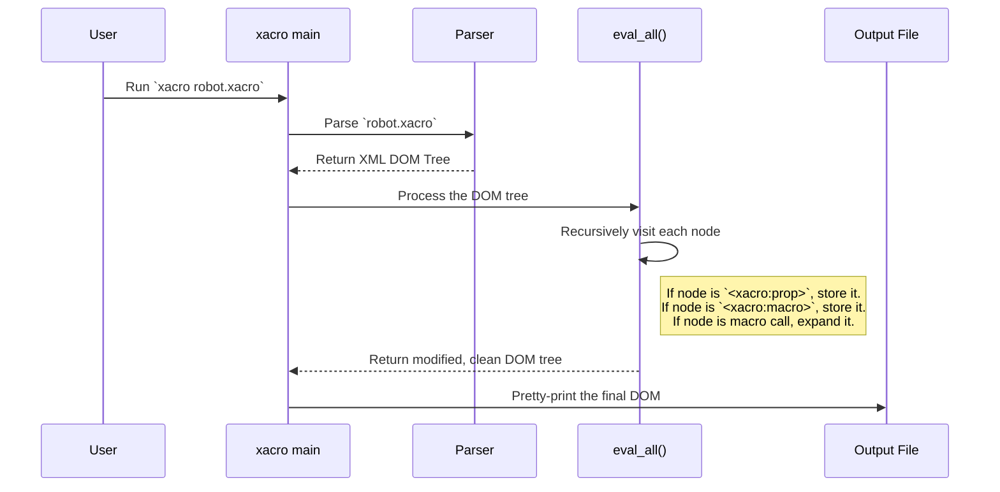

# Chapter 4: XACRO Processing Pipeline

In the previous chapters, we learned about the powerful tools `xacro` provides: defining variables with [Properties](01_property___expression_evaluation_.md), controlling sections with [Conditional Blocks](02_conditional_blocks_.md), and creating reusable templates with [Macro Expansion](03_macro_expansion_.md).

You now have all the individual Lego bricks. But how do you put them together? If you define a property and then immediately use it in a macro, how does `xacro` know to handle the property first? This chapter answers that by revealing the order of operations: the **XACRO Processing Pipeline**.

### The Assembly Line Analogy

The best way to understand the pipeline is to think of it as an **assembly line**.

1.  **Raw Materials**: Your `.xacro` file is the input, like a pile of raw metal, plastic, and wires.
2.  **The Assembly Line**: The `xacro` tool is a series of stations that work on the material.
3.  **Finished Product**: A clean, standard XML file comes out at the end, ready to be used by other tools.

The `xacro` assembly line has a clear, predictable order. It processes your file from **top to bottom**, one element at a time, performing specific actions at each "station."

### The Three Stages of Processing

The entire process can be broken down into three main stages. Let's follow a simple `.xacro` file through the pipeline.

**Input (`robot.xacro`)**
```xml
<robot xmlns:xacro="http://www.ros.org/wiki/xacro">
  <!-- 1. Define a property -->
  <xacro:property name="wheel_radius" value="0.1" />

  <!-- 2. Define a macro that uses properties -->
  <xacro:macro name="create_wheel" params="name">
    <link name="${name}">
      <visual>
        <geometry>
          <cylinder radius="${wheel_radius}" length="0.05"/>
        </geometry>
      </visual>
    </link>
  </xacro:macro>

  <!-- 3. Call the macro -->
  <xacro:create_wheel name="left_wheel" />
</robot>
```

#### Stage 1: Parsing into an XML Tree (DOM)

Before any `xacro` magic happens, the tool first reads your `.xacro` file and parses it into an in-memory structure called a **Document Object Model (DOM)**. Think of this as creating a blueprint or a family tree from your file.

At this stage, `xacro` doesn't know what `<xacro:property>` means. It just sees it as an XML element, like any other. The DOM tree for our example would look something like this:

-   `robot`
    -   `xacro:property` (with attributes `name` and `value`)
    -   `xacro:macro` (with attribute `name` and child `link`)
    -   `xacro:create_wheel` (with attribute `name`)

#### Stage 2: The Traversal and Evaluation Loop

This is the core of the assembly line. `xacro` now walks through the DOM tree from top to bottom, visiting each element. As it encounters special `xacro:` tags, it processes them.

Here’s a step-by-step walkthrough for our example:

1.  **Start at `<robot>`**: Nothing special to do. Move to its children.
2.  **Encounter `<xacro:property>`**: `xacro` recognizes this tag. It reads the `name` ("wheel_radius") and `value` ("0.1"), stores this pair in its internal dictionary (the [Symbol Table & Scoping](07_symbol_table___scoping_.md)), and then **removes the `<xacro:property>` tag** from the tree.
3.  **Encounter `<xacro:macro>`**: `xacro` sees a macro definition. It reads the name ("create_wheel") and its contents, stores the entire template in its "macro dictionary" for later use, and then **removes the `<xacro:macro>` tag** from the tree.
4.  **Encounter `<xacro:create_wheel>`**: `xacro` recognizes this as a macro call because it matches a name in its macro dictionary.
    - It creates a temporary, local scope.
    - It expands the macro's content, replacing `${name}` with "left_wheel" and `${wheel_radius}` with the `0.1` it stored earlier.
    - It **replaces the `<xacro:create_wheel>` tag** with the newly generated `<link>` block.

During this process, `xacro` also evaluates any `${...}` expressions it finds in regular XML attributes.

#### Stage 3: Generating the Final XML

After the traversal is complete, all the special `xacro:` tags are gone. The DOM tree now contains only standard XML.

**The final, in-memory tree:**
-   `robot`
    -   `link` (name="left_wheel")
        -   `visual`
            -   `geometry`
                -   `cylinder` (radius="0.1", length="0.05")

The `xacro` tool then converts this clean tree back into text and prints it out.

**Output (final XML)**
```xml
<?xml version="1.0" ?>
<!-- ... auto-generated banner ... -->
<robot>
  <link name="left_wheel">
    <visual>
      <geometry>
        <cylinder radius="0.1" length="0.05"/>
      </geometry>
    </visual>
  </link>
</robot>
```

The order is crucial: `xacro` *must* process the `<xacro:property>` before it gets to the macro call that uses it. This is why you must always define properties and macros *before* you use them.

### How Does It Work Under the Hood?

The entire pipeline is orchestrated by a few key functions in `xacro/__init__.py`.

1.  First, the `process_file` function is called. It parses the input file into a DOM tree.
2.  Then, it calls `process_doc`, which sets up the global environment (like the dictionaries for macros and symbols).
3.  Finally, `process_doc` calls the main worker function, `eval_all`, on the document's root element.

The `eval_all` function is the engine of the assembly line. It's a recursive function that walks the DOM tree.



#### A Glimpse at the Code

The `eval_all` function contains a large `if/elif` block that acts as the sorting center for the assembly line. Here's a highly simplified version of its logic:

```python
# A simplified view from xacro/__init__.py
def eval_all(node, macros, symbols):
    # ... loop through all child nodes of the current 'node' ...
    # Let's say we are currently at a child node.

    if node.tagName == 'xacro:property':
        grab_property(node, symbols)  # Add to symbol table and remove tag

    elif node.tagName == 'xacro:macro':
        grab_macro(node, macros)  # Add to macro dictionary and remove tag

    elif node.tagName in ['xacro:if', 'xacro:unless']:
        # Evaluate condition and either keep or remove the block
        ...

    elif handle_macro_call(node, macros, symbols):
        # This function checks if the tag is a macro call.
        # If so, it expands it and replaces the tag.
        pass

    else:
        # It's a regular XML tag, so just process its attributes
        # for ${...} expressions and recurse on its children.
        eval_all(node, macros, symbols)
```
This single, recursive function is responsible for walking the tree and dispatching each `xacro` element to the correct handler. The handlers (`grab_property`, `handle_macro_call`, etc.) modify the DOM tree in-place, removing the `xacro` tags as they go.

### Conclusion

You've now seen the big picture! The `xacro` processing pipeline isn't magic; it's a predictable, top-to-bottom process.

-   **Stage 1: Parse**: The `.xacro` file is converted into an in-memory XML DOM tree.
-   **Stage 2: Traverse & Evaluate**: `xacro` walks this tree, processing special tags, expanding macros, and evaluating expressions along the way.
-   **Stage 3: Output**: The final, cleaned-up DOM tree is converted back to text.

This top-down, single-pass nature is the most important thing to remember. It explains why the order of definitions in your `.xacro` file matters.

We've talked a lot about `xacro` walking and modifying the "XML tree." In the next chapter, we'll take a closer look at what that tree is and how `xacro` manipulates it.

Next, we will explore [XML DOM Traversal & Manipulation](05_xml_dom_traversal___manipulation_.md).

---

Generated by [AI Codebase Knowledge Builder](https://github.com/The-Pocket/Tutorial-Codebase-Knowledge)