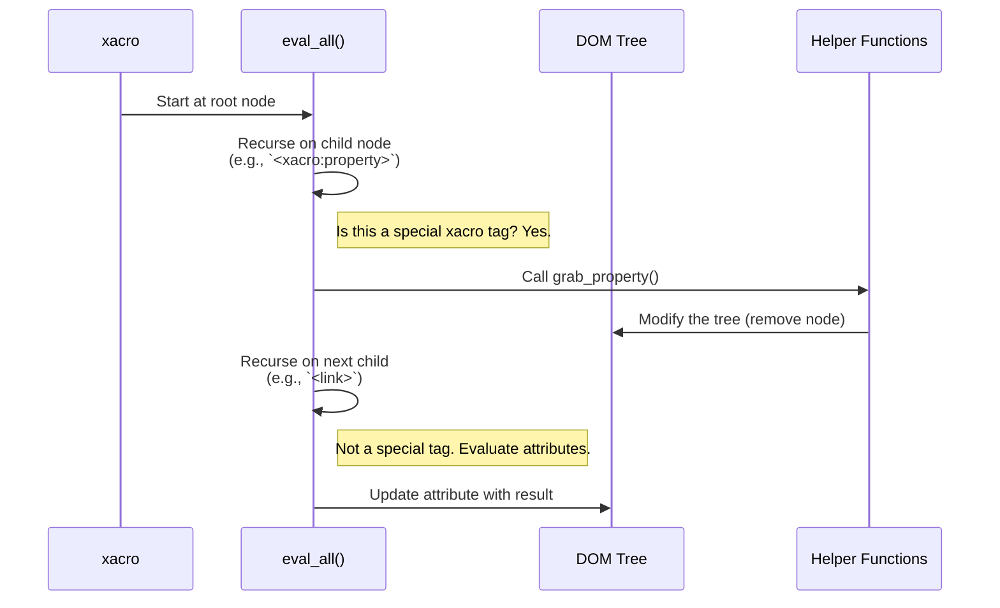

# Chapter 5: XML DOM Traversal & Manipulation

In the [previous chapter](04_xacro_processing_pipeline_.md), we saw the high-level "assembly line" that `xacro` uses to process a file. We learned that `xacro` works from top to bottom, handling properties, macros, and conditionals in a predictable order.

But what is `xacro` *actually* working on? It doesn't just read and write text. Under the hood, it converts your file into an intelligent, tree-like structure. This chapter pulls back the curtain to show you how `xacro` walks through this tree to do its work.

### The Document Tree Analogy

Imagine your XML file is a family tree.

-   The root tag (`<robot>`) is the original ancestor.
-   Tags nested inside it (`<link>`, `<joint>`) are its children.
-   Tags nested further are grandchildren, and so on.
-   Attributes like `name="base_link"` are personal details, like a person's name.

When you ask `xacro` to process your file, it first builds this entire family tree in its memory. This in-memory structure is called a **Document Object Model (DOM)**. Once the DOM is built, `xacro` can easily walk from the ancestor down to every single descendant.

Let's look at a simple example.

**Input (`simple.xacro`)**
```xml
<robot name="my_bot">
  <link name="base_link">
    <visual/>
  </link>
</robot>
```

The DOM for this file looks like this:

```mermaid
graph TD
    A[robot <br> name="my_bot"] --> B[link <br> name="base_link"];
    B --> C[visual];
```
This tree structure is what `xacro` *actually* sees and works with.

### The Walkthrough: Traversal and Manipulation

At its heart, `xacro` performs two key actions on this tree:

1.  **Traversal**: It walks the tree, visiting every single element and attribute. This process is like a census taker visiting every person in the family tree, starting from the oldest ancestor.
2.  **Manipulation**: When it visits a special `xacro` node (like `<xacro:property>` or a macro call), it performs an action. Usually, this action involves *changing the tree* by replacing the `xacro` node with plain XML.

The main function that does this is called `eval_all`. It's a **recursive** function, which means it calls itself to get its job done. Here’s how it works:

1.  `eval_all` is called on the root node (`<robot>`).
2.  It first evaluates the attributes of the current node (e.g., `${...}` expressions).
3.  Then, it loops through all the children of the current node.
4.  For each child, it calls `eval_all` on that child.

This process continues until every node in the tree has been visited.

#### A Step-by-Step Example

Let's trace `eval_all` with a file that uses a property.

**Input (`robot.xacro`)**
```xml
<robot xmlns:xacro="http://www.ros.org/wiki/xacro">
  <xacro:property name="body_width" value="0.2" />

  <link name="base_link">
    <visual>
      <box size="0.5 ${body_width} 0.1" />
    </visual>
  </link>
</robot>
```
1.  **`eval_all` starts at `<robot>`**: It sees no expressions in its attributes. It moves to its children.

2.  **Visit child `<xacro:property>`**: `eval_all` sees this is a special tag.
    -   **Action**: It calls a helper function (`grab_property`) that adds `body_width: 0.2` to the [Symbol Table & Scoping](07_symbol_table___scoping_.md).
    -   **Manipulation**: The `<xacro:property>` node has served its purpose and is **removed** from the tree.

3.  **Visit child `<link name="base_link">`**:
    -   `eval_all` is called on this `<link>` node. It processes the `name` attribute, finds no expressions, and moves to its children.
    -   **Visit grandchild `<visual>`**: `eval_all` is called on `<visual>`. No attributes to process. It moves to its children.
    -   **Visit great-grandchild `<box>`**: `eval_all` is called on `<box>`. It looks at the `size` attribute.
        -   **Action**: It finds the expression `${body_width}`. It looks this up in the symbol table and gets `0.2`.
        -   **Manipulation**: It replaces the attribute's value with the result. The attribute becomes `size="0.5 0.2 0.1"`.

After the traversal is complete, every `xacro` tag has been removed and every `${...}` expression has been replaced. The final DOM tree is pure, standard XML.

### How Does It Work Under the Hood?

The core of this process is the `eval_all` function recursively walking the DOM, and the `replace_node` function performing the tree manipulation.



#### A Glimpse at the Code

The `eval_all` function in `xacro/__init__.py` orchestrates this entire process. Its structure is a large `if/elif` block that checks the type of each node it visits.

```python
# A simplified view from xacro/__init__.py
def eval_all(node, macros, symbols):
    # First, evaluate the attributes of the current node
    for name, value in node.attributes.items():
        result = str(eval_text(value, symbols))
        node.setAttribute(name, result)
        
    # Then, loop through all children and recurse
    child = node.firstChild
    while child:
        if child.tagName == 'xacro:property':
            grab_property(child, symbols) # Adds to symbol table, removes node
        
        elif child.tagName == 'xacro:if':
            # ... handle conditional logic ...
            
        elif handle_macro_call(child, macros, symbols):
            # ... expands macro and replaces node ...
            pass
        
        else:
            # It's a regular tag, so just recurse
            eval_all(child, macros, symbols)
            
        child = child.nextSibling
```
This function is the census taker. It walks the tree (`child = child.nextSibling`) and, for each node, decides which action to take.

The actual modification of the tree is handled by helper functions, most importantly `replace_node` from `xacro/xmlutils.py`.

```python
# A simplified view from xacro/xmlutils.py
def replace_node(node, by, content_only=False):
    parent = node.parentNode

    if by is not None:
        # insert the new node(s) 'by' before the old 'node'
        parent.insertBefore(by, node)

    # remove the original node
    parent.removeChild(node)
```
This simple but powerful function is what allows `xacro` to swap out a macro call for its expanded content or to simply delete a property definition after it has been processed.

### Conclusion

You now understand the fundamental mechanism behind `xacro`! It's not magic, but a methodical process:

-   `xacro` converts your file into an in-memory **Document Object Model (DOM)** tree.
-   The `eval_all` function recursively **traverses** this tree, visiting every element.
-   As it visits special `xacro` elements, it **manipulates** the tree by replacing them with the final, evaluated XML.

This traversal-and-manipulation model is what transforms your dynamic `.xacro` file into a static, standard XML file.

So far, we've defined all our properties and switches inside the `.xacro` file itself. But what if you want to configure your robot from the command line when you run `xacro`, without having to edit the file every time?

Next, we'll learn about [Substitution Arguments](06_substitution_arguments_.md), which let you pass values into your `xacro` file from the outside world.

---

Generated by [AI Codebase Knowledge Builder](https://github.com/The-Pocket/Tutorial-Codebase-Knowledge)